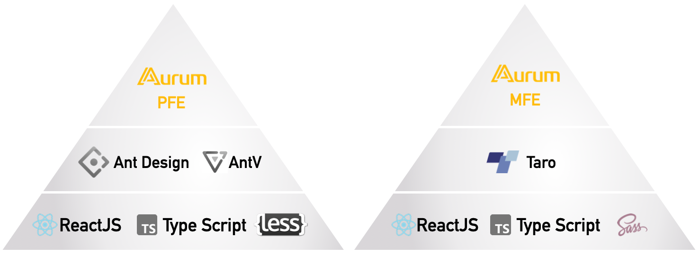

## **Aurum源起**

自麦中成立至今，已经产生了数不清的软件系统，由于业务扩张、开发团队分散，系统膨胀速度前所未有。每有新的想法和业务需求，研发团队总能在最快的时间内上马新的系统，在用户享受快捷的软件服务的同时，代价是每个软件系统在人机界面交互上都千差万别，体验也参差不齐。用户在跨系统使用软件时必然投入更多的时间理解各系统的不同交互；与此同时，研发人员在跨系统维护代码的时候，也将不得不进行很多不必要的重复性交互设计与开发工做。

想法很很自然：麦中范围的系统，不应该有一个相对统一的交互方法吗？


正如上图所说，“One System, One Experience” ， Aurum的想法于是应运而生。

## Aurum定义

Aurum 目标是对麦中所有系统中具有共性的交互模式进行抽象，也包括UI色彩、样式等， 形成的一套设计系统、一系列UI设计规范。这组设计规范将被实现为各种编程语言的UI组件库，提供给端应用调用。

我们将麦中的软件系统种类进行分析归纳，预计最终产生如下制品：

### 1. 设计制品

* 一组面向桌面大屏应用的UI设计规范
* 一组面向移动设备屏（手机、SOK专有屏denied）应用的UI设计规范

### 2. 软件制品

* 面向桌面等大屏应用的UI组件库
* 面向移动等小屏应用的UI组件库
而面向移动设备屏应用的UI组件库，又细分为：面向Web、Andorid和iOS三个方面的组件库实现。

因此，Aurum可以理解为是一套适用于麦中软件系统的设计系统、UI设计规范和代码实现。可以想见：如果未来端应用的UI都基于Aurum进行搭建，实现效率、品质和系统可维护性都将不可同日而语。


## 设计先行

要实现Aurum的蓝图，一定是设计先行。设计团队在Aurum上进行了深入的思考，我有幸聆听到团队思想碰撞的梵音，点点滴滴，摘录如下：

* BRAND DNA

  延续麦当劳品牌设计图形DNA，融入UI设计：

  薯条、芝士、芝麻粒都是Design System中的Aurum。

* 设计品质，美学依据

  基于成熟的美学结构，兼容不同的业务形态，

  保留适当的留白、提高阅读的舒适度。

* 执行品质，敏捷演化

  一套契约 Design Token，自动化遵从，无障碍反馈

* 场景化设计

  为Gen-Z而生，Happy Working，有节奏地工作...

最终，形成了独一无二的思考成果，让质量、服务、净化、价值完美和谐地统一进Aurum中。


## 代码实现之前的思考

### 与设计联动

考虑采用一种方法，使设计规范的定义精确传导给实现代码中。


设计为Aurum定义了一套Design Token，我们采用类似上图这种预定义变量准确映射，代码实现时再检查UI相关的样式是否引用了约定的Design Token，如果没有应给出明显的警告或者阻断代码入库。

Aurum的默认主色调是麦当劳金、紧缩布局模式。但该设计系统并不限制主题、布局的整体调整，所以，考虑代码实现时应该支持主题自定义。


### 技术栈的选择

当今软件系统的人机交互均以Web为主流，麦中的系统也不例外，因此我们着重在Web UI组件库实现的考量上。几个关键要素：

1. 基于开源扩展，不从零开始，否则不但实现工作量大，也增加了整个社会成本消耗；
2. 采用主流技术，确保系统未来的可维护性；
3. 兼顾现有系统已采用的UI技术，确保切换升级到Aurum时更平滑


如上。ReactJS 是显然的选择，它既是麦中在用系统采用的主流前端技术，也是业界使用的主流前端技术。Antd 是国际知名的MIT协议的组件库，Taro是跨端移动应用的统一技术框架，两者都建立在ReactJS技术之上。所有这些一切构成 Aurum组件库的基石。

## Aurum 开发



考虑实现限制，Aurum组件库将为桌面和移动应用单独分发，其开发也是完全分离的，名称为 Aurum PFE和Aurum MFE

### Aurum PFE - 面向桌面应用

典型地基于 Antd实现。 在 Aurum之前，麦中其实已经有一套 Portal Components（也是基于Antd）组件库，该组件库实现敏捷，迅速成为麦中系统UI交互的事实准则，在 BOSS 类应用范围实现了一定程度的人机统一交互。 但其与 Antd 版本的固定绑定、深度定制antd样式、主题封闭导致了一些可能致命的问题：跟进 antd 发展相当困难；BOSS子应用样式定制受限，互相污染。

在 Aurum 实现中，上述所有问题我们应极力避免。通常，组件库的设计和实现考虑的是面向使用者使用友好、面向开发者代码健壮、工程组织良好。对于我们的场景：继承和扩展 Antd 组件库，保留 Antd 所有的库接口能力，并始终跟随 Antd 版本升级，显然这些不会在 Antd 设计者的考量范围。我们不得不仔细研究 Antd 工程的组织方式，并定义了 Aurum 工程特有的的组织方法，关键点罗列如下：

1. 延续Antd主题定制能力，绝不能封闭它，确保 Aurum组件库使用者仍能像直接使用 Antd 那样进行样式隔离、预定义样式覆盖等；
2. 默认导出 Antd 所有组件，只对定制的Antd组件进行从Aurum中导出，Antd 组件定制严格遵从开闭原则，仅扩展 Antd，不得对其做任何修改；
3. 开放 Antd 依赖版本，使 Aurum 紧跟 Antd 版本更新；
4. 严格应用 TypeScript，确保组件接口契约在代码编译阶段就被精确遵守；

### Aurum MFE - 面向移动应用

前面已经提及，对于移动应用我们的重点考量也在 Web上。对于iOS/Android应用，原则是能用React Native 实现尽量用React Native实现，纯Native实现应控制在足够小的范围，这里不做赘述。

麦中移动端应用主要场景是小程序，而 Taro 作为一个跨端（小程序、H5、RN）技术框架，很好地满足了我们的需要。起初，2C的AIO（麦当劳点餐小程序）使用Taro进行了个性化的实现，运行良好。但此时还没有统一UI交互规范的必要，随着麦中系统的迅速扩张，企微的小程序系统需求猛增，Aurum MFE愈发凸显，移动端UI设计规范于是被纳入的 Aurum 规范定义。

去年底，小程序团队就已经迅速地抽象了AIO中具有共性的交互模式，使用 Taro 原生组件库扩展、gitbook开发文档，迅速成型数十个Taro组件库。


随着Aurum MFE设计规范的演进，MFE组件库工程组织的正规化也势在必行。工程组织支持大团队开发是重要考量，这次，我们参考了Taro UI的的工程组织，采用了与Aurum PFE的完全不同的项目管理方法：

1. 使用 lerna管理多项目：组件、组件DEMO、组件文档，使项目组织更清晰；
2. 向Taro UI的规范靠拢：使用SCSS作为样式语言，采用BEM规范；
3. 致力于使组件打包后能在RN环境下工作（当前RN环境需要复制组件源码进行引用）；

总的来说，Aurum MFE工程的组织方法更开发和先进，Rollup、Lerna等的采用都是直接了当的，比起Antd 工程深度的封闭，优势相当明显：易于理解、简单快捷。

Aurum MFE 2.X 的开发当前仍在进行中，面临早期版本的遗留问题和设计规范的校对，也包括图标库、图表的实现，工作量很大，还需要一些时日才能发布。

到目前为止，Aurum初步实现了这样一批设计规范：


## Aurum的使用者

**用起来好才是真的好**。和Aurum组件库开发比起来，我们更在意Aurum使用者的感受。从某种角度上，这比组件库的实现更难以捉摸，因为如果没有用户反馈，你有时完全不知道问题出现在哪。

总结起来，为了使Aurum组件库面向用户友好，有几个关键要素：

1. 直白的、准确的快速入门文档；
2. 提供一个简洁的脚手架工程；
3. 确保质量的TypeScript定义；

以为 Aurum PFE为例，因为继承 Antd 并扩展了Antd的能力，所以 Aurum 文档基本原则就是不对 Antd 文档已经描述的东西进行大篇幅重复，对于有 Antd 开发经验的同学来说，这相当友好。

对于 Aurum 有些诡谲的定制，再多的文档不如一行代码来的直接。运行

```bash
npx @omc/create-cra-app -p pear -s
```

将快速拉起一个Web工程，直接呈现一组 Aurum PFE的例子到浏览器，也许这才是使用组件库更好的起点。

当然，Aurum PFE的主要用户仍然是BOSS子应用，该类应用的涉及的配置更加琐碎，运行

```bash
npx @omc/create-boss-app -o boss -p tomato -r /tomato -s 
```

将生成一个BOSS子应用脚工程例子，可以快速直观地体验 Aurum PFE 在 BOSS中的用法。


至本文截稿时，BOSS团队应该已经发布了官方的BOSS工程脚手架，所以`@omc/create-boss-app`脚手架只是为了演示 Aurum PFE的应用，请勿直接作为 BOSS子应用的基础进行使用。

## Aurum的衍生

大家如果去 Aurum 官网文档，会看到有一组“高级组件”：字典选择器、应用名称选择等，这组组件显然是前面Input、Select等基础组件的组合，称“高级”的定义过于笼统，但是“复合”也许更合适。“复合组件”还可以继续细分，比如“字典选择器”实际还集成了远程 BOSS API的访问，这就和具体系统绑定了。我们认为Aurum PFE应该是面向更一般的麦中软件系统，而不仅为BOSS所应用。再比如，还可以有一种”复合组件“就是多个基础组件的拼接，形成更复杂的固定交互模式，但不和任何系统绑定，仍具有一般桌面系统可以使用的广泛性，此时称”高级组件“更合适。

下面这张图以 Aurum PFE 为例揭示了 Aurum 生态结构及可能的衍生。


## 写在最后

Aurum的诞生不足数月，还不尽完善，我们的愿望是全体同仁一起将其推进成熟。每个人可以申请贡献代码给 Aurum，组件的开发来自于设计团队的抽象和开发者的总结，组件入库前由前端架构委员会和设计团队方共同确认即可进行。

架构委员也不定期会从代码研发质量、业务使用情况等方面定期发展和演化Aurum，确保 Aurum 的业界先进性和持续的成熟度。

最后，还是最期待大家持续关注 Aurum 并反馈意见，参与到 Aurum 的建设中，为 Aurum 走向成熟和最终提高生产力添砖加瓦。

