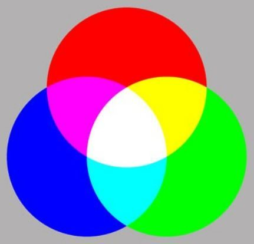
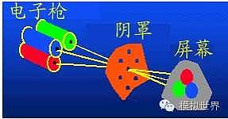

# 程序员素养 - 计算机色彩

## 1. 你懂得色彩的含义吗？

 		RGB: (255, 255, 0)

> 设计师请你制作一个网页，背景色为 RGB(255,  255 , 0)，你是不是完全懵逼状态？
>
> 你想知道设计师是怎么设计出来的色彩吗？

## 2.  三原色

> 这要从三原色说起，白色：三原色是基本颜色，其他所有颜色都可以合成。通常我们说的七彩：红橙黄绿青蓝紫，其中的橙、黄、青、紫都是合成光。比如红色+绿色 = 黄色；红色+蓝色=粉色
>
> 这是一个物理发现。

## 3. 计算机显示器怎么实现3原色？

>  计算机的屏幕有三束光线发射器：红、绿、蓝，每个光的强度可以设置256个梯度， 即0 到 255。以红色为例，如果红色光强为255，就是最亮的红，如果红色光强为0（即关闭光线发射器），屏幕就是黑色；绿光、蓝光同理。
>
> 例如：要在屏幕上显示一个最亮的黄色
>
> 答： 根据三原色图，只要将红光、绿色发射器强度调为最大，蓝光发射器关闭即可
>
> 该颜色用RGB表示就是 RGB(255, 255, 0)， RGB是英语红、绿、蓝首字母的缩写，括号里逗号分隔的数字依次为红、绿、蓝

是利用[阴极](https://zh.wikipedia.org/wiki/陰極)电子枪发射[电子](https://zh.wikipedia.org/wiki/電子)，在[阳极](https://zh.wikipedia.org/wiki/陽極)高压的作用下，射向荧光屏，使荧光粉发光，同时电子束在偏转磁场的作用下，作上下左右的移动来达到扫描的目的。早期的阴极射线管仅能显示光线的强弱，展现黑白画面。而彩色阴极射线管具有红色、绿色和蓝色三支电子枪，三支电子枪同时发射电子打在荧幕玻璃上[磷](https://zh.wikipedia.org/wiki/磷)化物上来显示颜色。

液晶显示器原理： https://www.zhihu.com/question/276397150#:~:text=%E8%83%8C%E5%85%89%E6%BA%90%EF%BC%88%E7%81%AF%E7%AE%A1%EF%BC%89%E5%B0%84%E5%87%BA,%E5%BD%A2%E6%88%90%E4%B8%B0%E5%AF%8C%E5%A4%9A%E5%BD%A9%E7%9A%84%E5%9B%BE%E5%83%8F%E3%80%82

## 看看BY的色盘

https://www.w3schools.com/colors/colors_rgb.asp

http://casesandberg.github.io/react-color/

http://react-component.github.io/color-picker/examples/panel.html

https://developer.mozilla.org/en-US/docs/Web/CSS/CSS_Colors/Color_picker_tool

## 带透明度（Alpha）的颜色表示方法

RGBA(255, 255, 0, 0.5);

> 以CRT为例，图象显示前先进预处理部分（BIT PLANE），有一个“BIT PLANE”显示器只显示纯黑白图。有8个“BIT PLANE”显示器显示2的8次方即256级灰读图。当然该图象数据显示前还要经过寄存器，寄存器把8个“BIT PLANE”中相应数据合为一个8位2进制数。即可实现256级灰度图
>
> 有一个预处理部件，可以显示256个阶梯灰度图，然后在与RGB颜色合成，就像给颜色掺了沙子，颜色饱和度下降，纯度下降了，就像蒙了一层灰

## 其他表示颜色的方法

Hue, Saturation, Lightness, Alpha

- **色相（Hue）**是色彩的基本属性，取值为：0 - 360。0或360：表示红色，120表示绿色，240表示蓝色，也可取其他数值来指定颜色。
- **饱和度（Saturation）**是指色彩的纯度，取值 0-100% 。越高色彩越纯，低则逐渐变灰。
- **亮度（Lightness）**是指色彩的纯度的亮度， 取值 0-100%。增加亮度，颜色会向白色变化；减少亮度，颜色会向黑色变化。
- **透明度（Alpha）** 取值 0~1 之间， 代表透明度。

黄色：hsla(60, 100%, 50%, 1)

hsl(60, 100%, 50%)

> Lightness 转换公式： 
>
> 步骤1：把RGB值转成 [0，1] 中数值。
>
> 步骤2：找出R,G和B中的最大值。
>
> 步骤3：计算亮度：L=(maxcolor + mincolor)/2
>
> 
>
> 步骤1: 黄色：rgb(255, 255, 0) => (1, 1, 0)
>
> 步骤2: maxcolor = 1, mincolor = 0 
>
> 步骤3：L=(maxcolor + mincolor)/2 = ( 1+ 0) /2 = 0.5

> 虽然表示方法不同，但是转换到硬件电路发出光束的逻辑是一样的

## 颜色16进制数字表示方法

背景色：#FFFF00FF 

> =>
>
> R: FF,  
>
> G: FF,
>
> B: 00, 
> A: FF

## 分辨率

## 真彩色

