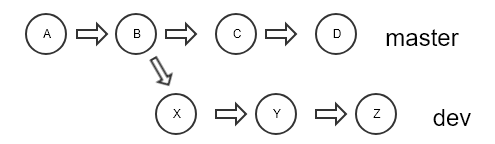
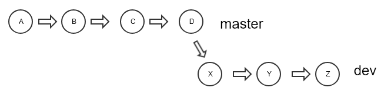
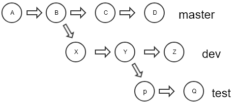

## 改变基

　　　　

一个 git 库，开发人员在 master 分支的 `B commit` 的时候，创建了一个 dev 分支，此时 `B commit` 是dev分支的基，然后分别进行两个分支的开发。

进行到master提交了 `D commit`，而 dev 分支提交到了 `Z commit`，如果此时需要将 dev 分支的基切换为 D，那么可以用下面这个命令：

```shell
git checkout dev # 切换到dev分支
git rebase master # 将master最新的commit作为基
```

　　执行这个命令时，可能会有分支冲突，解决冲突之后，进行如下操作：

```shell
# 解决冲突
git add xxx
git rebase --continue
```

　　进行完这些操作后，分支的情况就如下图了：

　　

　　使用git log来查看提交日志，可以看到dev分支的x、y、z的提交次序变到了maste分支的Dcommit后面。

　　也就是说，这里进行了一个git merge。

 ## 拓展

如果要将下面的test分支基变为master分支的D，那么可以使用

```shell
git rebase --onto master dev^ test
```


　　 

 

## 合并提交记录

　　首先看下面这个例子：

```shell
[root@centos demo]# git init
Initialized empty Git repository in /root/demo/.git/
[root@centos demo]# echo one >> a.txt
[root@centos demo]# git add a.txt
[root@centos demo]# git commit -m "first commit"
[master (root-commit) b7ee3a2] first commit
 1 file changed, 1 insertion(+)
 create mode 100644 a.txt
[root@centos demo]# echo two >> a.txt
[root@centos demo]# git commit -am "second commit"
[master 92ae9c4] second commit
 1 file changed, 1 insertion(+)
[root@centos demo]# echo three >> a.txt
[root@centos demo]# git commit -am "third commit"
[master 0985eec] third commit
 1 file changed, 1 insertion(+)
[root@centos demo]# echo four >> a.txt
[root@centos demo]# git commit -am "four commit"
[master 5bd480c] four commit
 1 file changed, 1 insertion(+)
[root@centos demo]# git show-branch --more=4    #查看四次提交记录
[master] four commit
[master^] third commit
[master~2] second commit
[master~3] first commit
```

上面代码进行了4次提交，但是现在有个需求，将这四次提交的合并为一个提交，提交信息整合一下，改成"four commit"，可以这么做：

```shell
[root@centos demo]# git rebase -i master~3
 
#会启动vi编辑器，顶部显示的内容如下：
pick 92ae9c4 second commit
pick 0985eec third commit
pick 5bd480c four commit
```

　　然后将上面这三行中，后面两行的pick替换为squash，即下面这个样子：

```
pick 92ae9c4 second commit
#将后面两次的pick改成squash，然后保存退出
squash 0985eec third commit
squash 5bd480c four commit
```

　　保存退出后，又会打开一个vim编辑器窗口，内容如下：

```
# This is a combination of 3 commits.
# This is the 1st commit message:
 
second commit
 
# This is the commit message #2:
 
third commit
 
# This is the commit message #3:
 
four commit
```

　　从上面三个commit信息，就是会显示在合并后的那个commit提交信息，如果原封不动的话，那么三次提交合并为一个提交之后，这一个提交就会有三行提交comment。

　　当然，可以使用#来注释其中的某几条comment，或者修改其中的comment，都行。

　　比如我只想保留最后一次提交comment，那么可以向下面这么做：

```
# This is a combination of 3 commits.
# This is the 1st commit message:
 
#second commit
 
# This is the commit message #2:
 
#third commit
 
# This is the commit message #3:
 
four commit
```

然后保存并退出，不出意外的话，现在已经合并提交成功了。

可以查看一下提交记录：

```
[root@centos demo]# git show-branch --more=4
[master] four commit
[master^] first commit
```

同时，文件的内容也没有发生改变：

```
[root@centos demo]# cat a.txt
one
two
three
four
```