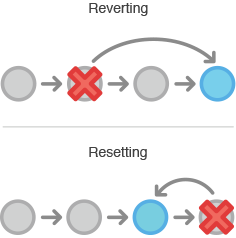

## reset

reset是用来修改提交历史的，想象这种情况，如果你在2天前提交了一个东西，突然发现这次提交是有问题的。 这个时候你有两个选择，要么使用git revert（推荐），要么使用git reset。



上图可以看到git reset是会 修改 版本历史的，他会丢弃掉一些版本历史。 而git revert是根据那个commit逆向生成一个新的commit，版本历史是不会被破坏的。 已经push到远程仓库的commit不允许reset

上面已经讲了，git reset是会丢弃掉commit的。 如果commit已经被push到远程仓库上了，也就意味着其他开发人员就可能基于这个commit形成了新的commit，这时你去reset，就会造成其他开发人员的提交历史莫名其妙的丢失，或者其他灾难性的后果。 因此，一旦commit已经被push到远程仓库，那么是坚决不允许去reset它的。

### a. 不带文件参数的reset

前面章节已经说道Git有三个区域，Git的所有操作实际上是在操作这三个区域的状态（或内容）。 git reset配合不同的参数，对这三个区域会产生不同的影响。 reset实际上有3个步骤，根据不同的参数可以决定执行到哪个步骤( --soft , --mixed , --hard )。 --soft --mixed --hard 注意

–mixed 是默认参数，也就是说执行reset的时候不给就认为是 --mixed 。 下表说明了三种形式的git reset所产生的不同效果。 target代表想要将git指向到哪个commit

```
working index HEAD target         working index HEAD
----------------------------------------------------
  A       B     C    D     --soft   A       B     D
                           --mixed  A       D     D
                           --hard   D       D     D
                           --merge (disallowed)

working index HEAD target         working index HEAD
----------------------------------------------------
  A       B     C    C     --soft   A       B     C
                           --mixed  A       C     C
                           --hard   C       C     C
                           --merge (disallowed)
```

### b. 带文件参数的reset

上面讲到的git reset实际上不带参数的，如果带上文件参数，那么效果会是怎样的？ HEAD不会动 将那个commit的snapshot里的那个文件放到Index区域中 需要注意的是带文件参数的git reset没有--hard, --soft这两个参数。只有--mixed参数。 unstage

下面这两个命令是一样的，都是reset到HEAD上。 git reset file.txt git reset --mixed HEAD file.txt 这个例子的意义在于，unstage file，仔细想一想是不是这样？当你把一个文件stage到Index区域里后后悔了，那么只需要把Index区域里的这个文件恢复到最近一次commit的状态（也就是HEAD），那就相当于unstage了。 恢复到历史版本

下面这个命令就是将某个文件恢复到历史版本上。 reset eb43bf file.txt 这个例子的意思在于，把某个文件恢复到Index区域里，然后直接commit，这样就等于把这个文件恢复到历史版本了，这样依赖你都不需要去改动Working Directory了。

## checkout

前面讲到checkout是会修改HEAD的指向，变更Index区域里的内容，修改Working Directory里的内容。 这看上去很像 reset --hard ，但和 reset --hard 相比有两个重要的差别: 1). reset会把working directory里的所有内容都更新掉; checkout不会去修改你在Working Directory里修改过的文件 2). reset把branch移动到HEAD指向的地方; checkout则把HEAD移动到另一个分支

第二个区别可能有点难以理解，举例来说：假设你有两个分支master和develop，这两个分支指向不一样的commit，我们现在在develop分支上（HEAD指向的地方） 如果我们 git reset master ，那么develop就会指向master所指向的那个commit。 如果我们 git checkout master ，那么develop不会动，只有HEAD会移动。HEAD会指向master。看图：

### 带文件参数

当执行git checkout [branch] file时，checkout干了这件事情： 更新了index区域里file文件的内容 更新了working directory里file文件的内容 总结reset和checkout

```
head    index   work dir  wd safe
Commit Level
reset --soft [commit]    REF     NO      NO        YES
reset [commit]           REF     YES     NO        YES
reset --hard [commit]    REF     YES     YES       NO
checkout [commit]        HEAD    YES     YES       YES

File Level
reset (commit) [file]    NO      YES     NO        YES
checkout (commit) [file] NO      YES     YES       NO
```