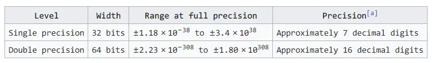
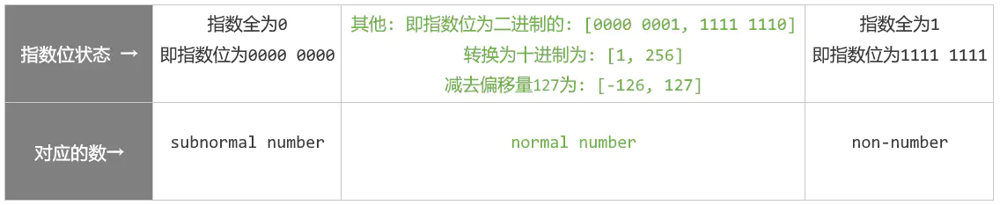
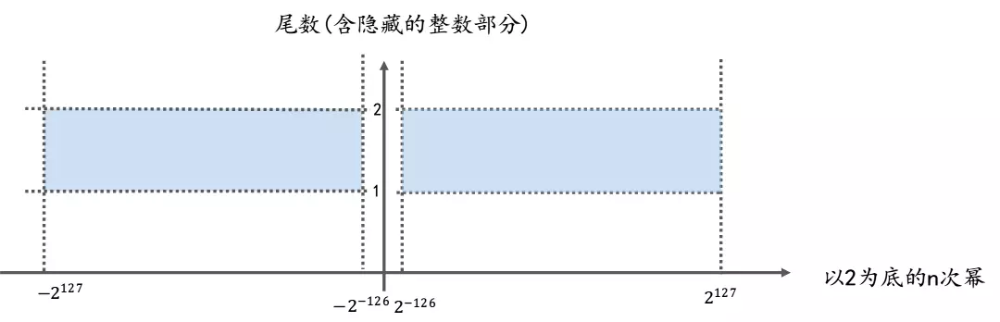

原文链接：https://www.jianshu.com/p/43b1b09f27f4

## 一. wiki中, 32位浮点数的取值范围

这里先直接给出维基上的取值范围:

可见float类型, 或者说32位浮点数的取值范围是**:**

或者说是:

![[-3.4*10^{38}, -1.18*10^{-38}] ∪ [1.18*10^{-38}, 3.4 * 10^{38}]](images/math?formula=[-3.4*10^{38}%2C -1.18*10^{-38}] ∪ [1.18*10^{-38}%2C 3.4 * 10^{38}]&ynotemdtimestamp=1616141052990)

直观表示的话就是:

[-340000000000000000000000000000000000000, -0.0000000000000000000000000000000000000118] ∪ [0.0000000000000000000000000000000000000118, 340000000000000000000000000000000000000]

用二进制来表述的话就是：

- 绝对值最大值：±3.4 * 1038（1.1111…1×2^127）即：

> 0-11111110-11111111111111111111111(23个1)

- 绝对值最小值：1.18 * 10-38（1.00…0×2^-126）的数据而不损失精度。

> 0-00000001-00000000000000000000001(22个0，最后一位是1)

## 二. 前置概念

在详细介绍这个范围是怎么计算出来的之前, 我们必须先了解一些概念.只有了解了这些概念, 才能真正的理解浮点数的取值范围是如何计算出来的.

而且此处假定你已经对IEEE754浮点数在内存中的存储方式有所了解, 还不了解的话也可以参考本系列的第一篇文章.

那这就开始吧

### 概念1: normal number(规格数) & subnormal number(非规格数)

根据IEEE754的规定, 按照尾数位隐藏的整数部分是 **1.** 还是**0.** 可以将浮点数划分为两类: **normal number(规格数)** 和 **subnormal number(非规格数)**

下面以32位浮点数为例来解释这些概念.

#### 1. normal number(规格数)

就是尾数位隐藏的整数部分是**1.**的数, 这种数叫做normal number, 可以理解为"正常的数"

一般来说, 我们遇到的都是normal number

举例: 20.5在内存中表示为: 0 1000 0011 **0100 1000 0000 0000 000**

其中尾数部分(即上面的加粗部分), 去掉后面补的零之后为: 01001

但事实上, 真实的尾数部分应该是: **1.\**01001, 即前面省略了整数部分\**1.**

#### subnormal number(非规格数)

尾数位隐藏的整数部分为**0.**的数, 叫做subnormal number, 也叫作denormal number, 可以理解为"低于正常数的数"

引入subnormal number这个概念, 是为了在浮点数下溢时, 可以逐位的损失精度, 以尽可能精确的表达0附近的极小数, 之后的章节会具体讲解.

为了表示subnormal number, IEEE754规定: **如果将指数位全部填充为0, 则表示这个数是个subnormal number**

举例: 以32位浮点数为例, 当你看到类似于 * **00000000** *********************** 这样内存状态的数时, (即指数位全部为0的数), 就应该知道, 这是个subnormal number, 此时这个数的尾数位隐藏的整数不是**1.** 而是**0.**

### 概念2: non-number(特殊数)

和subnormal number类似, IEEE754对于指数位全为1的状态也做了特殊规定:

**当指数位全部被1填充, 即指数位表示的值为255时, 用于表示这个浮点数处在一种非正常数(non-number)的状态: 即这个数可能是±infinity或NaN.**

注: Infinity和NaN是两个特殊数, 分别表示**无穷**和**Not a Number.** 我们后文还会详细讨论这两个特殊数

> The biased-exponent field is filled with all 1 bits to indicate either infinity or an invalid result of a computation.

所以: 当你看到类似于 * **11111111** *********************** 这样内存状态的数时, (即指数位全部为1的数), 就应该知道, 这是个non-number, 它用于表示特殊数.

## 三. 计算方法

在了解了上面两个概念之后, 再看计算方法就很简单了.

如上所述, IEEE754规定, 当指数位全部为0或者全部为1时, 用于表示两种特殊状态的数: subnormal number 和 non-number, 所以现在可以得到如下示意图, 以32位单精度浮点数为例:

这就是理解单精度浮点数取值范围的关键: **当我们讨论浮点数的取值范围时, 实际上讨论的是:** **normal number (上图中绿色部分)的范围.**

可以看出, 32位浮点数的**指数部分**其实是无法取到-127和128的, 因为:

用于表示**-127**的**0000 0000**被用来表示**subnormal number**了,

而用于表示**128**的**1111 1111**被用来表示**non-number**了.

**所以实际上32位浮点数的指数部分只能取到只能取到[-126, 127]**

再来看看尾数: 对于normal number, 尾数前隐藏的整数部分始终保持为**1.**

所以尾数(含隐藏的整数部分)所表示的值的范围其实是 [1.00...00, 1.11...11],

这个二进制数, 约等于十进制的[1, 2), 因为1.11..11非常逼近十进制的2

好啦, 现在我们知道, 对于32位flaot而言: 尾数(含隐藏的整数部分)的可取值为: [1 ,2), 指数位可取值[-126, 127], 且浮点数可正可负, 根据运算规则, 就不难算出32位float的取值范围了:

取值范围

然后为了看着顺眼, 我们把上式的以2为底, 替换为以10为底:

↑ 转换后小数位太长了, 所以这里写成了省略号的形式: 3.402823669**...**

从上面这个集合中, 取一个更容易表示的子集, 就是我们常见的32位float的取值范围了:

![[-3.4*10^{38}, -1.18*10^{-38}] ∪ [1.18*10^{-38}, 3.4 * 10^{38}]](images/math?formula=[-3.4*10^{38}%2C -1.18*10^{-38}] ∪ [1.18*10^{-38}%2C 3.4 * 10^{38}]&ynotemdtimestamp=1616141052990)

↑ 注意, 上面这个集合其实是32位float取值范围的子集, 不过和真正的取值范围也没有差太多, 表示起来也更简洁, 没有冗长的小数位, 还能写成闭区间的形式...所以在各种资料中, 我们常看到的取值范围就是上面这个.

↑ 之所以能写成**闭**区间的形式, 就是因为它只是真正取值范围的一个**子集.** 这里特意说明一下, 防止有的同学对这里的闭区间感到困惑.

# 四: 补充

下面是 32位单精度浮点数的取值范围示意图, 可以参照此图更好的理解一下前文内容

下图中, x轴代表以2为底的n次幂(即内存中的指数部分), y轴代表尾数(含隐藏的整数部分1.)

坐标系中任意一点(x, y)就代表一个浮点数,

这一点到x轴, y轴所围成的矩形的面积(即上图中橙色区域的面积), 就是这个浮点数的值 (即浮点数的值 = 尾数(含隐藏的整数部分) * 以2为底的n次幂)

上图中:

蓝色部分: 表示normal number的取值范围, 即, normal number类型的浮点数对应的坐标点只能出现在坐标系中的蓝色区域.

坐标点: 一个坐标点对应一个浮点数

橙色部分的面积: 表示该浮点数的值.

这就是32位浮点数取值范围的计算方法.

下一章将详细介绍为什么说32位浮点数的精度是"7位有效数", 这个7是怎么计算出来的, 下一章也将会是整个系列中最有难度, 最重要的一章.

那下一章再见吧~