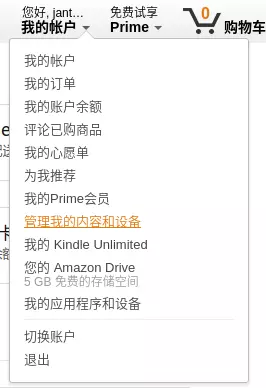
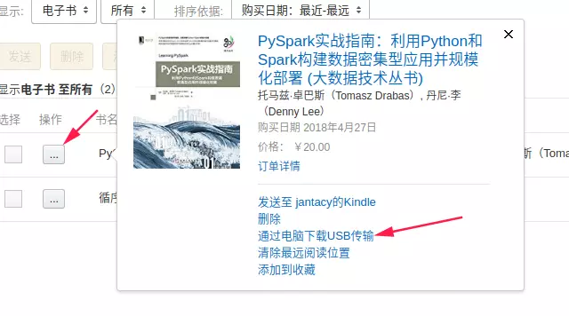

## 从 [amazon.cn](http://amazon.cn/) 下载 Kindle 电子书到本地

登录 [amazon.cn](http://amazon.cn/) ，选择“我的账户”，“管理内容和我的设备”，然后点击操作下方的省略号按钮，选择“通过电脑下载USB传输”，在弹窗后选择相应的后，就会自动将文件下载到本地（格式是azw3)。

以下载《PySpark实战指南》为例：

## 安装转换软件 calibre 及 解密插件

- 下载 [calibre](https://calibre-ebook.com/) 并安装.
- .azw3 格式电子书文件用 calibre 打开通常不能浏览（已经被 DRM 加密），所以要下载 calibre 插件 [DeDRM](https://github.com/apprenticeharper/DeDRM_tools)
- 安装 DeDRM

1. 解压后提取DeDRM_calibre_plugin文件夹里的 DeDRM_plugin.zip文件；
2. 打开calibre的首选项->高级选项->插件->从文件加载插件->勾选仅显示用户自己安装的插件
3. 选择"从文件加载插件"，选择对应的插件，即：选中 DeDRM_calibre_plugin 文件夹里的 DeDRM_plugin.zip文件；
4. 在插件列表中选中相应插件后点击“自定义插件”，在弹窗里点击elnk Kindle Ebooks输入kindle设置里的序列号（从Kindle设备里操作：设置->全部设置->设备选项->设备信息-序列号)。
5. 重启calibre后将刚才从亚马逊网站下载的付费电子书拖进来，然后选中相应书籍，选择逐个转换，在输出格式里选择pdf/mobi等你喜欢的格式，点击"确定"就等待大功告成吧。（如果转换失败，可以考虑换一种输出格式）

## 重点强调

切记是需要在输入kindle序列号之后，再把从亚马逊下载的书籍拖到calibre中，先拖入再输入kindle序列号可能会失败。