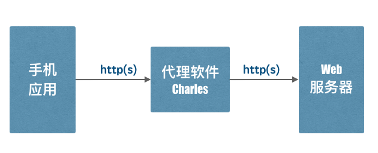
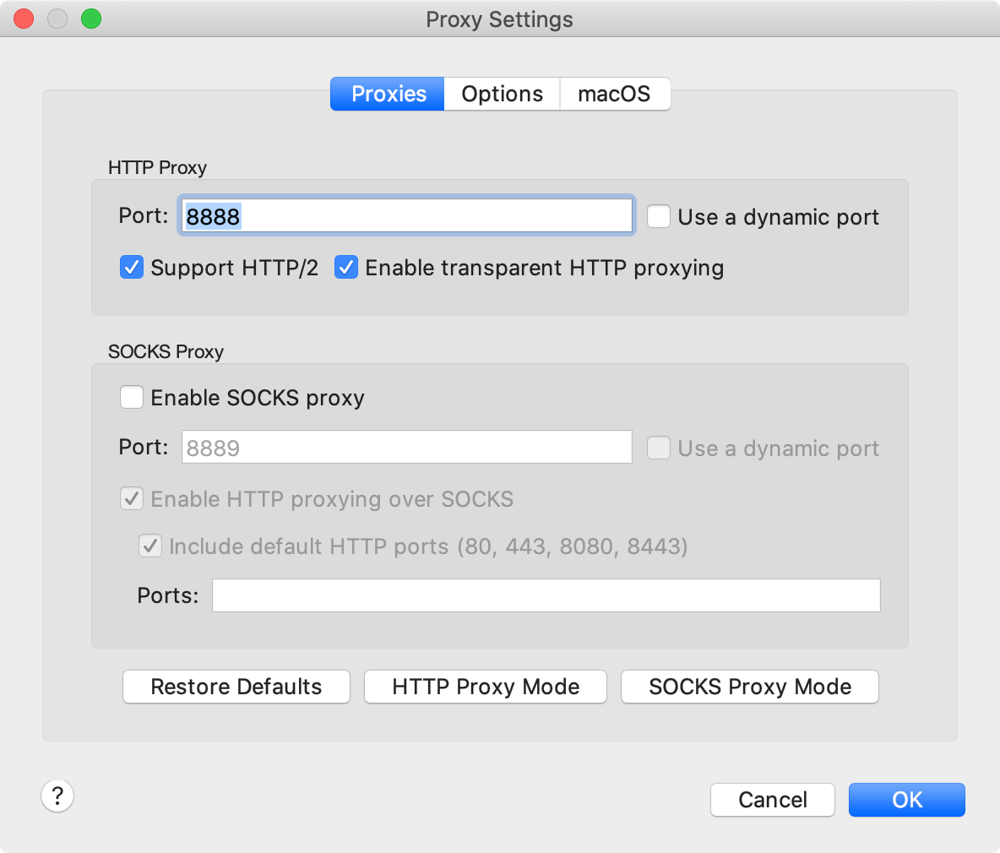
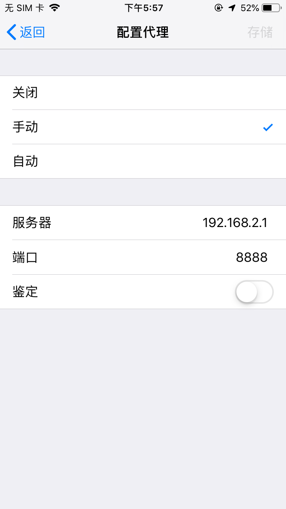
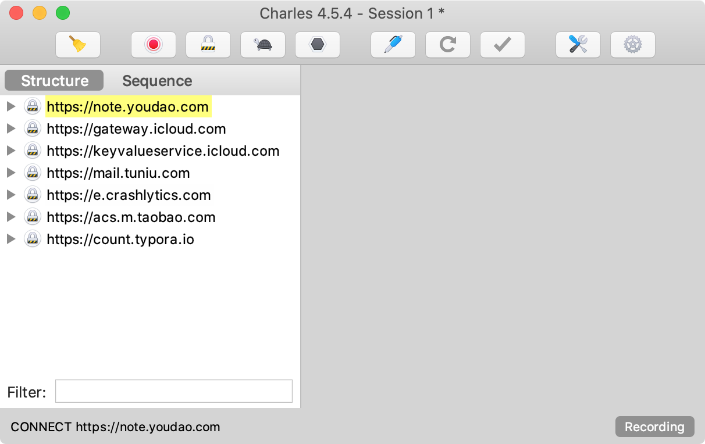
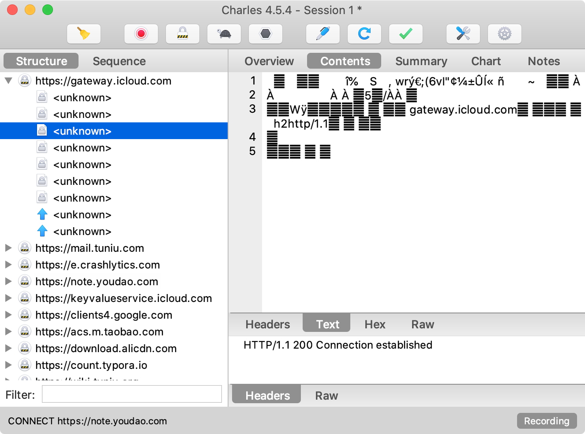
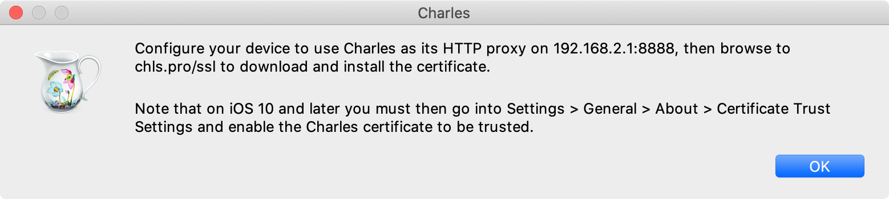
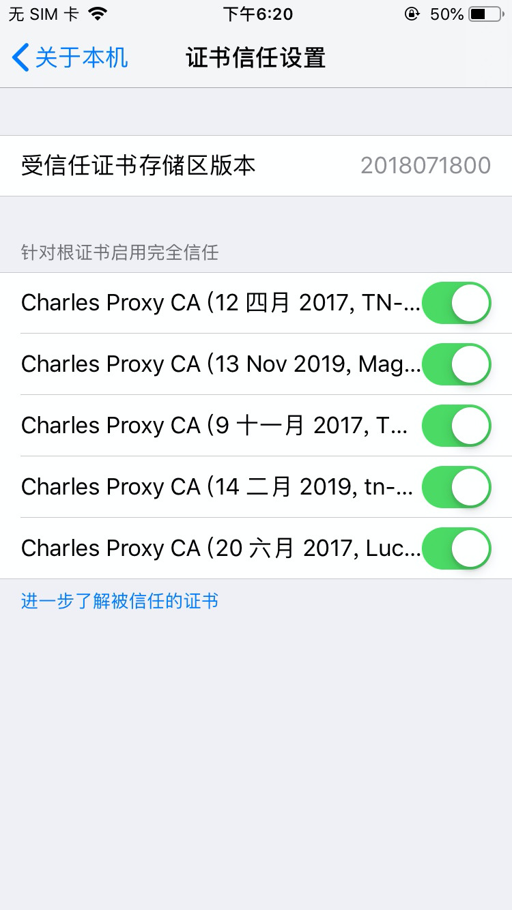
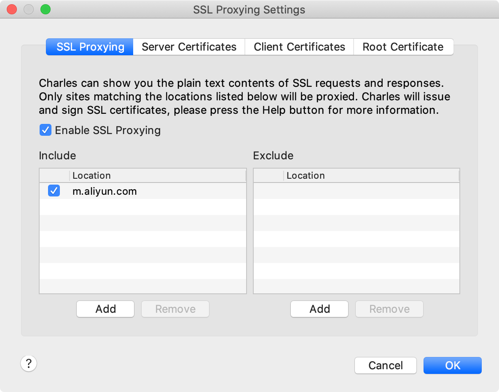
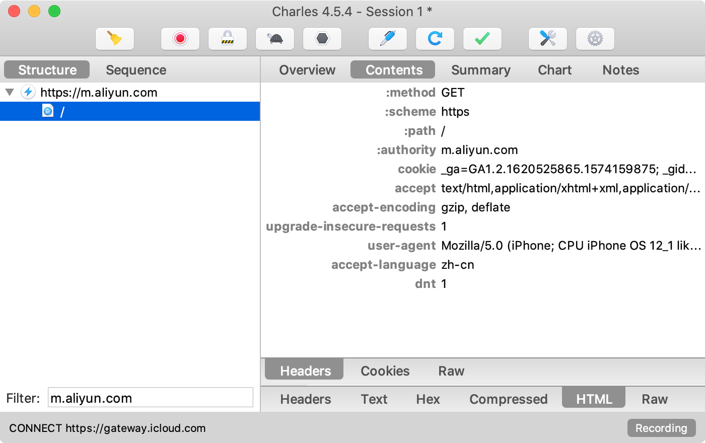
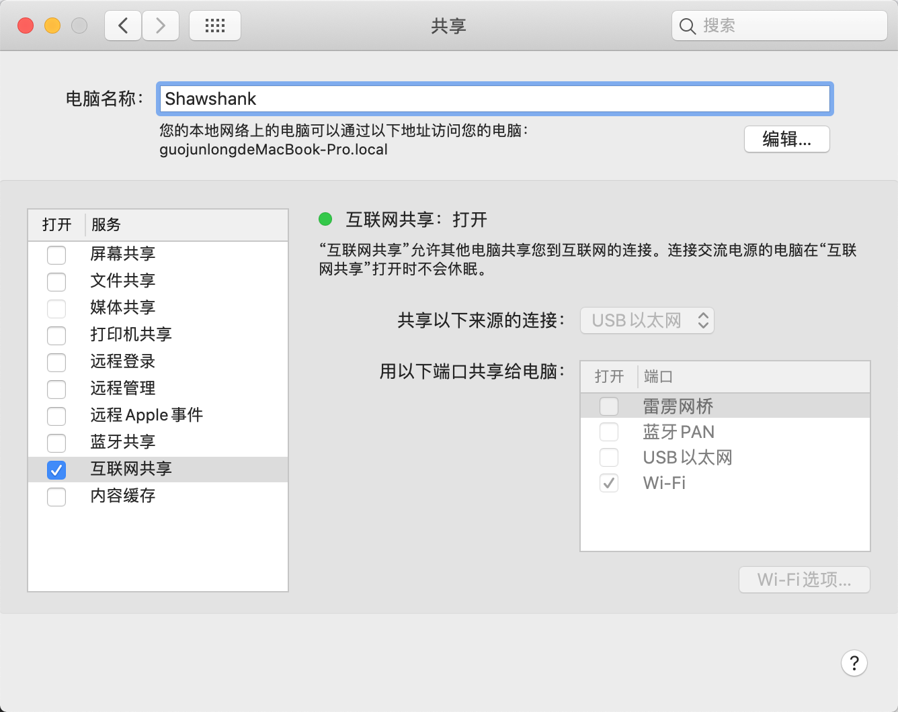

## http(s) 代理

在调试手机、桌面等非浏览器应用中 http(s) 请求的问题时，可以走 PC 上的 http(s) 代理软件，截获请求，记录 http(s) 请求和返回的数据，便于开发者调试。

为数不多的 http(s) 代理软件中，Charles（收费软件） 最受欢迎。下面以苹果手机为例，描述如何使用 macOs 上的 Charles 代理其http(s)请求进行开发调试。

## 安装运行 Charles v4.5.4

在 macOs 上下载安装 Charles （https://www.charlesproxy.com/ ）。启动 Charles将自动监听端口号 8888。打开菜单 Proxy -> Proxy Settings... 可以验证上述说法：

v4.5.4 版本默认就开启了 macOs Proxy（修改了你的网络的http(s)代理），这将使所有本机上 http(s) 请求经过 Charles代理，如果你不需要，点击 Proxy -> macOS Proxy 取消该设置。

## 手机设置代理

如果手机和 PC 在同一个 Wifi 网络，那么设置 wifi 的“配置代理”，选择手动，指定 macOS 电脑的服务器IP和 Charles 启用的端口号，我这里是： 192.168.2.1:8888

## 发送一个网页请求

进入 Charles，点击 Start Recording（默认其实已经开启），然后用手机访问一个网页试试看，是不是请求的信息显示在 Charles里了，点开图示左侧URL树，看看每次 http(s) 请求的输入输出信息是不是都被记录下来了？

## 解析 https 请求

展开 Charles 里捕获的 https 请求，你会发现显示的内容怎么都是乱码？

对，因为没有目标网站的私钥，简单的 http 代理 解析不了截获的内容。Charles的解决方案是：

https 客户端（本例是苹果手机）安装 Charles 签发的证书，这样客户端发送的 https 请求实际用的是 Charles 的证书，当数据到达 Charles 时，它可以 解析出来保存一份供分析，同时重新用目标 Web 服务器的证书加密报文后再次转发出去。

#### 具体实操如下：

1. Charles 进入菜单 Help->SSL Proxying->Install Charles Root Certificate on a Mobile Deivce or Remote Browser

1. 根据上图提示，手机打开浏览器访问 [chls.pro/ssl](http://chls.pro/ssl) 来安装 Charles 的证书。
2. 仍然根据上图提示，iOS以上手机进入 Settings->General->About->Certificate Trust Settings，允许该证书被信任。

注：你的手机上可能证书列表只有一个，选中打开即可。

1. Charles 里设置目标 https 网站白名单（不支持通配符）。 比如，想截获 [m.aliyun.com](http://m.aliyun.com/) 的请求，那么进入 Proxy -> SSL Proxying Settings... 添加 include 选项

现在，手机访问 [aliyun.com](http://aliyun.com/)，m.aliyun.com的请求被截获，并能查看到解码后的文本：

## PC 和手机不在一个 wifi 网络怎么办？

比如，我用苹果电脑，那么可以用“USB转RJ45”连接到外网，然后进入“偏好设置->共享”，选中“互联网共享”->“Wi-Fi”，这样我的手机可以连接这个共享出来的 Wifi网络，就能顺利使用 Charles了。

