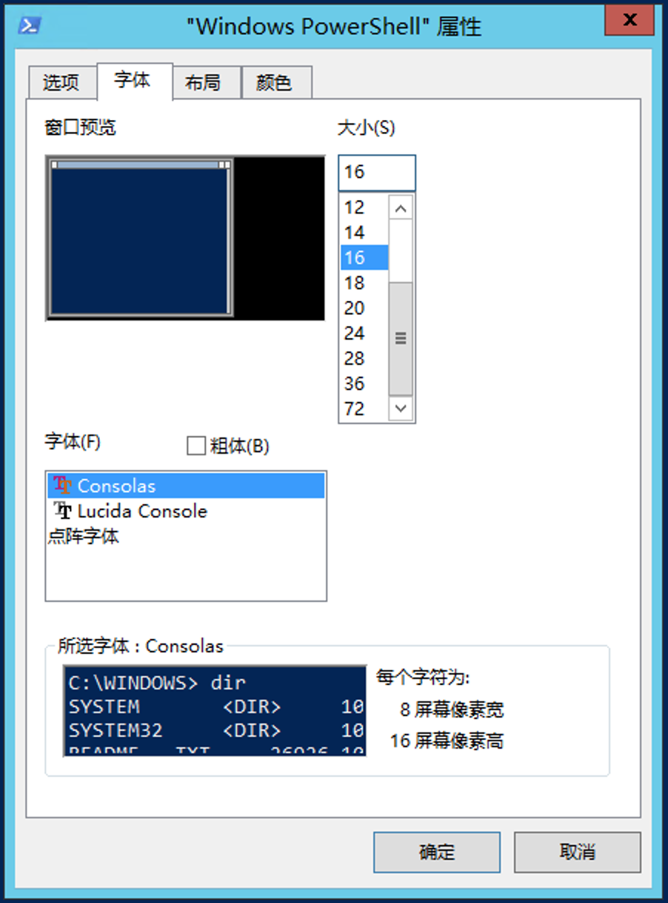

## 修改控制台（cmd 或者PowerShell）的编码

手动启动一个控制台程序，启动之后设置编码为utf8

```
chcp 65001
```

然后，修改窗口属性设置字体为Consolas



然后重新运行你的C语言程序试试。

## 2. 使用代码纠正

```c
#include <stdio.h>
#include <Windows.h>

// 控制台显示乱码纠正
int main(int argc, char const *argv[])
{
    system("chcp 65001"); //设置字符集 （使用SetConsoleCP(65001)设置无效，原因未知）
 
    CONSOLE_FONT_INFOEX info = { 0 }; // 以下设置字体
    info.cbSize = sizeof(info);
    info.dwFontSize.Y = 16; // leave X as zero
    info.FontWeight = FW_NORMAL;
    wcscpy(info.FaceName, L"Consolas");
    SetCurrentConsoleFontEx(GetStdHandle(STD_OUTPUT_HANDLE), NULL, &info);
    printf("%s\n", "C语言乱码问题");
    return 0;
}
```

不过上述代码有系统要求限制：

1. Minimum supported client ：Windows Vista [desktop apps only]
2. Minimum supported server ：Windows Server 2008 [desktop apps only]

详见MSDN：https://docs.microsoft.com/en-us/windows/console/setcurrentconsolefontex