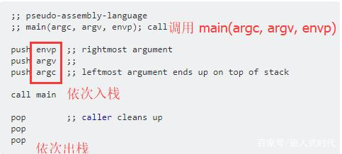
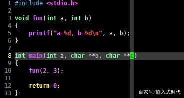

基本上，几乎每一个初学者在刚接触C语言时，都会被告知C语言程序的默认入口是 main() 函数，程序总是从入口函数处开始运行。一般来说，main() 函数有两个常用的原型，它们的C语言代码是下面这样的：

```
int main();
int main(int argc, char *argv[]);
```

为什么在C语言程序中，可以有不同类？当然，在一些比较旧的教材或者C语言代码中，读者可能还见过 void 返回值类型，甚至没有写返回值类型的 main() 函数原型：

```
void main();
main();
```

C++程序基本上也是如此，但是 C++ 提供了重载语法支持，因此同一个函数具有不同的参数类型是可以理解的。而C语言没有重载语法，为什么在C语言程序中，可以有不同类型的 main() 函数呢？

## 为什么C语言可以有不同类型的 main() 函数呢？

C语言程序支持多种类型 main() 函数，其实和支持可变参数函数是类似的。按照我之前文章中的讨论，对于可变参数函数，例如 printf() 函数，或者未明确指定参数的函数，例如 void fun(); ，在被调用时，是允许传入任意多参数的：

```
printf("...");
printf("...%d", 666);
fun();
fun(1, 2, 3, 4);
```

上面几行C语言代码都是合法的。一般来说，C语言代码被编译为指令后，函数被调用时，它的参数是按照顺序入栈的——要么是从最左参数依次入栈，要么是从最右参数依次入栈，函数执行完毕后，再依次出栈。下面是一段示例指令：



这时再来看C语言程序中的几种 main() 函数类型就简单了，如果 main() 函数时没有传递参数：

```
int main()
{ ...}
```

那么系统直接忽略参数栈就可以了。如果某段C语言程序中的 main() 函数有两个参数：

```
int main(int argc, char *argv[])
{ ...}
```

那么系统就会将 argc 和 argv 作为栈顶的两个元素，最后在 main() 函数执行完毕后，将参数从栈中弹出就可以了。

按照这种思路，我们甚至可以定义具有三个参数的 main() 函数，下面是一段C语言代码示例：



编译并执行这段C语言代码

> gcc t.c
> ./a.out

屏幕输出：

> a=2, b=3

这是容易理解的，因为处理三个参数的 main() 函数时，系统无非就是多做一些参数入栈和出栈的操作而已。如果某个平台需要使用 main() 函数的第三个参数（有些平台使用 main() 函数的第三个参数作为环境指针），它只需从堆栈顶部找到第三个元素就可以了。

这种情况下，类似的C语言代码是下面这样的：

```
extern int main(int argc, char **argv, char **envp);
void __start(void){
    /* ... */
    exit(main(argc_from_somewhere, argv_from_somewhere, envp_from_somewhere));
}
```

其实到这里，读者应该能明白了，C语言程序中的 main() 函数调用其实就是“约定”，只要 main() 函数不关心它的调用者传递的参数，那么传什么样的参数给 main() 都是可以得到正常工作的C语言程序的。

**最后**

还有一种情况需要说明，如果某段C语言程序中的 main() 函数是下面这样的，明确指定 main() 函数没有参数：

```
int main(void)
{ ...}
```

编译器可能会将其做特殊处理——执行一个代码转换，最后实际的 main() 函数实际上是下面这样的：

```
int main(int __argc_ignore, char **__argv_ignore, char **__envp_ignore)
{ /* ... */}
```

也有可能编译器会从几种预编译的备选方案中选择一种支持C语言程序定义的 main() 函数，这种方法也是可行的。