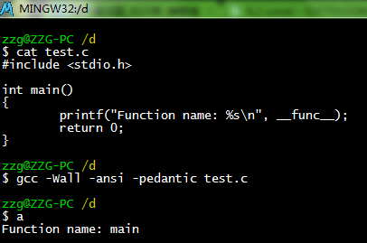

[GCC默认的标准不是ANSI C，而是GNU C90](https://www.cnblogs.com/emituofo/archive/2012/07/21/2601933.html)

我以前以为GCC默认的C标准是ANSI C，但是看了文档才知道默认标准是C90 with GNU extensions。

"extensions"有那些？看这里：http://gcc.gnu.org/onlinedocs/gcc/C-Extensions.html#C-Extensions

如果想要返璞归真，只遵循ANSI C，编译时加上-ansi选项即可（再加-pedantic选项，确保编译器使用该标准）。

加上这个选项后，你会发现好多平时无错的地方，编译时却出错。 最普遍的错误是"// 开头的单行注释"，因为它在ANSI C中是不允许的，所以整行报错。

来看一个特殊的例子吧

按理说，**func** 是C99的特性，用ANSI C标准编译为什么没报错呢？ 我也不知道