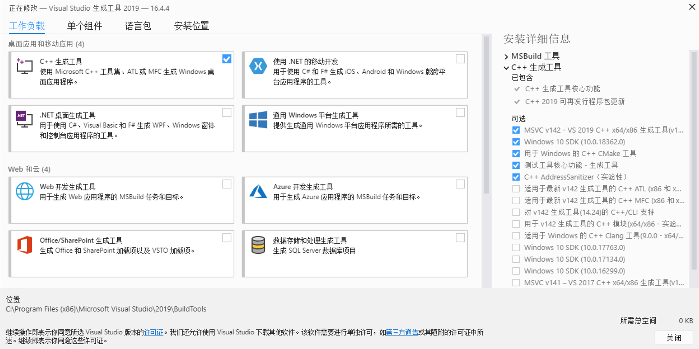

在Windows下开发 C/C++ 不使用Microsoft 的Visual Studio IDE（Community版也不要），只想使用它的命令行工具进行编译链接，参考官网：https://docs.microsoft.com/zh-cn/cpp/build/building-on-the-command-line?view=vs-2019 即可。

笔者的操作系统系统是 Windows Server 2012 R2 Datacenter

## Visual Studio 2019 生成工具

文章说："...如果只需要命令行工具集，请下载[用于 Visual Studio 的生成工具](https://visualstudio.microsoft.com/downloads/#build-tools-for-visual-studio-2019)。..."


## 安装

我现在的 vs_buildtools__2076612417.1580962803.exe，双击运行，选择“C ++ 生成工具”



## 环境设置

运行 C:\Program Files (x86)\Microsoft Visual Studio\2019\BuildTools\VC\Auxiliary\Build 目录下的环境设置命令：

> vcvars64.bat

将把cl.exe等工具所在的目录设置到PATH中，并设置两个系统环境变量LIB、INCLUDE，分别指定了系统头文件、库文件的位置。检验一下：

> echo %LIB%

结果如下：

```
C:\Program Files (x86)\Microsoft Visual Studio\2019\BuildTools\VC\Tools\MSVC\14.24.28314\lib\x64;
C:\Program Files (x86)\Windows Kits\10\lib\10.0.18362.0\ucrt\x64;
C:\Program Files (x86)\Windows Kits\10\lib\10.0.18362.0\um\x64;
C:\Program Files (x86)\Windows Kits\10\lib\10.0.18362.0\ucrt\x64;
C:\Program Files (x86)\Windows Kits\10\lib\10.0.18362.0\um\x64;
```

> echo %INCLUDE%

结果如下：

```
C:\Program Files (x86)\Microsoft Visual Studio\2019\BuildTools\VC\Tools\MSVC\14.24.28314\include;
C:\Program Files (x86)\Windows Kits\10\include\10.0.18362.0\ucrt;
C:\Program Files (x86)\Windows Kits\10\include\10.0.18362.0\shared;
C:\Program Files (x86)\Windows Kits\10\include\10.0.18362.0\um;
C:\Program Files (x86)\Windows Kits\10\include\10.0.18362.0\winrt;
C:\Program Files (x86)\Windows Kits\10\include\10.0.18362.0\cppwinrt;
C:\Program Files (x86)\Windows Kits\10\Include\10.0.18362.0\ucrt;
C:\Program Files (x86)\Windows Kits\10\Include\10.0.18362.0\shared;
C:\Program Files (x86)\Windows Kits\10\Include\10.0.18362.0\um;
C:\Program Files (x86)\Windows Kits\10\Include\10.0.18362.0\winrt;
```

其中，stdio.h 就在 C:\Program Files (x86)\Windows Kits\10\Include\10.0.18362.0\ucrt 目录。

.bat的设置仅在当前窗口有效，如果想所有有效，就手工设置LIB、INCLUDE到系统环境里去。

## 写一个C程序测试

hello.c 文件内容如下，存储为 UTF-8（without BOM）：

```
#include <stdio.h>

int main() {
    printf("%s\n", "你好，微软C");
    return 0;
}
```

使用cl.exe编译 hello.c，因为 cl.exe 已经在 PATH 里，直接运行即可：

> cl /Fehello.exe hello.c

屏幕输出：

> 你好，微软C

将例子修改如下

```
#include <stdio.h>
#include <Windows.h>

int main() {
    printf("%s\n", "你好，键盘侠"); /* 键盘侠的原名郭大侠 */
    return 0;
}
```

cl.exe 编译时提示warning：

> hello.c(1): warning C4819: 该文件包含不能在当前代码页(936)中表示的字符。请将该文件保存为 Unicode 格式以防止数据丢失

这是由于一些UTF-8中文字符导致，也会导致运行屏幕输出的中文乱码，最好的方法是增加编译如下参数：

```
cl /Fevending.exe /source-charset:utf-8 /execution-charset:utf-8 hello.c
```

编译时warning不再出现，运行hello.exe，屏幕输出：

> 你好，键盘侠