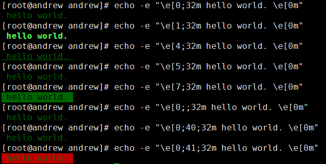

终端的字符颜色是用转义序列控制的，是文本模式下的系统显示功能。和具体的语言无关，所以C语言中的 printf/fprintf 函数也可以这样使用。

本文最重要的一句话，所有的问题都在这里，看明白了就知道怎么改变文本的显示方式了：

> \033[显示方式;前景色;背景色m

把\033换成\e是一样的：

> \e[显示方式;前景色;背景色m

## 解释：

①**颜色的转义序列是以 ESC 开头**
②**显示方式:**

0（默认值）、1（高亮）、22（非粗体）、4（下划线）、24（非下划线）、5（闪烁）、25（非闪烁）、7（反显）、27（非反显）

③**前景色:**

30（黑色）、31（红色）、32（绿色）、 33（黄色）、34（蓝色）、35（洋红）、36（青色）、37（白色）

④**背景色:**

40（黑色）、41（红色）、42（绿色）、 43（黄色）、44（蓝色）、45（洋红）、46（青色）、47（白色）

⑤**\033[0m表示默认，可以关闭前边设置的任何效果**



\033[ 的其他格式

```
\033[nA  光标上移n行  
\03[nB   光标下移n行  
\033[nC  光标右移n行  
\033[nD  光标左移n行  
\033[y;xH 设置光标位置  
\033[2J  清屏  
\033[K   清除从光标到行尾的内容  
\033[s   保存光标位置  
\033[u   恢复光标位置  
\033[?25l 隐藏光标  
\33[?25h  显示光标 
```

## 宏定义简化之。

为了人性化地在 printf 函数中进行着色输出，可以定义成一系列的宏：

```c
#define NONE                 "\e[0m"
#define BLACK                "\e[0;30m"
#define L_BLACK              "\e[1;30m"
#define RED                  "\e[0;31m"
#define L_RED                "\e[1;31m"
#define GREEN                "\e[0;32m"
#define L_GREEN              "\e[1;32m"
#define BROWN                "\e[0;33m"
#define YELLOW               "\e[1;33m"
#define BLUE                 "\e[0;34m"
#define L_BLUE               "\e[1;34m"
#define PURPLE               "\e[0;35m"
#define L_PURPLE             "\e[1;35m"
#define CYAN                 "\e[0;36m"
#define L_CYAN               "\e[1;36m"
#define GRAY                 "\e[0;37m"
#define WHITE                "\e[1;37m"

#define BOLD                 "\e[1m"
#define UNDERLINE            "\e[4m"
#define BLINK                "\e[5m"
#define REVERSE              "\e[7m"
#define HIDE                 "\e[8m"
#define CLEAR                "\e[2J"
#define CLRLINE              "\r\e[K" //or "\e[1K\r"
```