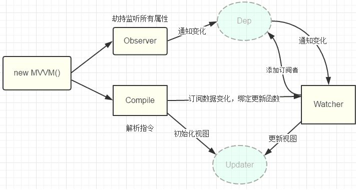

# 实现双向绑定Proxy比defineproperty优劣如何

## **前言**

**双向绑定**其实已经是一个老掉牙的问题了,只要涉及到MVVM框架就不得不谈的知识点,但它毕竟是Vue的三要素之一.

### Vue三要素

- 响应式: 例如如何监听数据变化,其中的实现方法就是我们提到的双向绑定
- 模板引擎: 如何解析模板
- 渲染: Vue如何将监听到的数据变化和解析后的HTML进行渲染

可以实现双向绑定的方法有很多,KnockoutJS基于观察者模式的双向绑定,Ember基于数据模型的双向绑定,Angular基于脏检查的双向绑定,本篇文章我们重点讲面试中常见的基于**数据劫持**的双向绑定。

常见的基于数据劫持的双向绑定有两种实现,一个是目前Vue在用的`Object.defineProperty`,另一个是ES2015中新增的`Proxy`,而Vue的作者宣称将在Vue3.0版本后加入`Proxy`从而代替`Object.defineProperty`,通过本文你也可以知道为什么Vue未来会选择`Proxy`。

> 严格来讲Proxy应该被称为『代理』而非『劫持』,不过由于作用有很多相似之处,我们在下文中就不再做区分,统一叫『劫持』。

我们可以通过下图清楚看到以上两种方法在**双向绑定**体系中的关系. 

> 基于数据劫持的当然还有已经凉透的`Object.observe`方法,已被废弃。 **提前声明:** 我们没有对传入的参数进行及时判断而规避错误,仅仅对核心方法进行了实现.

------

## 文章目录

1. 基于数据劫持实现的双向绑定的特点
2. 基于Object.defineProperty双向绑定的特点
3. 基于Proxy双向绑定的特点

------

### 1.基于数据劫持实现的双向绑定的特点

#### 1.1 什么是数据劫持

数据劫持比较好理解,通常我们利用`Object.defineProperty`劫持对象的访问器,在属性值发生变化时我们可以获取变化,从而进行进一步操作。

```js
// 这是将要被劫持的对象
const data = {
  name: '',
};

function say(name) {
  if (name === '古天乐') {
    console.log('给大家推荐一款超好玩的游戏');
  } else if (name === '渣渣辉') {
    console.log('戏我演过很多,可游戏我只玩贪玩懒月');
  } else {
    console.log('来做我的兄弟');
  }
}

// 遍历对象,对其属性值进行劫持
Object.keys(data).forEach(function(key) {
  Object.defineProperty(data, key, {
    enumerable: true,
    configurable: true,
    get: function() {
      console.log('get');
    },
    set: function(newVal) {
      // 当属性值发生变化时我们可以进行额外操作
      console.log(`大家好,我系${newVal}`);
      say(newVal);
    },
  });
});

data.name = '渣渣辉';
//大家好,我系渣渣辉
//戏我演过很多,可游戏我只玩贪玩懒月
```

#### 1.2 数据劫持的优势

目前业界分为两个大的流派,一个是以React为首的单向数据绑定,另一个是以Angular、Vue为主的双向数据绑定。

> 其实三大框架都是既可以双向绑定也可以单向绑定,比如React可以手动绑定onChange和value实现双向绑定,也可以调用一些双向绑定库,Vue也加入了props这种单向流的api,不过都并非主流卖点。

单向或者双向的优劣不在我们的讨论范围,我们需要讨论一下对比其他双向绑定的实现方法,数据劫持的优势所在。

1. 无需显示调用: 例如Vue运用数据劫持+发布订阅,直接可以通知变化并驱动视图,上面的例子也是比较简单的实现`data.name = '渣渣辉'`后直接触发变更,而比如Angular的脏检测则需要显示调用`markForCheck`(可以用zone.js避免显示调用,不展开),react需要显示调用`setState`。
2. 可精确得知变化数据：还是上面的小例子，我们劫持了属性的setter,当属性值改变,我们可以精确获知变化的内容`newVal`,因此在这部分不需要额外的diff操作,否则我们只知道数据发生了变化而不知道具体哪些数据变化了,这个时候需要大量diff来找出变化值,这是额外性能损耗。

#### 1.3 基于数据劫持双向绑定的实现思路

**数据劫持**是双向绑定各种方案中比较流行的一种,最著名的实现就是Vue。

基于数据劫持的双向绑定离不开`Proxy`与`Object.defineProperty`等方法对对象/对象属性的"劫持",我们要实现一个完整的双向绑定需要以下几个要点。

1. 利用`Proxy`或`Object.defineProperty`生成的Observer针对对象/对象的属性进行"劫持",在属性发生变化后通知订阅者
2. 解析器Compile解析模板中的`Directive`(指令)，收集指令所依赖的方法和数据,等待数据变化然后进行渲染
3. Watcher属于Observer和Compile桥梁,它将接收到的Observer产生的数据变化,并根据Compile提供的指令进行视图渲染,使得数据变化促使视图变化



> 我们看到，虽然Vue运用了数据劫持，但是依然离不开**发布订阅**的模式，之所以在系列2做了[Event Bus的实现](https://juejin.im/post/5ac2fb886fb9a028b86e328c),就是因为我们不管在学习一些框架的原理还是一些流行库（例如Redux、Vuex）,基本上都离不开**发布订阅**模式,而*Event*模块则是此模式的经典实现,所以如果不熟悉**发布订阅**模式,建议读一下系列2的文章。

------

### 2.基于Object.defineProperty双向绑定的特点

关于`Object.defineProperty`的文章在网络上已经汗牛充栋,我们不想花过多时间在`Object.defineProperty`上面,本节我们主要讲解`Object.defineProperty`的特点,方便接下来与`Proxy`进行对比。

> 对`Object.defineProperty`还不了解的请阅读[文档](https://developer.mozilla.org/zh-CN/docs/Web/JavaScript/Reference/Global_Objects/Object/defineProperty)

两年前就有人写过基于`Object.defineProperty`实现的[文章](https://segmentfault.com/a/1190000006599500),想深入理解`Object.defineProperty`实现的推荐阅读,本文也做了相关参考。

> 上面我们推荐的文章为比较完整的实现(400行代码),我们在本节只提供一个极简版(20行)和一个简化版(150行)的实现,读者可以循序渐进地阅读。

#### 2.1 极简版的双向绑定

我们都知道,`Object.defineProperty`的作用就是劫持一个对象的属性,通常我们对属性的`getter`和`setter`方法进行劫持,在对象的属性发生变化时进行特定的操作。

我们就对对象`obj`的`text`属性进行劫持,在获取此属性的值时打印`'get val'`,在更改属性值的时候对DOM进行操作,这就是一个极简的双向绑定。

```js
const obj = {};
Object.defineProperty(obj, 'text', {
  get: function() {
    console.log('get val');　
  },
  set: function(newVal) {
    console.log('set val:' + newVal);
    document.getElementById('input').value = newVal;
    document.getElementById('span').innerHTML = newVal;
  }
});

const input = document.getElementById('input');
input.addEventListener('keyup', function(e){
  obj.text = e.target.value;
})
```

在线示例 [极简版双向绑定](https://codepen.io/xiaomuzhu/pen/gzmEab/) by Iwobi ([@xiaomuzhu](https://codepen.io/xiaomuzhu)) on [CodePen](https://codepen.io/).

<script async src="https://static.codepen.io/assets/embed/ei.js"></script>

#### 2.2 升级改造

我们很快会发现，这个所谓的*双向绑定*貌似并没有什么乱用。。。

原因如下:

1. 我们只监听了一个属性,一个对象不可能只有一个属性,我们需要对对象每个属性进行监听。
2. 违反开放封闭原则,我们如果了解[开放封闭原则](https://zh.wikipedia.org/zh-hans/开闭原则)的话,上述代码是明显违反此原则,我们每次修改都需要进入方法内部,这是需要坚决杜绝的。
3. 代码耦合严重,我们的数据、方法和DOM都是耦合在一起的，就是传说中的面条代码。

那么如何解决上述问题？

Vue的操作就是加入了**发布订阅**模式，结合`Object.defineProperty`的劫持能力，实现了可用性很高的双向绑定。

首先，我们以**发布订阅**的角度看我们第一部分写的那一坨代码,会发现它的*监听*、*发布*和*订阅*都是写在一起的,我们首先要做的就是解耦。

我们先实现一个订阅发布中心，即消息管理员（Dep）,它负责储存订阅者和消息的分发,不管是订阅者还是发布者都需要依赖于它。

```js
  let uid = 0;
  // 用于储存订阅者并发布消息
  class Dep {
    constructor() {
      // 设置id,用于区分新Watcher和只改变属性值后新产生的Watcher
      this.id = uid++;
      // 储存订阅者的数组
      this.subs = [];
    }
    // 触发target上的Watcher中的addDep方法,参数为dep的实例本身
    depend() {
      Dep.target.addDep(this);
    }
    // 添加订阅者
    addSub(sub) {
      this.subs.push(sub);
    }
    notify() {
      // 通知所有的订阅者(Watcher)，触发订阅者的相应逻辑处理
      this.subs.forEach(sub => sub.update());
    }
  }
  // 为Dep类设置一个静态属性,默认为null,工作时指向当前的Watcher
  Dep.target = null;
```

现在我们需要实现监听者(Observer),用于监听属性值的变化。

```js
// 监听者,监听对象属性值的变化
  class Observer {
    constructor(value) {
      this.value = value;
      this.walk(value);
    }
    // 遍历属性值并监听
    walk(value) {
      Object.keys(value).forEach(key => this.convert(key, value[key]));
    }
    // 执行监听的具体方法
    convert(key, val) {
      defineReactive(this.value, key, val);
    }
  }

  function defineReactive(obj, key, val) {
    const dep = new Dep();
    // 给当前属性的值添加监听
    let chlidOb = observe(val);
    Object.defineProperty(obj, key, {
      enumerable: true,
      configurable: true,
      get: () => {
        // 如果Dep类存在target属性，将其添加到dep实例的subs数组中
        // target指向一个Watcher实例，每个Watcher都是一个订阅者
        // Watcher实例在实例化过程中，会读取data中的某个属性，从而触发当前get方法
        if (Dep.target) {
          dep.depend();
        }
        return val;
      },
      set: newVal => {
        if (val === newVal) return;
        val = newVal;
        // 对新值进行监听
        chlidOb = observe(newVal);
        // 通知所有订阅者，数值被改变了
        dep.notify();
      },
    });
  }

  function observe(value) {
    // 当值不存在，或者不是复杂数据类型时，不再需要继续深入监听
    if (!value || typeof value !== 'object') {
      return;
    }
    return new Observer(value);
  }
```

那么接下来就简单了,我们需要实现一个订阅者(Watcher)。

```js
  class Watcher {
    constructor(vm, expOrFn, cb) {
      this.depIds = {}; // hash储存订阅者的id,避免重复的订阅者
      this.vm = vm; // 被订阅的数据一定来自于当前Vue实例
      this.cb = cb; // 当数据更新时想要做的事情
      this.expOrFn = expOrFn; // 被订阅的数据
      this.val = this.get(); // 维护更新之前的数据
    }
    // 对外暴露的接口，用于在订阅的数据被更新时，由订阅者管理员(Dep)调用
    update() {
      this.run();
    }
    addDep(dep) {
      // 如果在depIds的hash中没有当前的id,可以判断是新Watcher,因此可以添加到dep的数组中储存
      // 此判断是避免同id的Watcher被多次储存
      if (!this.depIds.hasOwnProperty(dep.id)) {
        dep.addSub(this);
        this.depIds[dep.id] = dep;
      }
    }
    run() {
      const val = this.get();
      console.log(val);
      if (val !== this.val) {
        this.val = val;
        this.cb.call(this.vm, val);
      }
    }
    get() {
      // 当前订阅者(Watcher)读取被订阅数据的最新更新后的值时，通知订阅者管理员收集当前订阅者
      Dep.target = this;
      const val = this.vm._data[this.expOrFn];
      // 置空，用于下一个Watcher使用
      Dep.target = null;
      return val;
    }
  }
```

那么我们最后完成Vue,将上述方法挂载在Vue上。

```js
  class Vue {
    constructor(options = {}) {
      // 简化了$options的处理
      this.$options = options;
      // 简化了对data的处理
      let data = (this._data = this.$options.data);
      // 将所有data最外层属性代理到Vue实例上
      Object.keys(data).forEach(key => this._proxy(key));
      // 监听数据
      observe(data);
    }
    // 对外暴露调用订阅者的接口，内部主要在指令中使用订阅者
    $watch(expOrFn, cb) {
      new Watcher(this, expOrFn, cb);
    }
    _proxy(key) {
      Object.defineProperty(this, key, {
        configurable: true,
        enumerable: true,
        get: () => this._data[key],
        set: val => {
          this._data[key] = val;
        },
      });
    }
  }
```

看下效果:


在线示例 [双向绑定实现---无漏洞版](https://codepen.io/xiaomuzhu/pen/jxBRgj/) by Iwobi ([@xiaomuzhu](https://codepen.io/xiaomuzhu)) on [CodePen](https://codepen.io/).

<script async src="https://static.codepen.io/assets/embed/ei.js"></script>

至此,一个简单的双向绑定算是被我们实现了。

#### 2.3 Object.defineProperty的缺陷

其实我们升级版的双向绑定依然存在漏洞,比如我们将属性值改为数组。

```js
let demo = new Vue({
  data: {
    list: [1],
  },
});

const list = document.getElementById('list');
const btn = document.getElementById('btn');

btn.addEventListener('click', function() {
  demo.list.push(1);
});


const render = arr => {
  const fragment = document.createDocumentFragment();
  for (let i = 0; i < arr.length; i++) {
    const li = document.createElement('li');
    li.textContent = arr[i];
    fragment.appendChild(li);
  }
  list.appendChild(fragment);
};

// 监听数组,每次数组变化则触发渲染函数,然而...无法监听
demo.$watch('list', list => render(list));

setTimeout(
  function() {
    alert(demo.list);
  },
  5000,
);
```

在线示例 [双向绑定-数组漏洞](https://codepen.io/xiaomuzhu/pen/NMjKxV/) by Iwobi ([@xiaomuzhu](https://codepen.io/xiaomuzhu)) on [CodePen](https://codepen.io/).

<script async src="https://static.codepen.io/assets/embed/ei.js"></script>

是的,`Object.defineProperty`的第一个缺陷,无法监听数组变化。 然而[Vue的文档](https://cn.vuejs.org/v2/guide/list.html#数组更新检测)提到了Vue是可以检测到数组变化的，但是只有以下八种方法,`vm.items[indexOfItem] = newValue`这种是无法检测的。

```js
push()
pop()
shift()
unshift()
splice()
sort()
reverse()
```

其实作者在这里用了一些奇技淫巧,把无法监听数组的情况hack掉了,以下是方法示例。

```js
const aryMethods = ['push', 'pop', 'shift', 'unshift', 'splice', 'sort', 'reverse'];
const arrayAugmentations = [];

aryMethods.forEach((method)=> {

    // 这里是原生Array的原型方法
    let original = Array.prototype[method];

   // 将push, pop等封装好的方法定义在对象arrayAugmentations的属性上
   // 注意：是属性而非原型属性
    arrayAugmentations[method] = function () {
        console.log('我被改变啦!');

        // 调用对应的原生方法并返回结果
        return original.apply(this, arguments);
    };

});

let list = ['a', 'b', 'c'];
// 将我们要监听的数组的原型指针指向上面定义的空数组对象
// 别忘了这个空数组的属性上定义了我们封装好的push等方法
list.__proto__ = arrayAugmentations;
list.push('d');  // 我被改变啦！ 4

// 这里的list2没有被重新定义原型指针，所以就正常输出
let list2 = ['a', 'b', 'c'];
list2.push('d');  // 4
```

由于只针对了八种方法进行了hack,所以其他数组的属性也是检测不到的,其中的坑很多,可以阅读上面提到的文档。

我们应该注意到在上文中的实现里,我们多次用遍历方法遍历对象的属性，这就引出了`Object.defineProperty`的第二个缺陷,只能劫持对象的属性,因此我们需要对每个对象的每个属性进行遍历，如果属性值也是对象那么需要深度遍历,显然能劫持一个完整的对象是更好的选择。

```js
Object.keys(value).forEach(key => this.convert(key, value[key]));
```

### 3.Proxy实现的双向绑定的特点

Proxy在ES2015规范中被正式发布,它在目标对象之前架设一层“拦截”，外界对该对象的访问，都必须先通过这层拦截，因此提供了一种机制，可以对外界的访问进行过滤和改写,我们可以这样认为,Proxy是`Object.defineProperty`的全方位加强版,具体的文档可以查看[此处](http://es6.ruanyifeng.com/#docs/proxy);

#### 3.1 Proxy可以直接监听对象而非属性

我们还是以上文中用`Object.defineProperty`实现的极简版双向绑定为例,用Proxy进行改写。

```js
const input = document.getElementById('input');
const p = document.getElementById('p');
const obj = {};

const newObj = new Proxy(obj, {
  get: function(target, key, receiver) {
    console.log(`getting ${key}!`);
    return Reflect.get(target, key, receiver);
  },
  set: function(target, key, value, receiver) {
    console.log(target, key, value, receiver);
    if (key === 'text') {
      input.value = value;
      p.innerHTML = value;
    }
    return Reflect.set(target, key, value, receiver);
  },
});

input.addEventListener('keyup', function(e) {
  newObj.text = e.target.value;
});
```

在线示例 [Proxy版](https://codepen.io/xiaomuzhu/pen/KRmwRE/) by Iwobi ([@xiaomuzhu](https://codepen.io/xiaomuzhu)) on [CodePen](https://codepen.io/).

<script async src="https://static.codepen.io/assets/embed/ei.js"></script>

我们可以看到,Proxy直接可以劫持整个对象,并返回一个新对象,不管是操作便利程度还是底层功能上都远强于`Object.defineProperty`。

#### 3.2 Proxy可以直接监听数组的变化

当我们对数组进行操作(push、shift、splice等)时，会触发对应的方法名称和*length*的变化，我们可以借此进行操作,以上文中`Object.defineProperty`无法生效的列表渲染为例。

```js
const list = document.getElementById('list');
const btn = document.getElementById('btn');

// 渲染列表
const Render = {
  // 初始化
  init: function(arr) {
    const fragment = document.createDocumentFragment();
    for (let i = 0; i < arr.length; i++) {
      const li = document.createElement('li');
      li.textContent = arr[i];
      fragment.appendChild(li);
    }
    list.appendChild(fragment);
  },
  // 我们只考虑了增加的情况,仅作为示例
  change: function(val) {
    const li = document.createElement('li');
    li.textContent = val;
    list.appendChild(li);
  },
};

// 初始数组
const arr = [1, 2, 3, 4];

// 监听数组
const newArr = new Proxy(arr, {
  get: function(target, key, receiver) {
    console.log(key);
    return Reflect.get(target, key, receiver);
  },
  set: function(target, key, value, receiver) {
    console.log(target, key, value, receiver);
    if (key !== 'length') {
      Render.change(value);
    }
    return Reflect.set(target, key, value, receiver);
  },
});

// 初始化
window.onload = function() {
    Render.init(arr);
}

// push数字
btn.addEventListener('click', function() {
  newArr.push(6);
});
```

在线示例 [Proxy列表渲染](https://codepen.io/xiaomuzhu/pen/zjwGoN/) by Iwobi ([@xiaomuzhu](https://codepen.io/xiaomuzhu)) on [CodePen](https://codepen.io/).

```html
<script async src="https://static.codepen.io/assets/embed/ei.js"></script>
```

很显然,Proxy不需要那么多hack（即使hack也无法完美实现监听）就可以无压力监听数组的变化,我们都知道,标准永远优先于hack。

#### 3.3 Proxy的其他优势

Proxy有多达13种拦截方法,不限于apply、ownKeys、deleteProperty、has等等是`Object.defineProperty`不具备的。

Proxy返回的是一个新对象,我们可以只操作新的对象达到目的,而`Object.defineProperty`只能遍历对象属性直接修改。

Proxy作为新标准将受到浏览器厂商重点持续的性能优化，也就是传说中的新标准的性能红利。

当然,Proxy的劣势就是兼容性问题,而且无法用polyfill磨平,因此Vue的作者才声明需要等到下个大版本(3.0)才能用Proxy重写。