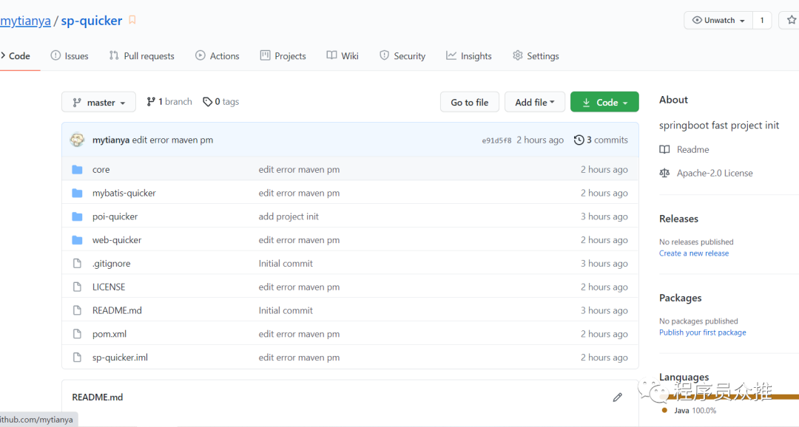
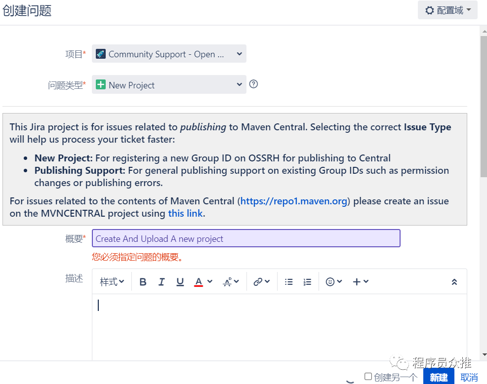
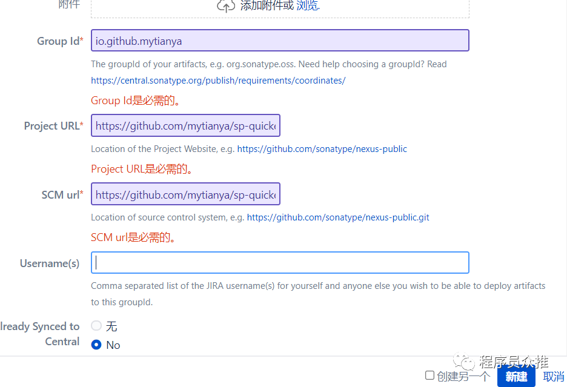
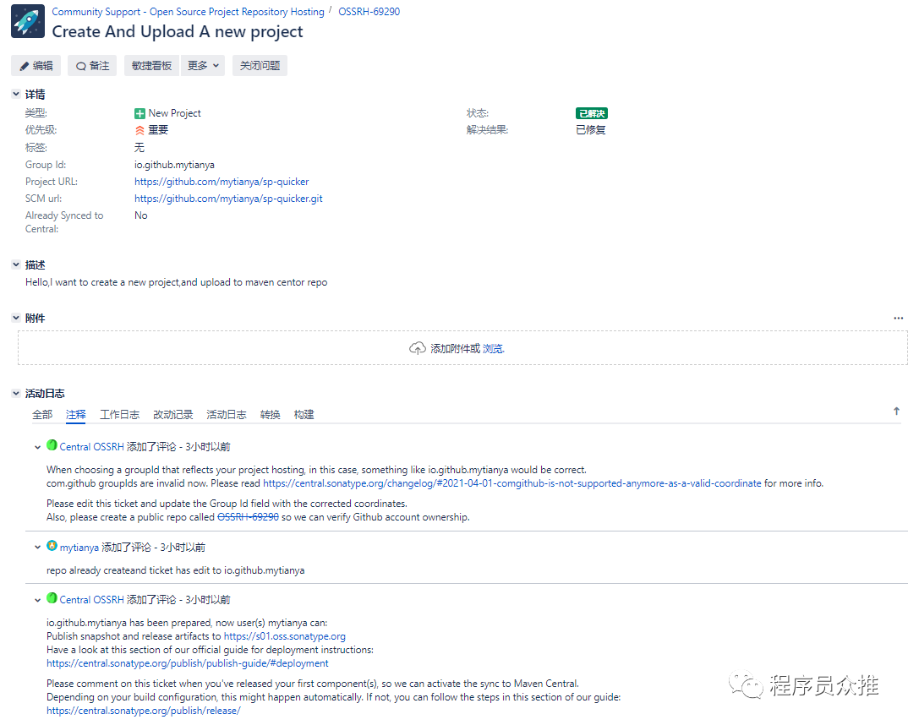

## 上传思路整个过程

- Github创建源码仓库，存放库源码
- 注册中心仓库sonatype账号,申请上传Jar包权限
- 配置项目上传相关Maven配置

## GitHub创建源码仓库

  在自己的GitHub创建一个项目仓库，上传Jar库的源码。我的项目地址是:https://github.com/mytianya/sp-quicker

image-20210523153311162

## 注册sonatype账号，申请上传Jar权限

  打开https://issues.sonatype.org/secure/Signup!default.jspa,注册sonatype账号

image-20210523153437257

  然后新建一个问题，注意选择项目类型与问题类型

image-20210523154851300

  其中GroupId填写io.github.你的github名称，注意不能填写**com.github**，不然后面的工单会报错，projectUrl这里我填写的是我项目的地址https://github.com/mytianya/sp-quicker，SCM url为：https://github.com/mytianya/sp-quicker.git

  这里按照管理员要求在github创建仓库验证自己是仓库的所有者跟第一次提交jar包后给他评论回复。这里注意后面不能提交SNAPSHOT的包，必须上传RELEASE的包。官方有相关教程的文档提供，**大家注意参考官方的教程有许多网上的教程已经不符合官方的规定了。**

image-20210523155500574

## 配置上传Jar的密钥

  在上传jar的过程中需要上传的密钥,这里是采用GPG加密，笔者使用的Ubuntu系统自带，windows安装gpg4win即可使用该命令。

  使用gpg --full命令，接下来选择加密类型(1)RSA，密码长度选择2048，然后再选择0密钥永不过期，后面输入姓名、电子邮箱跟密码。最后生成一个公钥。

推送公钥到公网的服务器。

```
gpg --keyserver hkp://pool.sks-keyservers.net --send-keys 生成的公钥
gpg --keyserver hkp://keyserver.ubuntu.com:11371 --send-keys 生成的公钥
```

查看公钥是否推送成功

```
gpg --keyserver hkp://pool.sks-keyservers.net --recv-keys 生成的公钥
gpg --keyserver hkp://keyserver.ubuntu.com:11371 --recv-keys 生成的公钥
```

## 项目配置中心仓库上传配置

这部分配置比较多，主要分为下面几个配置

- 在Maven settings.xml中配置中心仓库上传的用户与密码
- 在项目的pom.xml配置相关插件，上传仓库地址、项目相关信息。

### 在Maven settings.xml中的配置

```
<servers>
    <server>
        <id>sonatype-releases</id>
        <username>注册的账号</username>
        <password>注册的密码</password>
    </server>
    <server>
        <id>sonatype-snaphosts</id>
        <username>注册的账号</username>
        <password>注册的密码</</password>
    </server>
</servers>
```

### 在项目POM中的配置

```
<?xml version="1.0" encoding="UTF-8"?>
<project xmlns="http://maven.apache.org/POM/4.0.0"
         xmlns:xsi="http://www.w3.org/2001/XMLSchema-instance"
         xsi:schemaLocation="http://maven.apache.org/POM/4.0.0 http://maven.apache.org/xsd/maven-4.0.0.xsd">
    <modelVersion>4.0.0</modelVersion>
    <groupId>io.github.mytianya</groupId>
    <artifactId>sp-quicker</artifactId>
    <version>1.0</version>
    <description>A springboot quicker starter framework</description>
    <modules>
        <module>core</module>
        <module>web-quicker</module>
        <module>mybatis-quicker</module>
    </modules>
    <packaging>pom</packaging>
    <parent>
        <artifactId>spring-boot-starter-parent</artifactId>
        <groupId>org.springframework.boot</groupId>
        <version>2.4.1</version>
    </parent>
    <name>mytianya</name>
    <url>https://github.com/mytianya/sp-quicker.git</url>
    <inceptionYear>2021</inceptionYear>
    <licenses>
        <license>
            <name>Apache License, Version 2.0</name>
            <url>http://www.apache.org/licenses/LICENSE-2.0.txt</url>
            <distribution>repo</distribution>
        </license>
    </licenses>
    <issueManagement>
        <system>GitHub Issues</system>
        <url>https://github.com/mytianya/sp-quicker/issues</url>
    </issueManagement>
    <scm>
        <connection>scm:git:https://github.com/mytianya/sp-quicker.git</connection>
        <developerConnection>scm:git:git@github.com:mytianya/sp-quicker.git</developerConnection>
        <url>https://github.com/sp-quicker/sp-quicker</url>
    </scm>
    <developers>
        <developer>
            <name>mytianya</name>
            <email>dsyslove@163.com</email>
            <url>https://www.codehome.vip</url>
        </developer>
    </developers>
    <properties>
        <project.build.sourceEncoding>UTF-8</project.build.sourceEncoding>
        <project.reporting.outputEncoding>UTF-8</project.reporting.outputEncoding>
        <maven.compiler.source>8</maven.compiler.source>
        <maven.compiler.target>8</maven.compiler.target>
        <java.version>1.8</java.version>
    </properties>
    <profiles>
        <profile>
            <id>sonatype-release</id>
            <distributionManagement>
                <snapshotRepository>
                    <id>sonatype-snapshots</id>
                    <url>https://s01.oss.sonatype.org/content/repositories/snapshots</url>
                </snapshotRepository>
                <repository>
                    <id>sonatype-release</id>
                    <url>https://s01.oss.sonatype.org/service/local/staging/deploy/maven2/</url>
                </repository>
            </distributionManagement>
        </profile>
    </profiles>
    <build>
        <resources>
            <resource>
                <directory>src/main/java</directory>
                <includes>
                    <include>**/*.properties</include>
                    <include>**/*.xml</include>
                    <include>**/*.html</include>
                    <include>**/*.tld</include>
                    <include>**/*.ttf</include>
                    <include>**/spring.factories</include>
                </includes>
                <filtering>false</filtering>
            </resource>
        </resources>
        <plugins>
            <plugin>
                <groupId>org.apache.maven.plugins</groupId>
                <artifactId>maven-compiler-plugin</artifactId>
                <version>3.8.1</version>
                <configuration>
                    <source>1.8</source>
                    <target>1.8</target>
                </configuration>
            </plugin>
            <plugin>
                <groupId>org.apache.maven.plugins</groupId>
                <artifactId>maven-source-plugin</artifactId>
                <version>3.1.0</version>
                <executions>
                    <execution>
                        <id>attach-sources</id>
                        <goals>
                            <goal>jar</goal>
                        </goals>
                    </execution>
                </executions>
            </plugin>
            <!-- Javadoc -->
            <plugin>
                <groupId>org.apache.maven.plugins</groupId>
                <artifactId>maven-javadoc-plugin</artifactId>
                <version>3.1.1</version>
                <configuration>
                    <charset>UTF-8</charset>
                    <encoding>UTF-8</encoding>
                    <docencoding>UTF-8</docencoding>
                </configuration>
                <executions>
                    <execution>
                        <id>attach-javadocs</id>
                        <goals>
                            <goal>jar</goal>
                        </goals>
                    </execution>
                </executions>
            </plugin>
            <!-- GPG -->
            <plugin>
                <groupId>org.apache.maven.plugins</groupId>
                <artifactId>maven-gpg-plugin</artifactId>
                <version>1.6</version>
                <executions>
                    <execution>
                        <phase>verify</phase>
                        <goals>
                            <goal>sign</goal>
                        </goals>
                    </execution>
                </executions>
            </plugin>
            <plugin>
                <groupId>org.sonatype.plugins</groupId>
                <artifactId>nexus-staging-maven-plugin</artifactId>
                <version>1.6.7</version>
                <extensions>true</extensions>
                <configuration>
                    <serverId>sonatype-release</serverId>
                    <nexusUrl>https://s01.oss.sonatype.org/</nexusUrl>
                    <autoReleaseAfterClose>true</autoReleaseAfterClose>
                </configuration>
            </plugin>
        </plugins>
    </build>
</project>
```

## 最后一步

  上面的配置都配置好了以后，就可以执行maven deploy的命令上传到对应的中央仓库，并且在jira的issue下面安装要求回复管理员，我已第一次上传项目Jar，顺利的话10分钟后大功告成。即可以在maven的中央仓库找到自己的项目Jar包https://repo.maven.apache.org/maven2/io/github/mytianya/。


同理，发布 AAR，请参考：https://zhuanlan.zhihu.com/p/22351830?from_voters_page=true