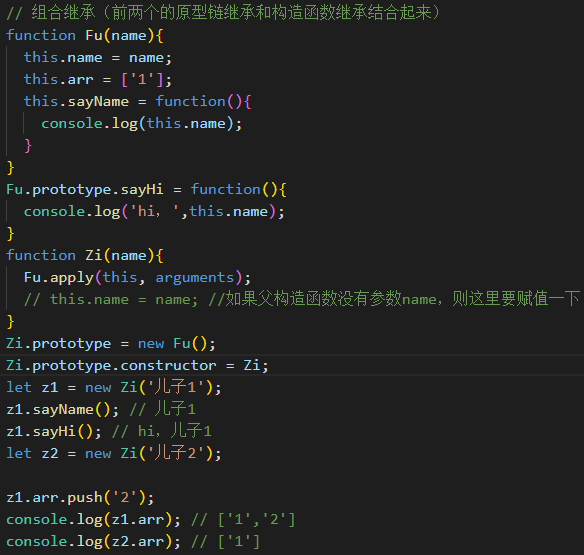
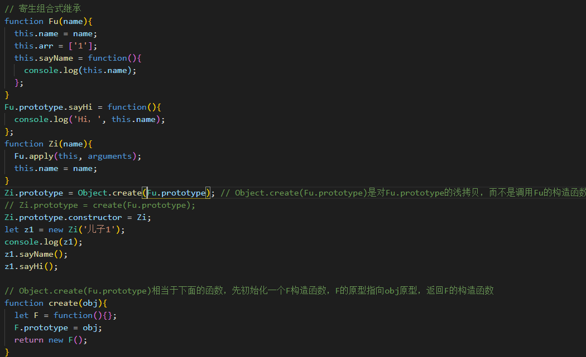

# 实现伪类继承的几种方式以及他们的优缺点

要搞懂JS继承，我们首先要理解原型链：每一个实例对象都有一个__proto__属性（隐式原型），在js内部用来查找原型链；每一个构造函数都有prototype属性（显示原型），用来显示修改对象的原型，`实例.__proto__=构造函数.prototype=原型`。原型链的特点就是：通过实例.__proto__查找原型上的属性，从子类一直向上查找对象原型的属性，继而形成一个查找链即原型链。 

## 1）原型链继承

　　我们使用原型继承时，主要利用sub.prototype=new super，这样连通了子类-子类原型-父类。

　　核心：将父类的实例作为子类的原型。

```js
//父类，带属性  
function Super(){  
    this.flag = true;  
}  
//为了提高复用性，方法绑定在父类原型属性上  
Super.prototype.getFlag = function(){  
    return this.flag;  
}  
//来个子类  
function Sub(){  
    this.subFlag = false;  
}  
//实现继承  
Sub.prototype = new Super;  
//给子类添加子类特有的方法，注意顺序要在继承之后  
Sub.prototype.getSubFlag = function(){  
    return this.subFlag;  
}  
//构造实例  
var es5 = new Sub;  
```

　　特点：

　　1. 非常纯粹的继承关系，实例是子类的实例，也是父类的实例
　　1. 父类新增原型方法/原型属性，子类都能访问到

　　缺点：

　　来自原型对象的引用属性是所有实例共享的，即属性没有私有化，原型上属性的改变会作用到所有的实例上。

## 2）构造函数继承：

　　在构造子类构造函数时内部使用call或apply来调用父类的构造函数

　　核心：使用父类的的构造函数来增强子类实例，等于是复制父类的实例属性给子类（没用到原型）

```js
function Super(){  
    this.flag = true;  
}  
function Sub(){  
    Super.call(this)  //如果父类可以需要接收参数，这里也可以直接传递  
}  
var obj = new Sub();  
obj.flag = flase;  
var obj_2 = new Sub();  
console.log(obj_2.flag)  //依然是true，不会相互影响  
```

　　优缺点：实现了属性的私有化，但是子类无法访问父类原型上的属性。

　　特点：
　　1. 解决了1中，子类实例共享父类引用属性的问题
   2.  创建子类实例时，可以向父类传递参数
   3. 可以实现多继承（call多个父类对象）

   缺点：
   1. 实例并不是父类的实例，只是子类的实例
   2. 只能继承父类的实例属性和方法，不能继承原型属性/方法
   3. 无法实现函数复用，每个子类都有父类实例函数的副本，影响性能

## 3）组合继承

利用构造函数和原型链的方法，可以比较完美的实现继承

```js
function Super(){  
    this.flag = true;  
}  
Super.prototype.getFlag = function(){  
    return this.flag;     // 继承方法  
}  
function Sub(){  
    this.subFlag = flase  
    Super.call(this)    // 继承属性  
}  
Sub.prototype = new Super;  
var obj = new Sub();  
// Sub.prototype = new Super; 会导致Sub.prototype的constructor指向Super;
// 然而constructor的定义是要指向原型属性对应的构造函数的，Sub.prototype是Sub构造函数的原型，
// 所以应该添加一句纠正：Sub.prototype.constructor = Sub;
Sub.prototype.constructor = Sub;  // 修复构造函数指向
Super.prototype.getSubFlag = function(){  
    return this.flag;  
}  
```


特点：
1. 弥补了方式2的缺陷，可以继承实例属性/方法，也可以继承原型属性/方法
2. 既是子类的实例，也是父类的实例
3. 不存在引用属性共享问题
4. 可传参
5. 函数可复用

缺点：
1. 调用了两次父类构造函数，生成了两份实例（子类实例将子类原型上的那份屏蔽了）

## 4）寄生继承

核心：通过寄生方式，砍掉父类的实例属性，这样，在调用两次父类的构造的时候，就不会初始化两次实例方法/属性，避免的组合继承的缺点

* example1

```js
function Cat(name){
  Animal.call(this);
  this.name = name || 'Tom';
}
(function(){
  // 创建一个没有实例方法的类
  var Super = function(){};
  Super.prototype = Animal.prototype;
  //将实例作为子类的原型
  Cat.prototype = new Super();
})();
var cat = new Cat();
console.log(cat.name);
console.log(cat.sleep());
console.log(cat instanceof Animal); // true
console.log(cat instanceof Cat); //true
Cat.prototype.constructor = Cat; // 需要修复下构造函数
```

* example2

 

　　特点：使用到了Object.create(Fu.prototype)实现原型链的浅拷贝
　　优点：解决了原型链继承和构造函数继承的缺点