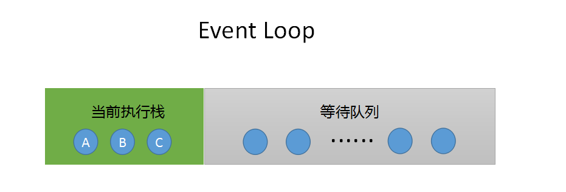
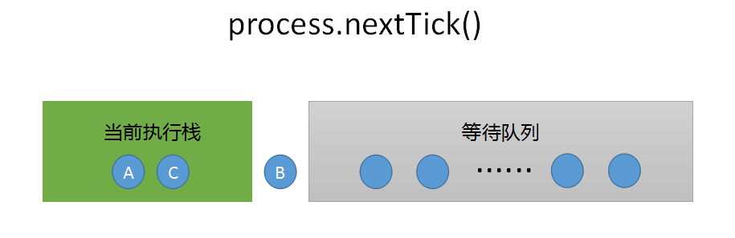
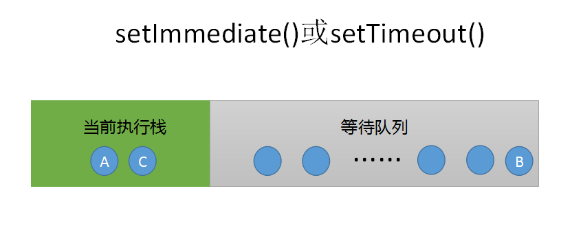

node.js中的非IO的异步API提供了四种方法，分别为setTimeOut(),setInterval(),setImmediate()以及process.nextTick()，四种方法实现原理相似，但达到的效果略有区别：

**本文假设你已经基本理解 Node.js 的事件循环Event Loop**

## I. setTimeout(),setInterval(),setImmediate()以及process.nextTick()

- setTimeout(), setInterval(), setImmediate() 是 MacroTask，process.nextTick() 是微任务，所以，process.nextTick() 总是先于 setTimeout(), setInterval(), setImmediate() 执行。
- setTimeOut(), setInterval(), 区别仅仅是执行频次差异，其他没有区别，所以下面就仅提及setTimeout

而setImmediate()与之十分相似，也表示主线程执行完成后立即执行。那么他们之间的区别是什么呢？看如下代码：

```
setTimeout(function(){
    console.log("setTimeout");
},0);
 
setImmediate(function(){
    console.log("setImmediate");
})
```

两者都代表主线程完成后立即执行，其执行结果是不确定的，可能是setTimeout回调函数执行结果在前，也可能是setImmediate回调函数执行结果在前，但setTimeout回调函数执行结果在前的概率更大些，这是因为他们采用的观察者不同，setTimeout采用的是类似IO观察者，setImmediate采用的是check观察者，而process.nextTick()采用的是idle观察者。

## II. 三种观察者优先级顺序：idle观察者 > io观察者 > check观察者

process.nextTick()与setImmediate()和setTimeout()的区别如下：

### 1、原始代码（无异步的情况）：

```
A();
B();
C();
```

它的执行顺序即代码顺序：



### 2、process.nextTick() 执行 B 的效果，代码如下：

```
A();
process.nextTick(B);
C();
```

它的执行顺序如下：



### 3、setImmediate()或者setTimeout()执行 B 效果，代码如下：

```
A();
setImmediate(B); // 或者setTimeout(B,0);
C();
```

它的执行顺序如下：



## III. 结论

- process.nextTick()，效率最高，消费资源小，但会阻塞CPU的后续调用；
- setTimeout()，精确度不高，可能有延迟执行的情况发生，且因为动用了红黑树，所以消耗资源大；
- setImmediate()，消耗的资源小，也不会造成阻塞，但效率也是最低的。