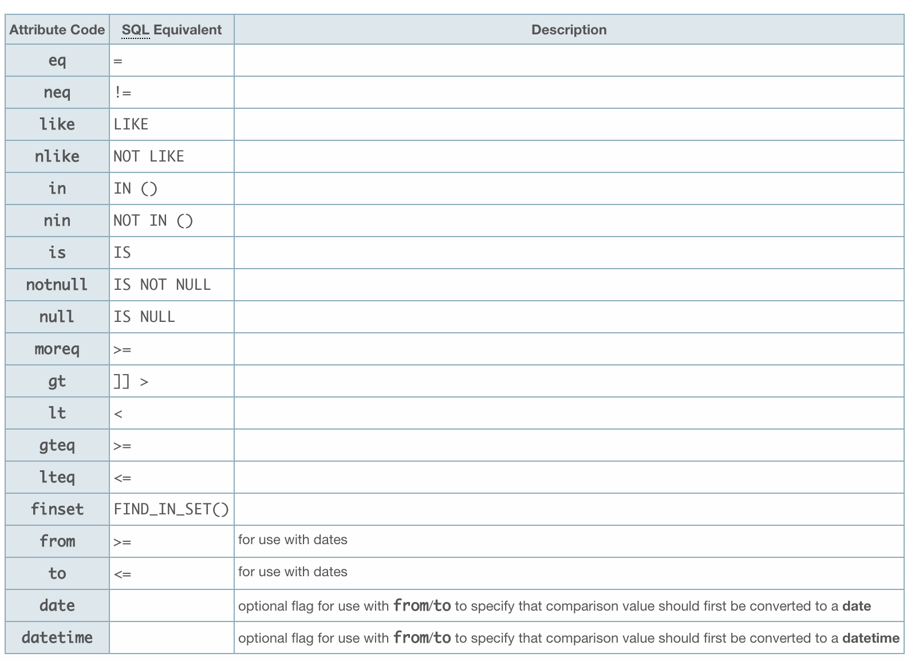

```
\Magento\Data\Collection\Db
     .                    .
    /|\                  /|\
     |                    |
     |              \Magento\Core\Model\Resource\Db\Collection\AbstractCollection
\Magento\Eav\Model\Entity\Collection\AbstractCollection 
```

如果实体是EAV模型，那么Collection对象一般继承\Magento\Eav\Model\Entity\Collection\AbstractCollection，否则继承\Magento\Core\Model\Resource\Db\Collection\AbstractCollection. 获得Collection对象实例：$coll = $entity_obj->getCollection();

## 1. 选择指定的属性显示:addAttributeToSelect()

```php
$coll->addAttributeToSelect('col');
$coll->addAttributeToSelect('*');
$coll->addAttributeToSelect(array('col1', 'col2'));
```

## 2. 排序: addAttributeToSort()

```php
$coll->addAttributeToSort('created_at', 'desc’) 
```

## 3. WHERE过滤(EAV用addAttributeToFilter, PLAIN表用addFieldToFilter)

```php
// Is Equal To (eq)
$coll->addAttributeToFilter('status', array('eq' = 1));
// Is Not Equal To (neq)
$coll->addAttributeToFilter('visibility', array('neq' = 1));
// Greater Than (gt)
$coll->addAttributeToFilter('price', array('gt' = 3.99));
// Less Than (lt)
$coll->addAttributeToFilter('price', array('lt' = 3.99));
// Greater Than or Equal To (gteq)
$coll->addAttributeToFilter('price', array('gteq' = 4.99));
// Less Than or Equal To (lteq)
$coll->addAttributeToFilter('price', array('lteq' = 4.99));
// Contains (like) - also uses % wildcards
$coll->addAttributeToFilter('sku', array('like' = 'DVD%'));
// Does Not Contain (nlike) - also uses % wildcards
$coll->addAttributeToFilter('sku', array('nlike' = 'ABC%'));
// In Array (in)
$coll->addAttributeToFilter('id', array('in' = array(1,3,12)));
// Not In Array (nin)
$coll->addAttributeToFilter('id', array('nin' = array(1,2,12)));
// Is NULL (null)
$coll->addAttributeToFilter('description', array(‘null’=>true));
// Is Not NULL (notnull)
$coll->addAttributeToFilter('description', array(‘notnull’=>true));
```

NULL和NOT NULL未经测试，如上写法导致字符串null和notnull不能被使用。应该为array(‘null’=>true)和array(‘notnull’=>true)更可靠。

```php
// 日期过滤
$coll->addAttributeToFilter('date_field', array(
   'from' => '2000-09-10',
    ));
 
$coll->addAttributeToFilter('date_field', array(
    'from' => '10 September 2000',
    'to' => '11 September 2000',
    'date' => true, // specifies conversion of comparison values
    )); 

// OR条件:
$coll->addAttributeToFilter(array(
    array(
        'attribute' => 'field_name',
        'in'        => array(1, 2, 3),
        ),
    array(
        'attribute' => 'date_field',
        'from'      => '2000-09-10',
        ),
)); 
```

## 4. 分页

```php
$coll->setCurPage(1);
$coll->setPageSize(10);
```

## 5. 输出Collection为数组

```php
$coll->toArray(); 
```

## 附: Filter Condition Codes

