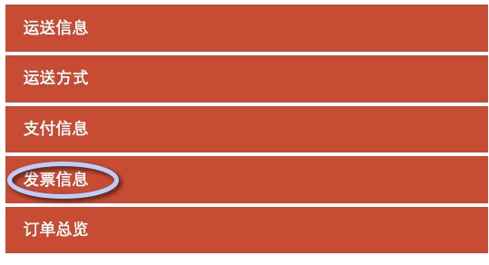

一. 增加一个Invoice的Block，使其显示在onepange checkout页

步骤1. 添加Invoice的Block类，重写checkout_onepage_index.xml 清单：Jam\Invoice\Block\Onepage\Invoice.php

```php
<?php
namespace Jam\Invoice\Block\Onepage;
class Invoice extends \Magento\Checkout\Block\Onepage\AbstractOnepage {
    protected function _construct() {
        $this->getCheckout()->setStepData('invoice', array(
            'label'     => __('Invoice Information'),
            'is_show'   => $this->isShow()
        ));
        parent::_construct();
    } 
}
```

清单：Jam\Invoice\view\frontend\onepage\invoice.phtml

```
This is invoice page.
```

清单：Jam\Invoice\view\frontend\layout\checkout_onepage_index.xml

```xml
<?xml version="1.0"?>
<layout xmlns:xsi="http://www.w3.org/2001/XMLSchema-instance">
    <referenceBlock name="checkout.onepage">
        <block class="Jam\Invoice\Block\Onepage\Invoice" name="checkout.onepage.invoice" as="invoice" template="onepage/invoice.phtml"/>
    </referenceBlock>
</layout> 
```

步骤 2. 重写\Magento\Checkout\Block\Onepage类

清单:Jam\Invoice\Block\Onepage

```php
<?php
namespace Jam\Invoice\Block;
class Onepage extends \Magento\Checkout\Block\Onepage {
    protected function _getStepCodes() {
        return array('login', 'billing', 'shipping', 'shipping_method', 'payment', 'invoice' , 'review');
    }
} 
```

清单:Jam\Invoice\etc\di.xml

```xml
<?xml version="1.0"?>
<config>
    <preference for="Magento\Checkout\Block\Onepage" type="Jam\Invoice\Block\Onepage" />
</config>
```

一旦重写了Block类，如果不重定义Block类对应的phtml文件，默认就依据原layout文件(magento_checkout_index.xml)里定义的template的路径去寻找模板文件(即重写模块的view/frontend/onepage.phtml)，所以，直接复制原onepage.phtml到该模块的view/frontend下（暂时不对其做任何修改）

最后，让 __('Invoice Information’)显示为“发票信息”，在i18n\zh_CN.csv中增加一条翻译信息，此处就不再赘述. ＊购买一个商品进入checkout页，结果显示为：

