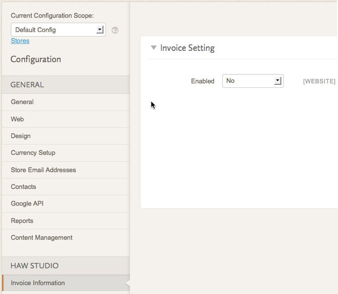

## I. 添加etc/adminhtml/system.xml

```xml
<?xml version="1.0"?>
<config>
    <system>
        <tab id="haw" translate="label" sortOrder="200">
            <label>Haw Studio</label>
        </tab>
        <section id="invoice" translate="label" type="text" sortOrder="102" showInDefault="1" showInWebsite="1" showInStore="1">
            <label>Invoice Information</label>
            <resource>Haw_Invoice::config_invoice</resource>
            <tab>haw</tab>
            <group id="invoice" translate="label" type="text" sortOrder="0" showInDefault="1" showInWebsite="1" showInStore="0">
                <label>Invoice Setting</label>
                <field id="active" translate="label" type="select" sortOrder="1" showInDefault="1" showInWebsite="1" showInStore="0">
                    <label>Enabled</label>
                    <source_model>Magento\Backend\Model\Config\Source\Yesno</source_model>
                </field>
            </group>
        </section>
    </system>
</config> 
```

简要说明：添加一个id为Tab，然后添加一个id为invoice的Section，在该Section下添加一组(id为invoice)设置，为了便于说明，该组设置中有且仅有一条field。注意：section标签下有一个resource标签，该标签的值必须在定义在acl.xml（见后述）

## II. 添加etc/adminhtml/acl.xml

```xml
<?xml version="1.0"?>
<config>
    <acl>
        <resources>
            <resource id="Magento_Adminhtml::admin">
                <resource id="Magento_Adminhtml::stores">
                    <resource id="Magento_Adminhtml::stores_settings">
                        <resource id="Magento_Adminhtml::config">
                            <resource id="Haw_Invoice::config_invoice" title="Config Invoice Section" />
                        </resource>
                    </resource>
                </resource>
            </resource>
        </resources>
    </acl>
</config> 
```

进入后台Stores->Configuration看到如下运行结果：

