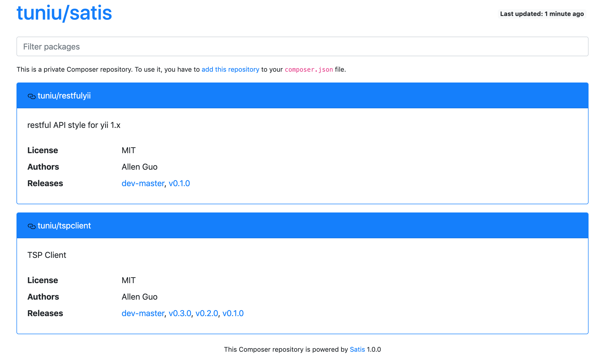

## 干掉PHP

第一次接触途牛PHP的系统的时候，公司的目标只有一个：干掉PHP。因为程序员们有了新宠：Node.js。有了它，Web开发可以全栈使用 JavaScript。

起初，我当然是雄心勃勃，让团队用上更新的技术栈、更时髦的方法进行Web开发，动力十足。翻开庞大的PHP代码后，总结有至少以下问题：

1. 失控的项目代码组织；
2. 原始的项目协作方法；
3. 无序地堆积代码，无处不见复制粘贴；
4. 底层框架陈旧，并错误使用导致难以升级。

常常见到代码注释里的插科打诨，无不透露出程序员绝望的情绪，对于团队放弃PHP，我也给予深深的同情。

## 别做梦了

但是，几个月后，我终于清楚：PHP的包袱甩不掉！浩瀚的业务逻辑代码，已经为公司服务了十年以上，岂是说丢就能丢的？所以总是有倒霉蛋被安排维护基于PHP的遗留系统，比如我。

只有“痛”，才能痛下决心。既然甩不掉，那就让他活起来。

## 现代的 PHP

### 包管理器

现代语言的基本特征是拥有现代化的包管理工具。PHP采用PECL管理C扩展；PEAR来管理PHP扩展。不过并不成功。直到 2013 年 [Composer](http://getcomposer.org/) 的出现，情况才有了质的改观。我也是 Composer 最早的用户。

基于Composer，PHP因此能管理更复杂的SDK依赖，构建更庞大的工程。商业机构也能按需搭建私有Composer服务器。

### PHP 7新特性

此时，PHP 7 发行已经有4个年头，由于Node.js、Python、Go等新框架和语言的风头正劲，似乎PHP 7并没有受到外界多少关注。也许只有Phper们自己知道，PHP 7 有多美。几个要点：

1. 增加一坨简洁的语法；
2. 支持类型声明（用ts的同学是不是能共鸣？）；
3. 性能提升——简单说，就是你原来用10台服务器，现在用5台；
4. 废弃那容易引起混乱的函数、库。

## 重构途牛的PHP系统

途牛遗留的PHP系统主要基于 PHP 5.5 和 Yii 1.1框架，因此显而易见与现代PHP系统的差距。

#### 1. 升级到 PHP 7

PHP 7 和 PHP 5 并不完全兼容，这正是我们面临的第一个挑战。由于旧有代码量巨大，将Yii 1.1升级，必须将所有业务代码改造，这几乎不可能。必须得有点愚公移山的精神，当我们决心一点点修改系统的不兼容语法时，事情变得似乎没那么困难。我们采用了工具：https://github.com/sstalle/php7cc 辅助检查PHP 7环境下系统的可用性，进展异常顺利。

另外，使用Php项目中都有一个命名服务的客户端采用了 libevent 扩展，升级到 PHP 7 之后，重构为 Event 扩展。

#### 2. 混合使用 Composer 管理依赖库

Yii 1.1时代没有采用 Composer，但是我们仍然可以在遗留PHP系统中同时使用Composer。

在重构代码过程中，我们将那些跨项目使用的代码一步步抽离出来，采用Composer管理，因此构建了我司私有的 Comoposer仓库，开发者可以持续为SDK库有序添砖加瓦。下面是我司 Comoposer 仓库地址：

#### 3. 使用Docker来部署

这是一个可选项。我个人认为这有违PHP的敏捷（因为PHP发布从来不需要重启服务器），我们当前采用Docker部署，最重要的背景是：用原来方法发布到服务器的PHP代码和代码仓库的一致性强烈不可信，其次才是系统的可伸缩性。

我司自研的Tardis系统轻量、敏捷，协助我们项目轻松完成Docker部署。

## 一切都是刚刚开始

在业务逻辑代码没有任何重构的情况下，我们已经升级到PHP 7/Composer 的现代开发风格了。如果止于此，不在代码逻辑质量方面改进提高，那么PHP系统终将为遗留系统。

PHP的使命可止于此，也可不止于此！先让我来为PHP正名：

#### 多进程正是PHP的灵魂

当多线程、NIO语言、方案漫天飞的时候，PHP始终在那里预启动多个进程，守候着每一次网络来访，来一个请求，用心执行，执行完恢复如初，继续静静等候，不留一点痕迹。

话说大家该理解PHP程序员为什么那么“烂”了吧？就是Phper的代码写得再差，一个请求结束后一切都归零了。

什么Gof设计模式、内存泄漏我统统不必操心，我可以把更多精力关注在业务逻辑上。

这正是通常局外人理解的PHP的“弱”，其实有开源的 Swoole、还有我认识的北飘老胡写的Hufu Framework，玩出多线程、NIO，但始终偏于一隅。

PHP选择了它的运行模型，这不是语言的局限，这是语言的哲学。

用心审视它，才会爱上它。读完本文，希望大家不再用处理遗留代码的心态使用PHP，而是真正意识到它的 Sharp，有意识地向你的PHP系统注入新的血液，让遗留的系统重生。