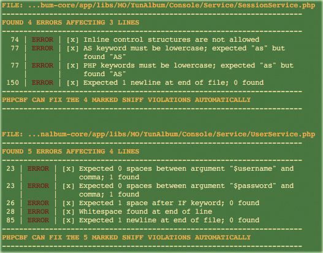
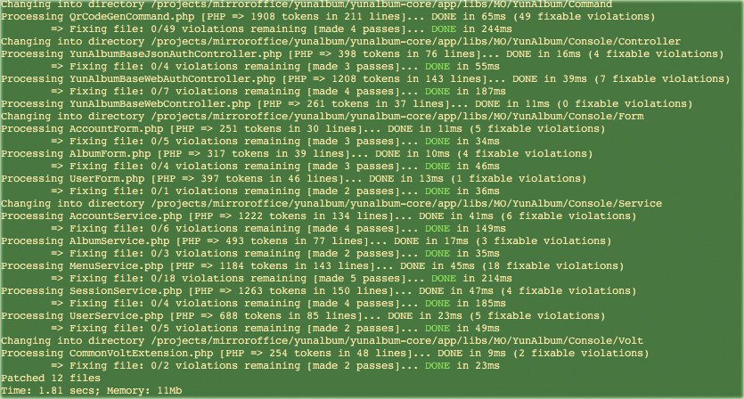

PHP_CodeSniffer是一个代码规范的检查和修正的工具，使用pear安装

> pear install PHP_CodeSniffer

安装好后相关命令 phpcbf，phpcs 则被安装到pear的命令所在目录，可以直接运行

## phpcs 代码规范检查工具

> phpcs --standard=PSR2 --colors ./src

pear的代码标准在：http://pear.php.net/manual/en/coding-standards.php 意为：用PSR2标准检查src目录下所有php文件，看是否有规范违反，一个可能的结果下：

## phpcs 代码规范修复工具

如果发现某些文件不符合规范，那么执行

> phpcbf --standard=PSR2 --colors .

可能执行结果如下：

