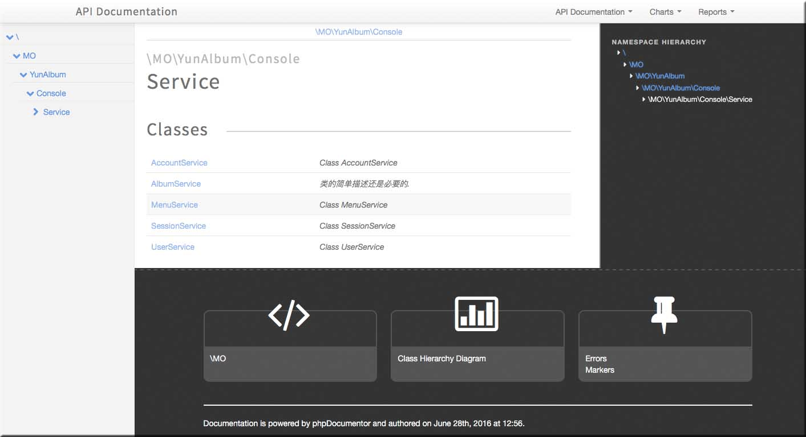

## phpDocument ([https://phpdoc.org](https://phpdoc.org/))

phpDocument是一个产生api文档的工具. 根据php文件的代码和注释自动产生友好的api文档。采用pear安装：

> pear channel-discover [pear.phpdoc.org](http://pear.phpdoc.org/) pear install phpdoc/phpDocumentor

然后执行phpdoc命令

> phpdoc -d ./src -t ./docs/api

产生的文档类似如下效果

