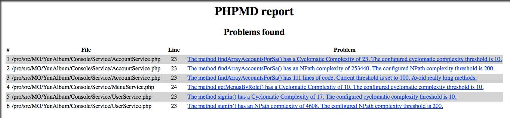

## phpmd (https://phpmd.org/)

phpmd（PHP Mess Detector）可以直接抓出一些代码的缺陷，而不只是看到冷冰冰的数据，它依赖pdepend包.

### 1. 安装

使用composer安装phpmd方法：

> composer global require phpmd/phpmd:@stable

有点慢哈哈：） 于是：

> wget http://static.phpmd.org/php/2.4.2/phpmd.phar

复制phpmd.phar到path所在路径，命名为phpmd，并使之具有可执行权限，就可以使用phpmd命令了.

### 2. 运行

如：

> phpmd . html codesize>~/result.html

上述报表揭示了在一个方法中，如果复杂度过高就会被指出有问题。这通常是程序逻辑比较复杂，容易发生错误，所以最好拆开或想办法降低复杂度。 phpmd还能检查未使用的变量等不规范的代码习惯. 跟pdepend比较起来，phpmd更容易上手，而且他的说明很直接，如果对于这些品质量测不是那么熟悉，phpmd应该会比较好用。