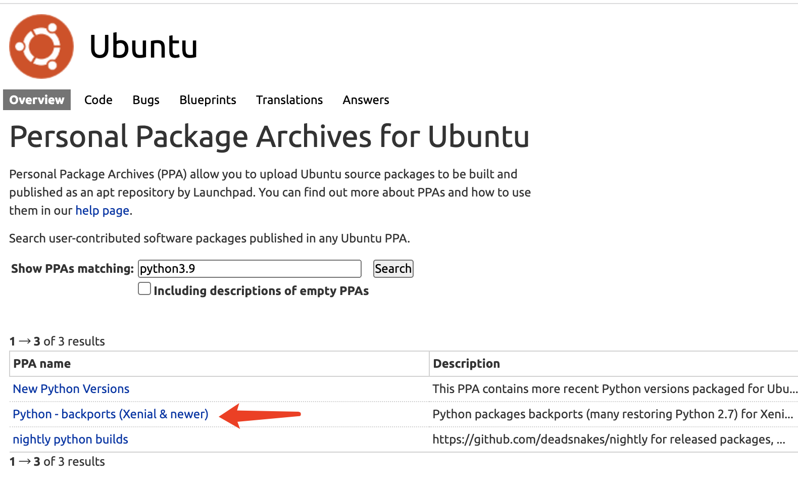

# 用 apt 方式 将 Ubuntu 16/18 上的 python 升级到 python3.9 的方法


## 找到PPA，添加到apt仓库

使用 apt 方式 将 Ubuntu 16/8 上的 python 升级到 3.9 版，本质上学习如何找到包括 python新版本的 apt 仓库。通常我们使用 PPA Repo： https://launchpad.net/ubuntu/+ppas

搜索 `python3.9`，如下图：




以选择第2条点击进入为例，页面描述了如何添加 apt 仓库

>Adding this PPA to your system
>
>You can update your system with unsupported packages from this untrusted PPA by adding **ppa:savoury1/python** to your system's Software Sources. ([Read about installing](https://launchpad.net/+help-soyuz/ppa-sources-list.html))
>```bash
>sudo add-apt-repository ppa:savoury1/python
>sudo apt-get update       
>```

## 安装 python3.9

> $ apt install python3.9

安装好后，运行

> $ python3.9 -V 

## 总是使用 venv管理python项目

所以，你应该也安装 venv

> $ apt install python3.9-venv

然后进入自己的项目目录，执行

> $ python3.9 -m venv venv
>
> $ . venv/bin/activate

此时，你处于 venv 隔离环境下，这时使用pip、python命令都默认是 3.9版本了