# 企业应用全生命周期
---
半圆公开课D

## Joy Don

### 来自于20世纪的程序员
### 全栈工程师、连续创业者

## You are programmer first.

## 冯•诺依曼计算机模型
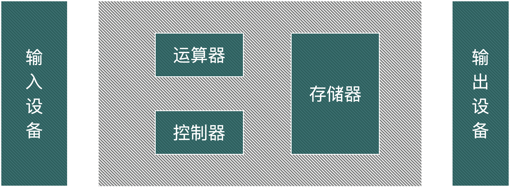

## 举个 🌰
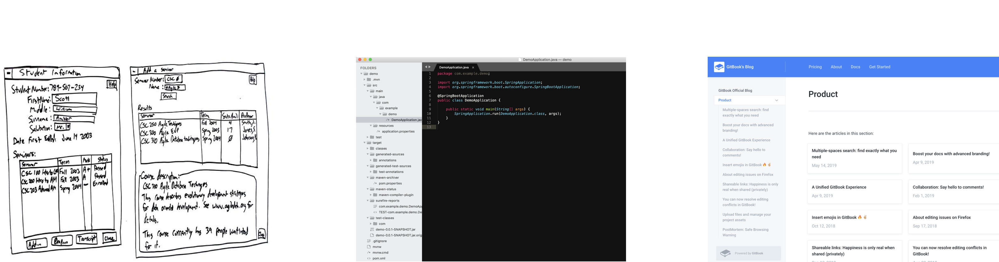

## 大规模应用开发需要工程化方法

## 软件生命周期 - 8个阶段
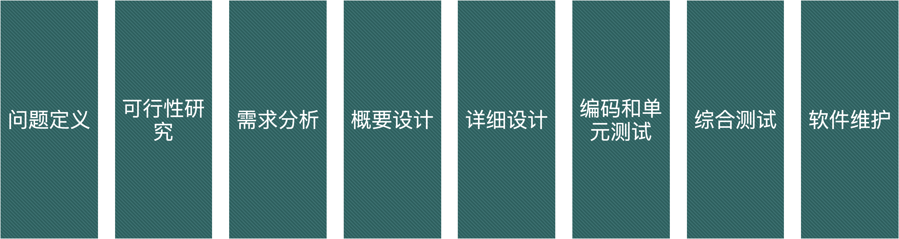

## 软件生命周期 - 实战型5阶段
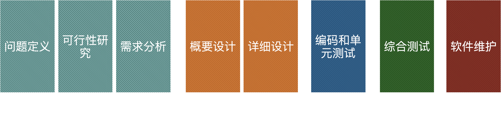

## 软件生命周期 - 用户角色
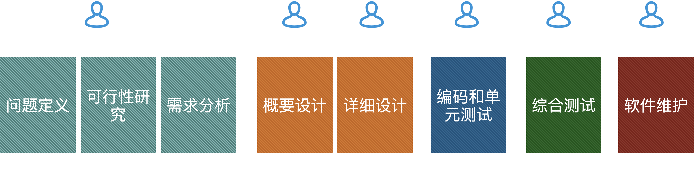

## 软件生命周期工具覆盖
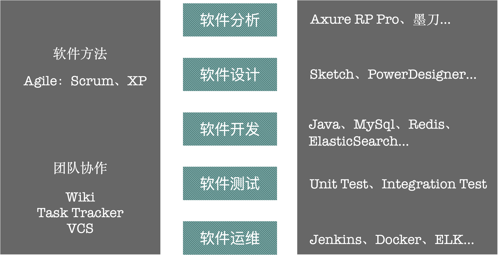

## 软件交付

## ① 分析阶段
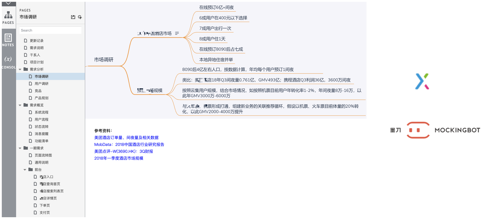

## ② 设计阶段
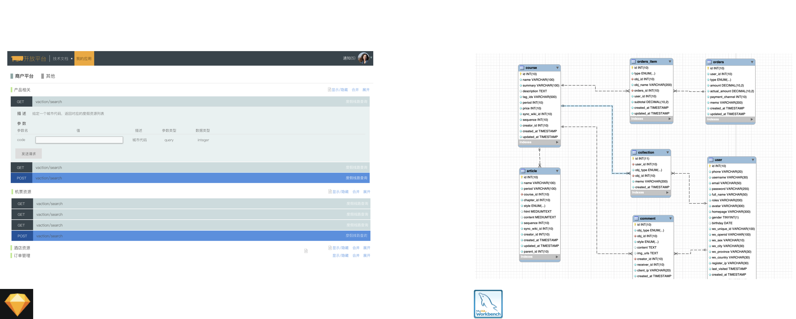

## ③ 开发阶段

## ③ 开发阶段 🌰

### ▷ **假设某创业团队要开发一个电商网站，要支持PC、手机端.**

## ④ 测试阶段

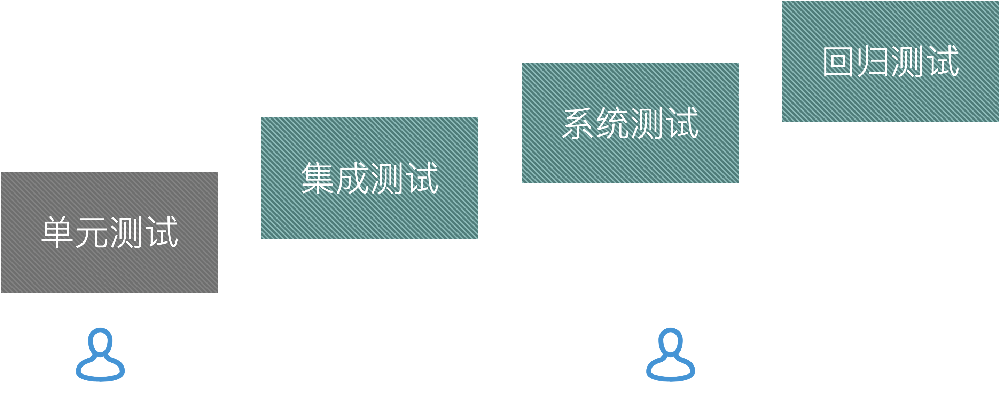

## ⑤ 运维阶段
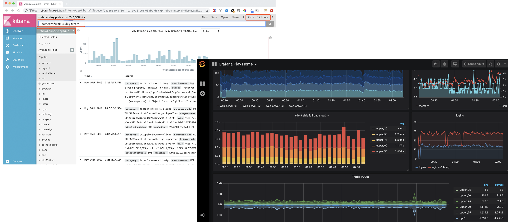

## 贯穿始终的协作
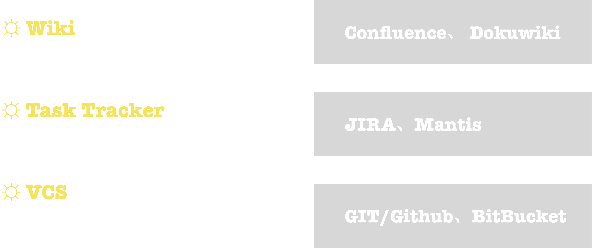

## 软件方法的抉择
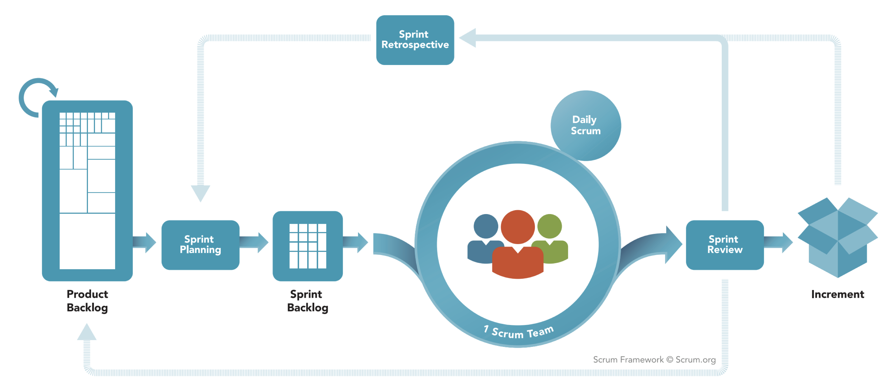

Agile : Scrum

# **半圆为你加速**

## 四阶段分解

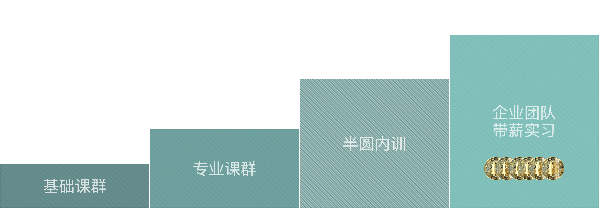

## If you are just a code fans， then？

## 一个程序员的修养 - 在编程之前

1. 工欲善其事、必先利其器(使用Mac)
2. 天下武功、唯快不破(成为优秀的打字员)
3. 一生万物、万物归一(学会命令行)
4. 好记性不如烂笔头(会记读书笔记)
5. 寻根问题、追本溯源(正确检索知识的方法)
6. 塑造网络个人品牌

---

