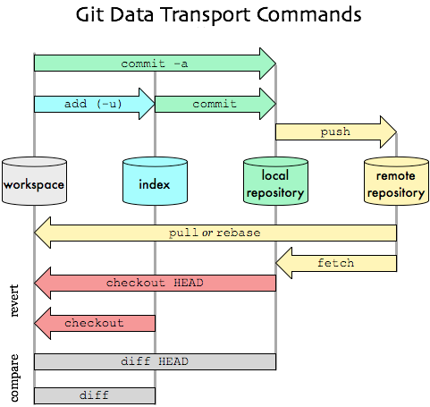

在第一次使用git仓库之前，建议你总是全局设定好你的个人信息

```bash
git config --global [user.name](http://user.name/) "Allen"
git config --global user.email "'koda@gmail.com"
```

## I. 基础操作

### 1. 第一次拉仓库代码

```bash
git clone http://git.banyuan.club/starship.git
```

它实质做了几个工作：

- git fetch远程仓库到本地仓库
- 创建本地master分支，对应远程master分支
- checkout master分支到index和wd区
- 你在wd区开始开发工作！

### 2. 更新远程仓库上的代码

```bash
git pull
```

假如你当前工作在master本地分支，默认设定的上游仓库是orgin仓库的master分支，那么该操作执行的就是：将orgin/master分支的代码的差异从远程仓库下载下来，然后合并到本地仓库的master分支。相当于fetch和merge命令的集合：

```bash
git fetch origin master
git merge origin/master
```

使用后者分开命令是比较审慎的做法，可以在merge之前执行

```bash
git log -p master..origin/master
```
明确了解分支间的差异，再决定是否合并及如何合并.

### 3. 提交代码修改

如果你在本地wd区修改了如果代码并想提交到远程仓库，进入项目目录，执行：

```bash
git add .
git commit -m 'some messges'
git push
```

如果有成员先于你提交了代码到远程仓库，在执行git push的时候会被阻止，此时请先执行 git pull（其实我们总是建议你在git push前执行git pull），下面是可能遇到的几种情况：

执行git pull，没有冲突立即合并，然后再执行 git push即可 执行git pull，有冲突，在wd区手工解决，然后重新执行 git add , git commit，再执行git push

## II. 分支操作

### 1. 创建分支

假设你正工作在master本地分支，执行

```bash
git checkout -b dev
```

取远程同名分支origin/dev，并立即创建了一个名字为dev的本地分支，并切换WD到dev分支。接下来dev分支进行开发测试。直到完成后同步到远程仓库。

注：如果没有远程origin/dev分支，就基于当前操作的分支创建一个本地dev，没有对应的上游仓库分支.

```bash
git push origin dev
```

将把本地dev分支内容推到默认远程仓库的dev分支，如果远程仓库没有该分支，就创建一个。

此时另一个成员加入与你共同开发dev分支代码，他在自己的电脑上git clone代码仓库后，然后执行

> git checkout -b dev origin/dev #假设已经执行过了默认克隆操作.

就基于远程仓库origin/dev，创建了本地分支dev，就可以开发了。

如果使用git branch 命令来创建分支，和git checkout方式的区别主要在于不会默认切换分支，另外git branch命令最好明确指定上游分支（如果需要的话），否则不会自动关联上游分支.

### 2. 分支合并

假设dev分支的代码已经开发完成，想合并到master分支，

#### a. 全量合并

```bash
git checkout master
git merge dev
```

这将把dev的所有改变都被合并到了master。如果你仅仅想合并指定修改，应使用cherry-pick

#### b. cherry-pick

例如：在分支dev下使用git log命令查出你要合并的修改commit id(以b732e9为例)，然后切换到master分支，执行：

```bash
git cherry-pick b732e9
```


### 3. 分支删除

- 删除本地分支

```bash
git branch -D dev01
```

- 删除远程分支

```bash
git push origin :remote-branch
```

- 删除远程分支本地缓存

```bash
git branch -r -d origin/dev01
```

## III. 标签(Tag)操作

发布一个版本后，最好为发布版本做个标签TAG

### 创建tag

> git tag -a v0.1.0 -m 'Intial Release v0.1.0' # 也可以轻量级创建tag： git tag v0.1.0
> git push origin --tags #提交所有tags
> git push origin v0.1.0 #提交指定tag

### 查看tag

> git tag -l #查看仓库里有多少个tag

也可以进入tag看下源代码

> git checkout v0.1.0

### 删除tag

> git tag -d 0.1.0 #删除本地tag
> git push origin :refs/tags/0.1.0 #删除远程tag

## IV. Patch 用法

有时，A、B两个分支代码不同，现在想用B分支代码完全覆盖A分支代码，使俩分支代码一样，下面以为名为uat、release分支为例，用release分支代码完全覆盖 uat分支代码
```bash
## 切换到 release分支，生成patch文件
git checkout release
git diff uat >~/release.patch
## 回到 uat分支， 应用patch文件
git checkout uat
git apply ~/release.patch
```

## V. fork分支如何保持和原分支同步更新

### 添加 upstream

用`git remote -v` 查看是否有`upstream`，如果没有，添加： `git remote add upstream xxx.git`

### 拉取 upstream

假设当前工作分支是master，那么该操作会把upstream合并到当前分支。如果本地没有修改和冲突，本地仓库就被更新了 本步骤操作相当于：

```bash
git fetch upstream
git merge upstream/master
```

### 提交到 upstream
提交本地仓库的更新到远程仓库

## 附：其他日常操作命令

- 概览仓库情况: 多少分支、多少tag

```bash
git branch -a #查看远程仓库所有分支。
git tag -l #查看远程仓库所有标签 。

git ls-remote --tags origin
git ls-remote --heads origin
git ls-remote origin
```

- 查看上游仓库情况

```bash
git remote -v
```
- 同步远程分支名
删除了远程分支，本地同步时使用如下命令，否则 `git branch -r`还是旧的分支名列表

```bash
git remote update origin --prune
 ```
- 查看上游分支

```
git branch -vv
```

- commit

```bash
git commit
git commit -a –amend #对最近一次commit的进行修改
```

- reset

```bash
git reset／git checkout / git revert
```

一言难尽，但很重要。这个链接不错： https://segmentfault.com/a/1190000003102737

这里仅介绍最粗暴的一个：放弃工作目录所有修改！

> git reset --hard HEAD

- DIFF

```bash
git diff #working copy和staging区域对比
git diff --cached #等同--staged，staging区域和仓库对比
git diff HEAD #working copy、staging和仓库一起对比
git diff 6720722 b28b566 # 明确比较两个版本差异，一般选前者为更早的历史版本
git diff master ^origin/master 比较本地master分支和远程master的差别
```

- 查看日志

```bash
git log git log --name-status 每次修改的文件列表, 显示状态
git log --name-only 每次修改的文件列表
git log --stat 每次修改的文件列表, 及文件修改的统计
```

- whatchanged

```bash
git whatchanged 每次修改的文件列表
git whatchanged --stat 每次修改的文件列表, 及文件修改的统计
```

- git show 显示最后一次的文件改变的具体内容
- git rebase
- 查看当前WD的状态

```bash
git status
```

- 文件模式不反应为版本变更：
```bash
git config core.fileMode false
```
- .gitignore文件 - 用来忽略不想上传或提交的文件或目录
- .gitkeep文件 - 放在想提交的空目录下，作为占位符.

- 导出干净的某个分支代码:

```bash
git archive --format zip --output "./my-project.zip" master -0
```

将master分支代码导出并zip 打包后放在当前目录下，`my-project.zip`就是目标文件，`-0`的意思是不压缩.
