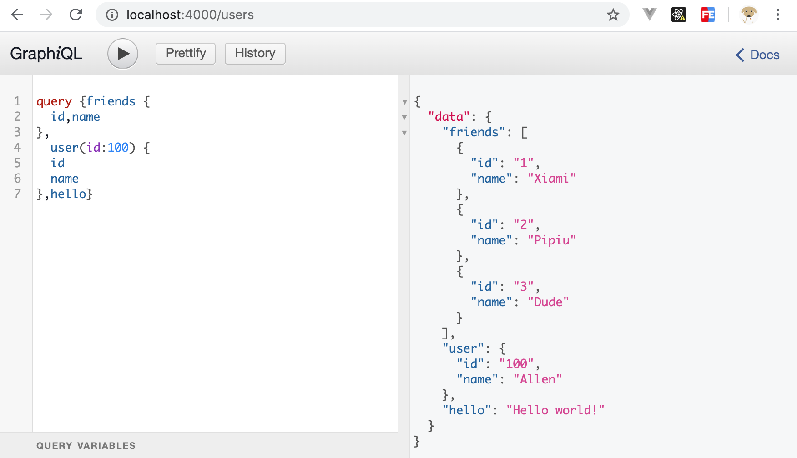

本文假设你已经对 Koa2 有一定的实践，也理解 @koa-router 的用法。

## I. 安装依赖

https://github.com/graphql-community/koa-graphql

```bash
yarn add @koa/router 
yarn add graphql
yarn add koa-graphql
```

## II. 服务端开发

### 写一个 Schema：UserSchema

```js
const { buildSchema } = require('graphql');
const UserSchema = buildSchema(`
  type Query {
    hello: String
    user(id: Float): User!
    friends: [User]
  },
  type User {
    id: ID
    name: String
  },
`)
```

### 写一个 Resolver：UserResolver

Resolver 实现前面定义的 Schema

```js
const userResolver = {
  user:  (params) => { 
    const {id} = params
    const users = {
        100: {id: 100, name: 'Allen'},
        200: {id: 200, name: 'Koda', weight: 140}
    }
    return users[id] || {alias: 'Judy', id: 999, name: 'Default'};
  },
  friends:  () => { 
    return [
        {id: 1, name: 'Xiami'},
        {id: 2, name: 'Pipiu'},
        {id: 3, name: 'Dude'},
    ] 
  },
  hello: () => 'Hello world!' 
};
```

### 绑定 Schema 和 Resolver

```js
const router = new Router();
...

router.all('/users', graphqlHTTP({
    schema: UserSchema,
    rootValue: userResolver,
    graphiql: true,
}));
```

## III. 客户端存取

### 用 graphiql 存取

假设 koa 启动在 4000 端口，访问 http://localhost:4000/users , 启动了 graphiql 接口，方便测试



### API 方式存取

#### a). graphql-request库

```bash
yarn add graphql-request
```

- query 代码例子：

```js
import { request } from 'graphql-request'

const query = `{
    friends {
        id,name
    }
}
`;

(async () => {
    const resp = await request('http://localhost:4000/users', query);
    console.log(resp.friends)
})()
```

#### b). apollo client 库

```bash
yarn add apollo-boost graphql-tag graphql
```

- query 代码例子：

```js
import ApolloClient from 'apollo-boost'
import gql from 'graphql-tag';

(async () => {
    const client = new ApolloClient({
        uri: 'http://localhost:4000/users'
    });        
    const resp = await client.query({
        query: gql`
            friends {
                id,name
            }
        `
    })
    console.log(resp.data.friends)
})()
```

> 注：gql 支持变量，此时使用 client.query 方法参数对象的 variables 节点，传入变量对象列表即可。

- mutation 代码例子：

删除 id 为 10 的文章.

```js
import ApolloClient from 'apollo-boost'
import gql from 'graphql-tag';

(async () => {
    const resp = await client.mutate({
        mutation: gql`
            mutation Article($id: Int!){
                remove (id: $id){
                    error, message
                }
            }
        `,
        variables: {
            id: 10
        }
    })
})()
```

> 如果加载单独的 .gql文件，建议使用 graphql.macro 替代 graphql-tag