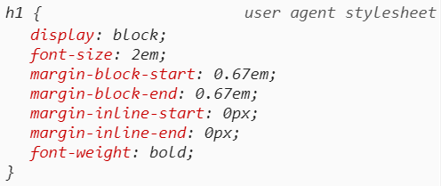
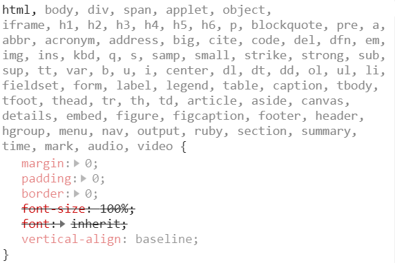

# Normalize CSS or CSS Reset?!

补充：2022年，关注：https://github.com/elad2412/the-new-css-reset

## CSS Architecture — Part 1

As a rule, we want an HTML elements to look the same way, independent of which browser is being used to view it. Unfortunately, this is not the case because of the way browsers run.

The question of which approach to use in eliminating differences between user agent styles is an ongoing debate between **Normalize CSS vs CSS Reset**.


Before we dive into how I recommend working correctly, I’d like to explain these two terms to those of you who aren’t familiar with them.

## CSS User Agent Styles

When a browser renders an HTML page, it applies basic styles before you’ve even written a single style. For Example, the`<h1>` to `<h6>` HTML tags in all browsers differ from the normal text: in general, their font sizes are larger, their font-weight is bold(`font-weight:bold`), and they have margins on the top & the bottom.



<h1> default styles in chrome

While all browsers apply their basic styles, each browser has its specific styles different from other browsers, and that, of course, causes an inconsistency problem. That’s the problem that we’ll be talking about in this post.

The attempt to solve the browser inconsistency problem has produced two approaches: the **Normalize CSS approach** and the **CSS Reset approach**. In a nutshell, we can describe the **Normalize CSS as a gentle solution** and the **Reset CSS as a more aggressive solution**. Now let’s elaborate.

## Normalize CSS

**Normalize**.**css** is a small **CSS** file that provides cross-browser consistency in the default styling of HTML elements.

That means, that if we look at the W3C standards of the styles applied by the browsers, and there is an in inconsistency in one of the browsers, the `normalize.css` styles will fix the browser style that has the difference.

But in some cases we can’t fix the faulty browsers according to the standard, usually because of IE or EDGE. In these cases the fixes in the Normalize will apply the IE or EDGE styles to the rest of the browsers.

**Here’s a real life example**: Chrome, Safari and Firefox render `<h1>` tags that are inside an `<article>`/ `<aside>`/ `<nav>`/ `<section>` tag with a font-size that is smaller than an independent `<h1>` tag, and with a different margin size. These are the user agent styles in Chrome, Safari and Firefox in the case of an `<h1>` tag inside an `<article>`/ `<aside>`/ `<nav>`/ `<section>` tag:

```
:-webkit-any(article,aside,nav,section) h1 {
   font-size: 1.5em;
   margin-block-start: 0.83em;
   margin-block-end: 0.83em;
}
```

The Internet Explorer and EDGE browsers are in the minority with the styles they apply in this case, and theoretically, it would make sense that the styles defined in `normalize.css` would target IE / EDGE. However, **it’s not possible to target IE / EDGE since those browsers don’t have an “any” selector**. Therefore, for normalize to reset `<h1>` styles to act the same for all browsers, Normalize CSS defines the IE / EDGE styles to be applied by all browsers.

Example:

```
/* 
  Correct the font size and margin on `h1` elements within `section`  and `article` contexts in Chrome, Firefox, and Safari.
*/
 h1 {  font-size: 2em;  margin: 0.67em 0;}
```

[Normalize.css](https://github.com/necolas/normalize.css/blob/master/normalize.css) is an open source, continuously updated project on Github, created by [Nicolas Gallagher](https://github.com/necolas).

[necolas/normalize.cssA modern alternative to CSS resets. Contribute to necolas/normalize.css development by creating an account on GitHub.github.com](https://github.com/necolas/normalize.css/blob/master/normalize.css)

## Reset CSS

Reset CSS takes a different approach and says that we don’t need the browsers’ default styles at all. Whatever styles we need, we’ll define in the project according to our needs. So **“CSS Reset” resets all of the styles** that come with the browser’s user agent.

This approach works well in the above example, with those `<h1>` to `<h6>` default styles: most of the time we want neither the browsers’ default `font-size` nor the browser’s default `margin`.

There are multiple types of CSS Reset on the web. Here is an example of what a small part of CSS Reset looks like(from [Eric Meyer’s CSS Reset](https://meyerweb.com/eric/tools/css/reset/)):

```
html, body, div, span, applet, object, iframe, h1, h2, h3, h4, h5, h6, p, blockquote, pre, a, abbr, acronym, address, big, cite, code, del, dfn, em, img, ins, kbd, q, s, samp, small, strike, strong, sub, sup, tt, var, b, u, i, center, dl, dt, dd, ol, ul, li, fieldset, form, label, legend, table, caption, tbody, tfoot, thead, tr, th, td, article, aside, canvas, details, embed,  figure, figcaption, footer, header, hgroup,  menu, nav, output, ruby, section, summary, time, mark, audio, video {  
   margin: 0;  
   padding: 0;  
   border: 0;  
   font-size: 100%;  
   font: inherit;  
   vertical-align: baseline; 
}
```

In the CSS Reset way, we define all HTML tags to have no padding, no margin, no border, the same font-size and the same alignments.

The problem with CSS Resets is that they are ugly: they have a big chain of selectors, and they make a lot of unnecessary overrides. And even worse, they are unreadable when debugging.



CSS reset — chain of ugly CSS selectors

But still there are styles we prefer to reset like `<h1>` to `<h6>`, `<ul>`,`<li>` and etc.

# How to work, together in peace, with both Normalize CSS & CSS Reset

My suggestion to you is to use **Normalize CSS with little bit of CSS Reset.** Use them both, but wisely!

In my projects, I incorporate the benefits of each of the methods. On the one hand, I want the benefits of the **Normalize CSS**, while in other cases I want the benefits of a **CSS Reset** without those big chains of ugly CSS selectors.

## Making Your Own CSS Reset

In my 13 years’ experience, I have learned that there are HTML tags you always want to reset. For example links’ color, buttons’ default styles, lists’ default, etc.

Besides the `normalize.css` that I use, I add a`reset.local.css` with all the styles I want to override. Unlike an ordinary **CSS reset**, I only target specific HTML tags’ styles rather than making a big list of tags.

Here is an example of **how to make your own CSS Reset**:

**My CSS Reset— reset.local.css**

```
/****** Elad Shechter's RESET *******/
/*** box sizing border-box for all elements ***/
*,
*::before,
*::after{box-sizing:border-box;}a{text-decoration:none; color:inherit; cursor:pointer;}
button{background-color:transparent; color:inherit; border-width:0; padding:0; cursor:pointer;}
figure{margin:0;}
input::-moz-focus-inner {border:0; padding:0; margin:0;}
ul, ol, dd{margin:0; padding:0; list-style:none;}
h1, h2, h3, h4, h5, h6{margin:0; font-size:inherit; font-weight:inherit;}
p{margin:0;}
cite {font-style:normal;}
fieldset{border-width:0; padding:0; margin:0;}
```

This way the CSS reset is a lot less aggressive and a lot more readable in every way you look at it.

## Basic Typography

Besides the `normalize.css` and the`local.reset.css` that I have in all of my projects, I add another file for basic typography. This file isn’t part of either **normalize CSS** or **CSS reset**, it’s a basic style sheet with the website’s typography, containing properties like `direction`, `font-family`, `font-size`, `line-height`, font color.

## typography.css

```
html{ 
   font-size: 1px;/*for using REM units*/
}body{
   font-family: -apple-system, BlinkMacSystemFont, 'Segoe UI', 'Roboto', 'Oxygen', 'Ubuntu', 'Fira Sans', 'Droid Sans', 'Helvetica Neue', sans-serif;
   font-size: 16rem;
   font-weight: 400;
   line-height: 1.3;
   color: #222;
}
```

## Putting It All Together

Utilizing the benefits of SASS pre-processor, I have a `_reset.scss` file that includes all these parts:

- **Normalize.css** — the [latest version of CSS Normalize from GitHub](https://github.com/necolas/normalize.css/blob/master/normalize.css).
- My own **CSS Reset**
- **A Basic Typography** File

**Example (_resets.scss file):**

```
@import "resets/normalize.scss";
@import "resets/reset.local.scss";
@import "resets/typography.scss";
```

# To Summarize

In this post, I showed you my CSS Architecture for Normalizing & Resetting styles, based on lots of stuff I’ve learned over the years.
This post is the first in a series of articles on CSS Architecture which I will be writing and sharing with you every few weeks.