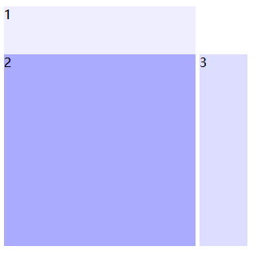
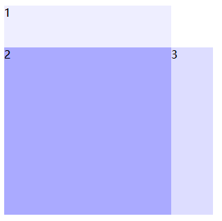

## 使用font-size:0解决设置inline-block引起的空白间隙问题

## 一、空白间隙问题

**在进行页面布局的时候为了页面代码所谓整洁刻度，往往会设置缩进或是换行，但是元素display为inline-block或是inline时，行内元素虽然没有设置 margin值，这些换行或是缩进。还是会出现空白间隙。**

如下所示：

**HTML部分**

```html
<div id="box1">1</div>
<div id="box2">2</div>
<div id="box3">3</div>
```

**CSS部分**

```css
   #box2{
        width:240px;  
        height:240px;
        background-color:#aaf;
        display:inline-block;

    }
    #box1{
        width:240px;
        height:60px;
        background-color: #eef;
    }
    #box3{
        width:60px;
        height:240px;
        background: #ddf;
        display:inline-block;
    }
```

由于排版原因，虽然没有设置 margin ，两个div之间还是出现了空白间隙。这是由于排版换行的原因两个div之间才留下了空白字符，导致间隙的产生。



 

## 二、解决空白间隙

1、**将两个div元素不换行，写成一行**。也可以解决这个问题，但是这并不是最好的方法

**HTML代码**

```html
<body>
<div id="box1">1</div>
<div id="box2">2</div><div id="box3">3</div>
</body>
```

**CSS代码**

```css
#box2{
        width:240px;  
        height:240px;
        background-color:#aaf;
        display:inline-block;
    }
    #box1{
        width:240px;
        height:60px;
        background-color: #eef;
    }
    #box3{
        width:60px;
        height:240px;
        background: #ddf;
        display:inline-block;
    }
```



2、解决这个问题，最好方式**是给元素加上一个父元素，给父元素font-size:0。（这样会导致元素中的文字消失，还要在另外给元素中的文字设置大小，文字最小是12px**）

**HTML部分**

```html
<div style="font-size:0">
<div id="box1">1</div>
<div id="box2">2</div><div id="box3">3</div>
</div>
```


  

## 三、其他元素

**（一）、<a> 超链接出现空白间距**

```html
<a href="#" style="background:#99f">我也是超链接</a>
<a href="#" style="background:#f99">我是一超链接</a>
<a href="#" style="background:#9f9">好巧咱们都是超链接</a>
```

因为在代码排版的时候，<a>换行了，所以每个超链接之间会有空白间隙。a元素默认的是行内块元素


**解决方法：**

1、写成一行； 

```html
<a href="#" style="background:#99f">我也是超链接</a><a href="#" style="background:#f99">我是一超链接</a><a href="#" style="background:#9f9">好巧咱们都是超链接</a>
```


2、在a 元素外面添加一个父元素，在父元素中设置 **font-size:0**；这样超链接文字大小就变成了0，还要单独设置样式 **font-size: 16px;**。

**HTML部分**

```html
<div style="font-size:0px;  ">
<a href="#" style="background:#99f">我也是超链接</a>
<a href="#" style="background:#f99">我是一超链接</a>
<a href="#" style="background:#9f9">好巧咱们都是超链接</a>
</div>
```

**CSS部分**

```css
a { font-size: 16px;}
```

 

**（二）图片之间出现间隙**

```html


```


 **解决方法：**

1、写成一行；

```html

```

2、设置父元素 **font-size:0**;

```html
<div style="font-size:0px;  ">


</div>
```

