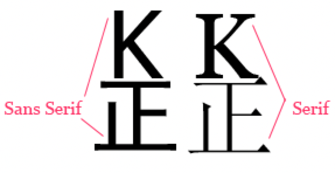
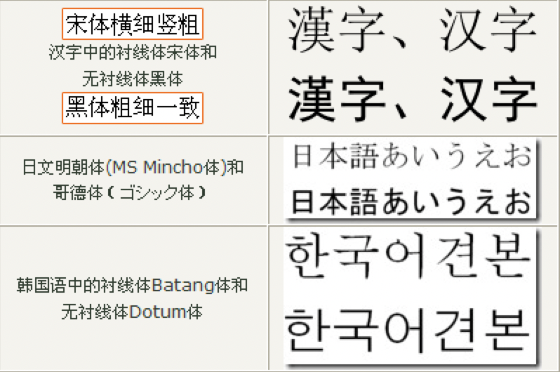
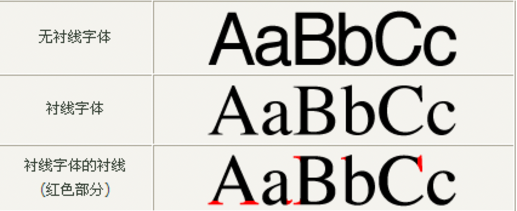
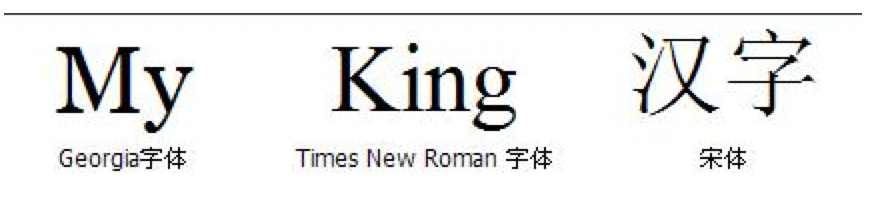
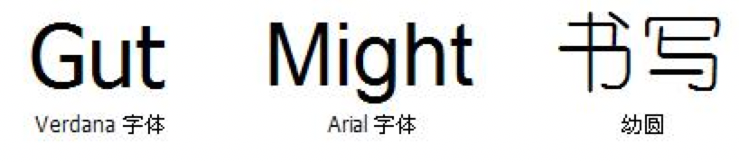

T　在西方国家罗马字母阵营中，字体分为两大种类：Sans Serif和Serif，打字机体虽然也属于Sans Serif，但由于是等宽字体，所以另外独立出Monospace这一种类，例如在Web中，表示代码时常常要使用等宽字体。

Serif的意思是，在字的笔划开始及结束的地方有额外的装饰，而且笔划的粗细会因直横的不同而有不同。相反的，Sans Serif则没有这些额外的装饰，笔划粗细大致差不多。如下图：



可以看出，我们平时所用的Georgia、Times New Roman等就属于Serif字体，而Arial、Tahoma、Verdana等则属于Sans Serif字体。对中文而言，同样存在这两大种类，很明显，宋体、细明体(繁体中常用)等就属于Serif，而黑体、幼圆等则属于Sans Serif。

Serif和Sans Serif的一般比较：

- ① Serif的字体容易辨认，因此易读性较高。反之Sans Serif则较醒目，但在行文阅读的情况下，Sans Serif容易造成字母辨认的困扰，常会有来回重读及上下行错乱的情形。
- ② Serif强调了字母笔划的开始及结束，因此较易前后连续性的辨识。
- ③ Serif强调一个word，而非单一的字母，反之Sans Serif则强调个别字母。
- ④ 在小字体的场合，通常Sans Serif比Serif更清晰。

因为黑体字属于“无衬线体”（Sans-serif），而宋体字属于“有衬线体”（Serif），后者对于人眼的辨识来说会更轻松一些，所以阅读的时候会比较舒服。日本文字偏欧美的无衬线体（Sans-serif），所以大部分的人都使用歌德体(相当于西洋文字的无衬线体)。





**适用用途：**

通常文章的内文、正文使用的是易读性较佳的Serif字体，这可增加易读性，而且长时间阅读下因为会以word为单位来阅读，较不容易疲倦。而标题、表格内用字则採用较醒目的Sans Serif字体，它需要显着、醒目，但不必长时间盯着这些字来阅读。

像宣传品、海报类，为求醒目，它的短篇的段落也会採用Sans Serif字体。但在书籍、报刊杂志，正文有相当篇幅的情形下，则应採用Serif字体来减轻读者阅读上的负担。在Web设计及浏览器设置中也应遵循此原则为是。

**实际应用：**

在Firefox 中（目前似乎只有Firefox有此功能），可以分别单独指定Sans Serif、Serif及Monospace的中西文字体，然而这个选项并未设置在工具菜单中，不过可以在Addressbar中键入about: config，然后在Filter中过滤font找到如下Preference Name：

```
Code:
font.name.monospace.x-western
font.name.monospace.zh-CN
font.name.sans-serif.x-western
font.name.sans-serif.zh-CN
font.name.serif.x-western
font.name.serif.zh-CN
```

你可以依照上述Sans Serif、Serif及Monospace的原则来分别指定一种对应字体，按照W3C的CSS规则，在font（或者font-family）的最后都要求指定一个Serif这样的Generic-family，避免客户端实在没有指定字体时使用本机上的Serif默认字体。

因为衬线字体的可读性非常好，所以它应用的最多的地方也正是出版物或者印刷品的正文内容等以大段文字作为表现形式的作品上。

比较常见的衬线字体有：Georgia, Garamond, Times New Roman, 中文的宋体等等。



无衬线字体比较圆滑，线条一般粗细均匀。比较适合用作艺术字、标题等。因为无衬线字体通常粗细比较均匀，所以在小字体显示的时候，可读性会降低，容易引起视觉疲劳。

常见的无衬线字体有：Trebuchet MS, Tahoma, Verdana, Arial, Helvetica, 中文的幼圆，隶书等等。 　　 



**其他的通用字体族**

印刷学中，除了serif和sans-serif之外，通常还有Monospace等宽字体、scripts手写体（比如花体）、blackletter铅字体（也叫gothic哥特体。严格的说，很多常用的serif字体其实是gothic字体）、ornamental 装饰体（那些在文字笔划上或者周围有装饰花纹的字体。很多中世纪书籍上很常见。如果脑残体真的成了字体，那么应该可以算装饰体吧……）和symbol 符号字体（比如有名的wedding123……）

**Monospace等宽字体：**

所谓的等宽字体，是指每个字符宽度都一致的字体。一个著名的例子就是 Courier New 字体。因为字符宽度一致，所以特别容易对齐，能快速精确的定位到某行某列，因此经常用来显示代码。

Cursive书写体：相当于印刷学中的手写体。中文的华文行草就是这样的一个字体。

网页设计中的默认字体：字体大小(12px)、行高(18px)

```
font: 12px/1.5 Tahoma, Helvetica, Arial, sans-serif;
```

- ① font-family默认采用Tahoma. Tahoma是英文Windows操作系统的默认字体，这个字体比较均衡，显示中英文混排很不错，是经久耐看的一款字体。
- ② Mac OS X系统有一款比Tahoma更典雅的系统默认字体：Helvetica，非Mac系统的Helvetica字体都是Rip版。
- ③ Arial是早期Windows英文系统的默认字体，XP和Vista上都是Tahoma。
- ④ 最后的sans-serif是针对强悍的Linux DIY族。Linux默认只有kernel，字体完全由用户自定义，针对这部分用户，sans-serif可能能派上用场。
- ⑤ 最后，无论在XP还是Vista下，不指定网页的中文字体时，默认就是宋体。因此font-family里的'宋体'是多余的，可以省去。