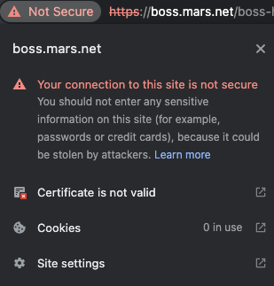
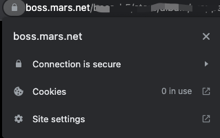

# 给在本机运行的Webpack应用配置 HTTPS

>为什么本地需要 https 环境？
>
>一个重要理由：因为 Facebook 的 Javascript SDK 只能在 **https** 环境中运行，为了开发方便，本地搭建https开发环境。

使用 vitejs 搭建本地https开发环境。

## 一、**域名配置**：

域名可以用配置hosts解决，/etc/hosts配置一条记录指向127.0.0.1即可。

```
127.0.0.1 boss.mars.net
```

## 二、**证书**：证书我们使用mkcert签发

https://github.com/FiloSottile/mkcert 

1、macOS 下 安装mkcert

```bash
brew install mkcert
```

2、在项目根目录下创建自目录存放域名证书和私钥, 生成所需域名对应的本地证书，例如 my.com

```bash
mkdir config && cd config
mkcert boss.mars.net
```

将产生 `boss.mars.net-key.pem`和`config/boss.mars.net.pem`。

3、配置 vitejs 开启 https

```json
import { defineConfig } from 'vite';
export default defineConfig({
  ...
  server: {
    port: 443,
    https: {
      key: fs.readFileSync('config/boss.mars.net-key.pem'),
      cert: fs.readFileSync('config/boss.mars.net.pem')
    }
  }
}   
```

启动 vitejs 的 Web服务，访问`https://boss.mars.net`




显示不安全，要生成 mkcert 根证书，安装到 `keychain`。

4、使用mkcert生成根证书，并安装到 macOs的 `keychain`

```
mkcert -install
```

5、再次访问 `https://boss.mars.net`，显示网站安全。




> 注：有介绍使用 `@vitejs/plugin-basic-ssl`，但是生成证书不是安全的（第3步的样子），不建议使用。