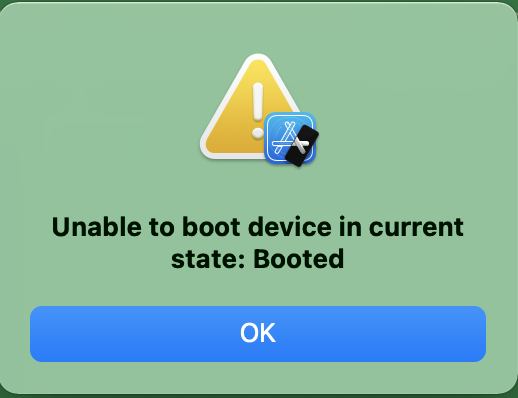
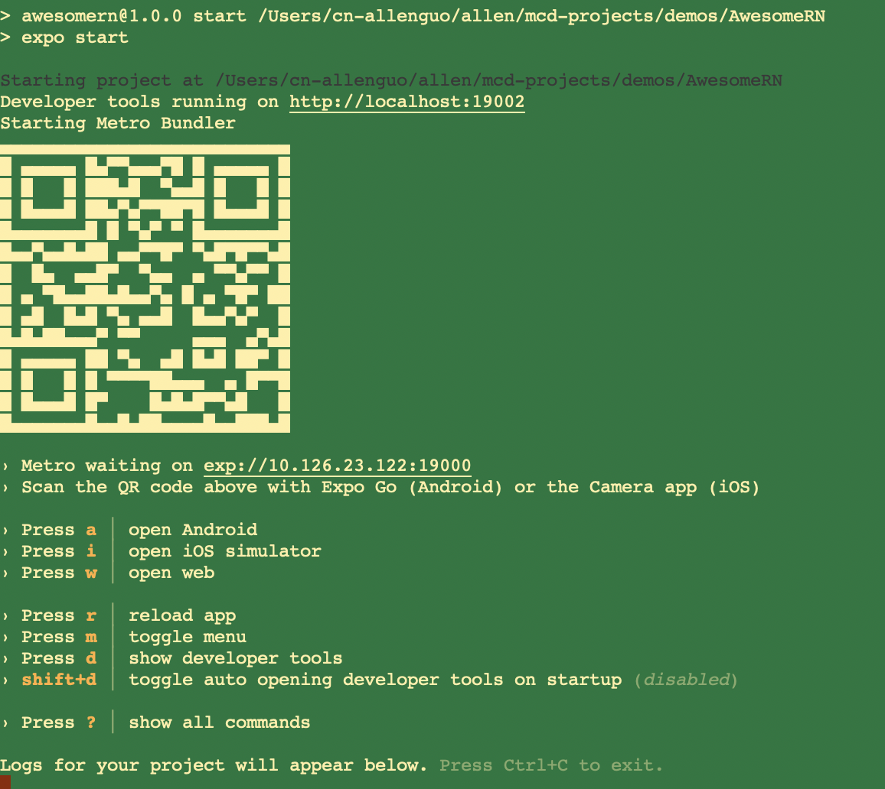
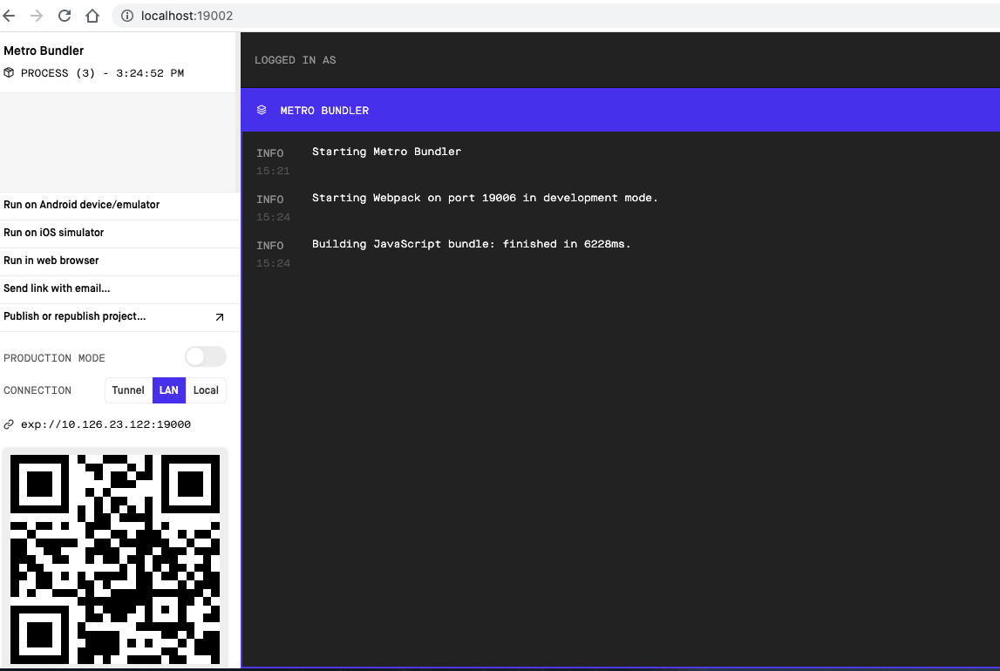

[toc]
# React Native 入门之Hello World

官网：https://reactnative.dev/


跟随 Enviromnment Setup 文档：https://reactnative.dev/docs/environment-setup

## 1. React Native CLI Quickstart

> 该方法创建一个RN模板项目，也包含了Android、iOS壳应用（分别位于 andorid、ios子目录）。

### 初始化项目

选择我工作电脑的平台（macOS， iOS），预安装环境包括： node、wantchman、xcode等，不过Web前端程序员默认都装了这些吧，所以直接初始化项目：

```shell
npx react-native init AwesomeProject
```

### 运行项目(默认模拟器上)

```bash
npm run ios
```

直接打开ios模拟器显示如下内容：


> 注：我本机运行有如下错误，但是点击 `OK` 继续运行不影响使用：
> 

### 支持热更新

官文说：如果想支持热更新，应该在 `npm run ios` 之前运行

```bash
npm run start
```

该脚本实际执行了 `npx react-native start`，本质是启动了 `react-native`里的 Metro Bundler，类似于 webpack的热更新。<b style="color:red">但是：实际测试发现不执行  `npm run start` 依然默认在热更新模式下.</b>

### 运行在手机设备

上面示例的是运行 App 在电脑上的模拟终端，如果要运行在真机，看 https://reactnative.dev/docs/running-on-device


## 2. Expo CLI Quickstart

> Expo创建一个RN模板项目，也自带了Andorid、iOS壳应用，不过在项目下并没有 andorid、ios子目录，应该是隐藏在 node_modules目录下。另外 Expo 也提供了apple和andorid的手机应用Expo Go 用于真机直接下载测试
>
> 苹果应用：https://apps.apple.com/app/apple-store/id982107779
>
> 谷歌应用：https://play.google.com/store/apps/details?id=host.exp.exponent&referrer=www

### 初始化项目

```bash
npm install -g expo-cli
expo init AwsomeProject
cd AwsomeProject
```

### 运行项目(默认设备上)

```bash
npm run start
```

终端显示类似如下的内容



Expo支持相当丰富的方式浏览你的App：

####  A.  真机访问：在你的 android/ios 安装 Expo App https://expo.io/

 然后扫描终端上显示的二维码

#### B. 模拟运行：根据屏幕打开网页：  http://localhost:19002

看到类似如下页面：



你可以直接选择  `Run in web browser`；如果你已经安装过 `emulator`，可以选择 `Run on Andorid device/emulator` 或者 `Run on iOS simulator`。

