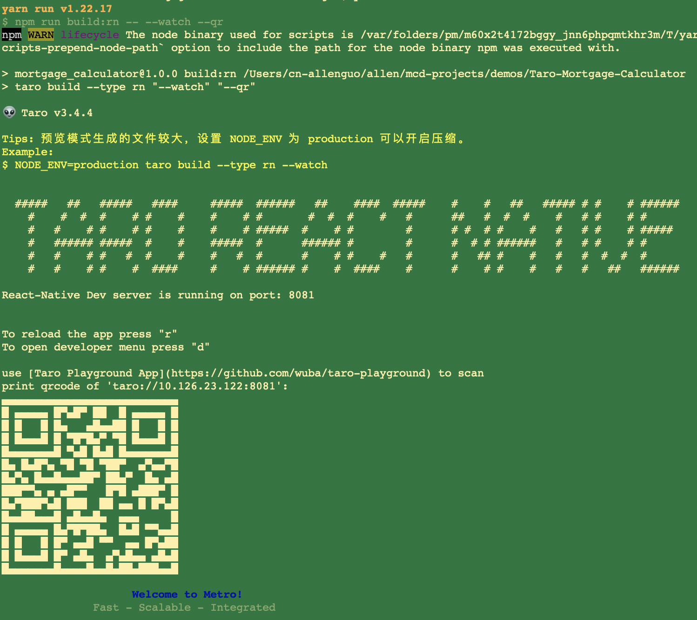
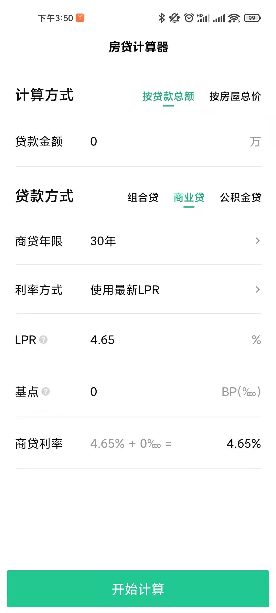

[toc]
# 基于Taro的React Native工程入门

官网文档： https://taro-docs.jd.com/taro/docs/react-native/


## 获取并运行项目(从一个官方例子工程入手)

```bash
 # clone到本地
  git clone https://github.com/wuba/Taro-Mortgage-Calculator.git
  
  # 进去项目根目录
  cd Taro-Mortgage-Calculator
  
  # 安装依赖
  yarn
  
  # 运行RN 默认端口8081
  yarn dev:rn
```

> 注： 我 `yarn dev:rn` 时提示缺少 `@react-native-community/cli`，手动安装之。

显示类似 Expo 的运行界面（实际也是 expo的包装）：



## 使用 Taro Playground预览

  官网： https://github.com/wuba/taro-playground#app-download

手机安装 Taro Playground 应用，扫描上图二维码，运行如下（默认热更新）：

