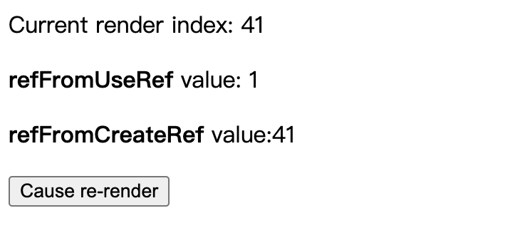

假设大家已经使用过 React Hook，并且至少用过 useRef 和 createRef两者中的一个

## createRef 和 useRef 效果一样的例子

```jsx
import { createRef } from 'react';
const FocusInput = () => {
	const inputElement = createRef();
	const handleFocusInput = () => {
	  inputElement.current.focus();
	}
  
  return (
    <>
    	<input ref={inputElement} type="text" />
      <button onClick={handleFocusInput}>Focus inpu</button>
    </>
  );
}
```

将上面例子中 `createRef`修改为`useRef`，效果一样。

## createRef 与 useRef 的区别

既然 createRef 和 useRef 的作用完全一样，那为什么 react 要设计一个新的 hook ? 难道只是会了加上 use , 统一 hook 规范么? 

官网的定义如下: 

> `useRef` returns a mutable ref object whose `.current` property is initialized to the passed argument (`initialValue`). The returned object will persist for the full lifetime of the component.

换句人话说 , useRef 在 react hook 中的作用, 正如官网说的, 它像一个变量, 类似于 this , 它就像一个盒子, 你可以存放任何东西. 

**createRef 每次渲染都会返回一个新的引用，而 useRef 每次都会返回相同的引用。**

### 1. 使用 createRef 的场合

```jsx
import React, { createRef, useRef } from "react";

const App = () => {
  const [renderIndex, setRenderIndex] = React.useState(1);
  const refFromUseRef = useRef();
  const refFromCreateRef = createRef();

  if (!refFromUseRef.current) {
    refFromUseRef.current = renderIndex;
  }

  if (!refFromCreateRef.current) {
    refFromCreateRef.current = renderIndex;
  }

  return (
    <>
      <p>Current render index: {renderIndex}</p>
      <p>
        <b>refFromUseRef</b> value: {refFromUseRef.current}
      </p>
      <p>
        <b>refFromCreateRef</b> value:{refFromCreateRef.current}
      </p>

      <button onClick={() => setRenderIndex(prev => prev + 1)}>
        Cause re-render
      </button>
    </>
  );
};

export default App;
```

运行上述代码，多次点击按钮 `Cause re-redner`可能产生如下结果：




### 2. 使用 useRef的场合

我们先来看一个经典的问题：

```jsx
import React, { useState } from "react";

export default function App() {
	const [ count, setCount] = useState(0);
  
  function handleAlertClick() {
		setTimeout(() => {
			alert("You clicked on: " + count);
    }, 3000);
  }
	return (
		<div>
			<p>You clicked [countf times</p>
			<button onClick={() => setCount(count + 1)}>Click Me</button>
      <button onClick={handleAlertClick}> Show alert </button>
   </div>
);
```

运行结果就是 `alert` 的结果始终为 0，不是 count 的实时状态，那么如何让点击的时候弹出实时的 count ?

### useRef 的例子

```jsx
import React, { useState, useRef, useEffect } from "react";

export default function App() {
  const [count, setCount] = useState(0);
  const latestCount = useRef(count);
  useEffect(() => {
    latestCount.current = count;
  });
  function handleAlertClick() {
    setTimeout(() => {
      alert("You clicked on: " + latestCount.current);
    }, 3000);
  }
  return (
    <div>
      <p>You clicked {count} times</ p>
      <button onClick={() => setCount(count + 1)}>Click me</button>
      <button onClick={handleAlertClick}> Show alert </button>
    </div>
  );
}
```

## 3. useRef 复杂例子（封装hook）

基于 2 的例子，现在假设我们希望在界面上显示出 `上一次 count` 的值.

```jsx
import { useEffect, useRef, useState } from "react";

export default function App() {
    const [count, setCount] = useState(0);
    const preCountUseRef = useRef();
    useEffect(() => {
        preCountUseRef.current = count
    });
    return <div>
        <p>preCount: {preCountUseRef.current}</p>
        <p>You clicked {count} times</p>
        <button onClick={() => setCount(count + 1)}>Click me</ button>
    </ div>
}
```

运行后，多次点击 `Click me`，显示可能如下：


> 注：看起来每次 count 改变时， `preCountUseRef.current` 都赋值为 `count`，为什么 `preCount`显示上一次的值呢？
>
> 这是因为：useRef 是不能出发 re-render的，所以显示的还是上一次的值。

最后， 我们尝试把它封装成自定义 hook，使代码看起来更优雅

```jsx
import React, { useEffect, createRef, useRef } from "react";

const usePrevious = (state: any) => {
    const ref = useRef();

    useEffect(() => {
        ref.current = state;
    });
    return ref.current;
};

export default function App() {
    const [count, setCount] = React.useState(0);
    const prevCount = usePrevious(count);
    return <div>
        <button onClick={() => setCount(count + 1)}>+</button>
        <button onClick={() => setCount(count - 1)}>-</ button>
        <p>Now: {count}, before: {prevCount}</ p>
    </div>
};
```

## 总结

useRef 不仅仅是用来管理 DOM ref 的，它还相当于 this , 可以存放任何变量. 

useRef 可以很好的解决闭包带来的不方便性. 你可以在各种库中看到它的身影,  比如 react-use 中的 useInterval , usePrevious …… 

值得注意的是，当 useRef 的内容发生变化时,它不会通知您。更改.current属性不会导致重新呈现。 因为他一直是一个引用 . 
