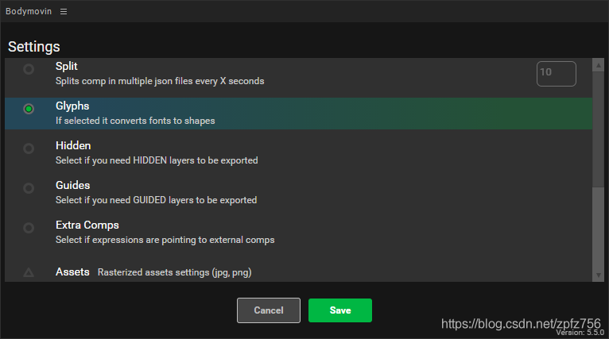

[toc]

目前实现 SVG 动画较简便的方式有两个：[Lottie](https://github.com/airbnb/lottie-web) 和 [SVGA](http://svga.io/index.html)（两个库各有优缺点，具体对比请转至 [《Android 动画库对比(Lottie 和 SVGA)》](https://jfson.github.io/2018/01/08/41-anim/)）。这里讲解如何从 After Effect 导出到Web去调用整个流程。


## After Effect 部分

### 1. 安装ZXP Installer
在安装 Bodymovin 之前需要先安装 ZXP Installer，其下载链接为：https://aescripts.com/learn/zxp-installer/。

### 2.安装 Bodymovin
然后再下载 Bodymovin，其各版本下载链接：https://github.com/bigxixi/bodymovin_cn。

### 3.导出data.json
打开AE，记得先把所有图层预合成，然后重命名合适的名称，接着在菜单栏选择 "窗口" - "扩展" - "Bodymovin"，点击如图所示的小齿轮：


然后选择 Glyphs 这项，也可同时勾选 Standalone 、Demo ，但是这里没必要也用不上，勾选 Glyphs 即可，如图：



注：Standalone 可导出单独的 js 文件，里面包含 json 动画数据和库文件，无需再引用 lottie.js 库文件，而使用本方式时可直接引用 js 文件，代码如下：

```html
<!-- 注意 data.js 文件与当前 html 文件同级 -->
<script src="./data.js"></script>
```
然后在 `<body></body>` 内需添加以下代码即可：

```html
<!-- 注意 id 名称不可随意更改，若要更改请先把 data.js 里面的获取 DOM 语句更改 -->
<div id="script"></div>
```

而 Demo 会导出单独的 html 文件，里面包含 json 数据和库文件，直接打开即可预览。但是不推荐使用 Standalone 和 Demo 这两种形式，json 数据和库文件整合在一起，文件会很大，影响加载速度！

点击如图所示位置可更换文件保存位置：


最后点击左上角绿色按钮 "Render" 等待渲染即可。渲染完毕后，打开保存的文件夹，你会发现文件夹里有个 data.json 文件，里面保存的就是动画数据。

为了省带宽，我已经把 data.json 上传至 Github，如果有导出 images 文件夹，需要一同上传，否则无法正常显示！或者你也可以这样做：先把 images 上的图片上传至图库并获取每个图片的链接，记住，图片顺序不能乱。然后打开 data.json，把 "assets" 字段下的 u 集合都删除，然后 p 集合换成对应的图片链接，如图：


整理后的动画数据应该是这样子的：


然后下面就可以直接引用 data.json 文件而无需管理 images 文件夹了。


## Web 部分
啰嗦几句：本来用 vue-lottie 依赖也可以实现（这个依赖有小坑，解决小坑请看这里：点我 ），但是后期为了优化 build 时的文件， 所以没有采用该方法，毕竟看了下 vue-lottie 依赖封装的代码还是有点多的。

### 1.引入 lottie.js
打开 public 文件夹下的 html 模板文件，在合适的位置引入 lottie.js，这里建议把官方的 lottie.js Fork 到自己的 Github，然后自己再引用。官方 [lottie-web](https://github.com/airbnb/lottie-web/tree/master/build/player) ，记得选 min 版本哦！如图：


代码如下（这里引用的是我 Github 的链接）：

```html
<script src="//zpfz.github.io/Website/dist/js/lottie.min.js" crossorigin="anonymous" type="text/javascript"></script>
```

### 2.添加 SVG 舞台
在需要添加 SVG 动画的位置添上以下语句：
```html
<div id="lottie"></div>
```
上述的 div 就好比是 SVG 动画的舞台，让它在 id 名为 lottie 的 div 下进行动画。

3.添加动作代码
lottie.js 提供了一些参数，比如是否自动播放，是否循环播放等等，更多方法/属性请访问：点我 ，官方实例请访问：点我 。一般可以在生命周期函数（比如 created、mounted 等等）添加代码，这里推荐在 mounted 周期下执行代码，其代码如下：

```js
mounted() {
    // 创建动画实例，并设置好默认属性  
    let animData = {
        // 绑定 id 名为 lottie 的舞台
        wrapper: document.getElementById('lottie'),
        // 动画类型
        animType: 'svg',
        // 是否循环播放
        loop: true,
        // 是否预渲染
        prerender: true,
        // 是否自动播放
        autoplay: true,
        // json 动画数据路径
        path: '这里替换成你的 data.json'
    };
    // 执行动画实例
    let anim = bodymovin.loadAnimation(animData);
 }
```
弄完以上步骤就能测试下动画显示效果啦！怎么样？很简单吧！
