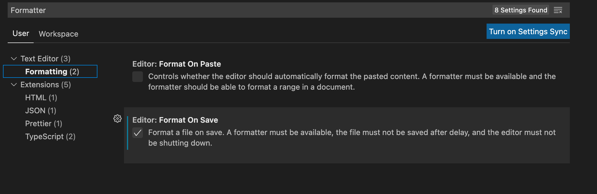

# EditorConfig

https://editorconfig.org/

“EditorConfig帮助开发人员在不同的编辑器和IDE之间定义和维护一致的编码样式。”

## VSCode插件

名称：Prettier - Code formatter

https://marketplace.visualstudio.com/items?itemName=esbenp.prettier-vscode#configuration

安装好后，右键单击目录名能产生 .editorconfig 文件，例：

```ini
# EditorConfig is awesome: https://EditorConfig.org

# top-most EditorConfig file
root = true

[*]
indent_style = space
indent_size = 4
end_of_line = lf
charset = utf-8
trim_trailing_whitespace = false
insert_final_newline = false
```

这样，比如，在代码文件中按TAB就会执行规则 `indent_size = 4` 产生4个空格

Preferences->Settings找到Fromatting



可以做到：当文件存储的时候，按照 .editorconfig 的内容进行格式化后保存。