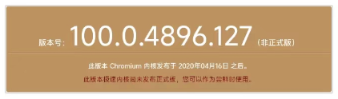
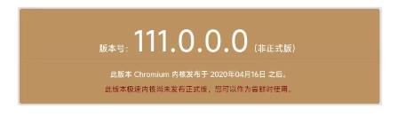
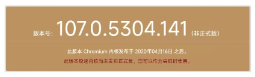
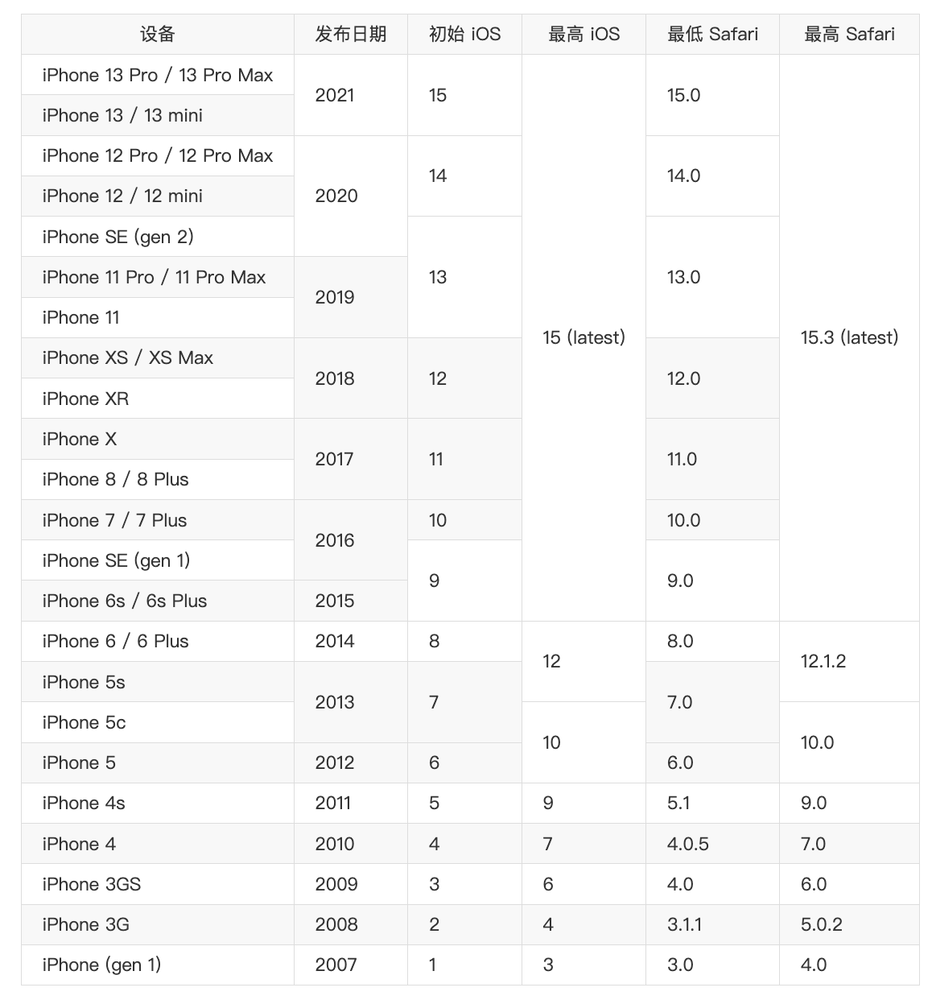

# 依浏览器市场份额对H5应用进行兼容性测试(移动端)

[toc]

测试H5 应用在移动设备上浏览器兼容性，要考虑用户的Webview宿主，常见的宿主分类：

* 手机内置浏览器
* 装机量巨大的应用内嵌Webview，如**微信**
* 用户自行安装的浏览器，比如 android开发者群体喜欢安装 **Chrom for Andorid**

Android和iOS 是移动端的主流操作系统，以下仅考察这两个平台。

## Android

对于 Andorid 手机来说，各个厂商在发行手机时，其Webview版本可能经过了定制，以我的小米手机为例，默认的手机浏览器是“手机浏览器”；由于工作和社交需要，我也安装了微信、Chrome For Andorid，以下是三个Webview的版本

* **小米手机浏览器**

  

* 微信 Webview

  

* 谷歌浏览器

  

> 注：测试方法是打开浏览器访问 https://liulanmi.com/labs/core.html ，即返回当前浏览器的版本信息。

### 确定兼容性范围

* 首先确定H5应用的用户群体主流 Andorid手机型号范围，然后确定**厂商操作系统**（定制了Android OS）版本范围，进而查出**厂商操作系统**哥版本搭载的相应内置浏览器版本范围（实际取取最低版进行兼容），然后进行兼容性开发和测试。

  > Android手机厂商繁杂，其内置的定制浏览器也繁杂多样，通过 [Mobile Vendor Market Share](https://gs.statcounter.com/vendor-market-share/mobile) 确定硬件流行度。
* 如果H5应用运行在指定的App宿主下，如运行在**微信**里，则需要首先根据微信的版本流行度，确定要测试的微信版本范围，从而确定各版本内部对应搭载的 Webview 名称和版本，然后进行兼容性开发和测试。

* 如果用户使用了自行安装的浏览器访问H5应用，通常只能在系统运营阶段收集用户的浏览器信息，然后进行补充兼容性开发和测试

## iOS

iOS是Apple拥有独家版权的移动操作系统，内嵌的浏览器是Safari，随 iOS升级而升级，并仅搭载Apple的硬件发行，因此可以从官方获得iPhone和iOS、Safari的发行版本对应关系。

 **参考**

* Safari version history（包括与iOS版本对应关系） https://en.wikipedia.org/wiki/Safari_version_history#iOS
* iOS version by device  https://iosref.com/ios#iphone

* iOS version usage https://iosref.com/ios-usage 

### 确定兼容性范围

* 首先，从 [iOS Version Market Share@statcounter](https://gs.statcounter.com/os-version-market-share/ios/mobile-tablet/worldwide) 分析iOS 版本流行度，确定兼容的iOS版本范围（对应的iPhone设备也就基本确定），进而确定了搭载的Safari版本范围，然后进行兼容性开发和测试。

* 如果H5应用运行在指定的App宿主下，如运行在iOS微信里，则需要首先根据微信的版本流行度，确定要测试的微信版本范围，从而确定各版本内部对应搭载的 Webview 名称和版本，然后进行兼容性开发和测试。
* 如果用户使用了自行安装的浏览器访问H5应用，通常只能在系统运营阶段收集用户的浏览器信息，然后进行补充兼容性开发和测试
