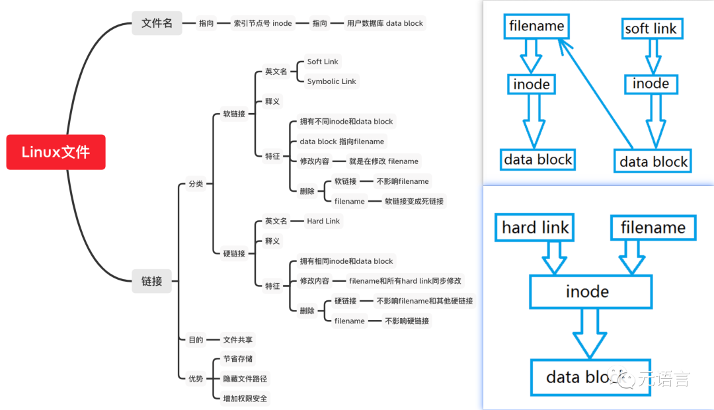

[toc]



在某个npm/yarn管理的Js项目下，改用`pnpm` 安装依赖:

```bash
pnpm i
```

仍然会产生正确的`node_modules`目录，只是里面的依赖包都是到 `node_modules/.pnpm` 目录下的`软链接`，同时`node_modules/.pnpm` 目录下的包文件也是 `pnpm`全局依赖包缓存目录下包文件的`硬链接`，关系类似如下：

```
node_modules/<package a>--->node_modules/.pnpm/<package a>--->global pnpm cache/<pacakge a>
```

这个`pnpm`全局缓存目录是啥？可以用命令

```bash
pnpm store path
```

查到，我的mac OS查到的目录是 `/Users/koda/Library/pnpm/store/v3`


## Bash 命令验证硬链接

### 在node_modules/.pnpm`目录下找出一个有超过1个硬链接的指定文件

以我的项目为例，有个名为 `which`的依赖包（预先进入该包所在目录 `cd node_modules/.pnpm/which@2.0.2/node_modules/which`)

运行 `ls -l`

```bash
ls -l which.js 
```

返回结果行的第2列是`4`，表示文件`which.js`有 4 个硬链接。

```
-rw-r--r--  4 koda  1785738871  3163 May 11  2022 which.js
```

### 查出指定文件的 inode 值

运行`ls -i`

```bash
ls -i which.js 
```

返回该文件的 inode 是 42949443

```
42949443 which.js
```

### 去 pnpm 全局缓存目录尝试查找同 inode 的文件名

```bash
cd ~/Library/pnpm/store/v3/
find . -inum 42949443
```
返回结果：

```
./files/6e/5617ff8dcdacdb444a61fb55aae7d19dd6addd175dc299bd20e8a6e1bf13ee105f53dac49033d0775561714b0093a88ecd9e865bdb8ddd7bb7bbe9ef990214
```

用`cat`查看该文件和项目`node_modules/.pnpm`下的 `which.js`的内容完全一样

