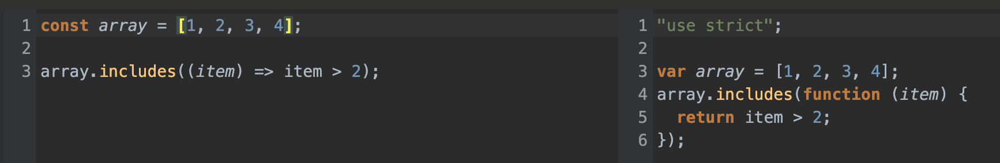
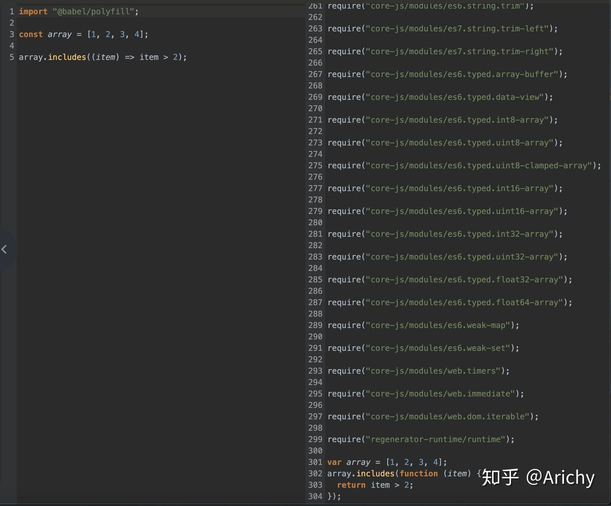
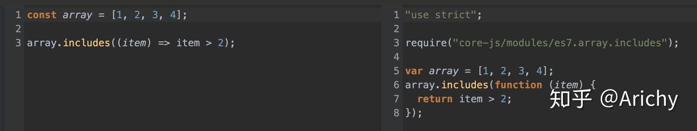
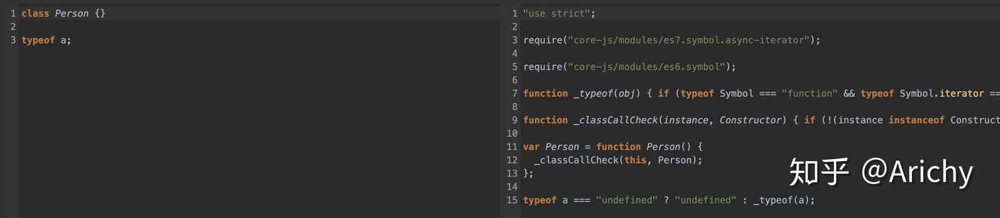
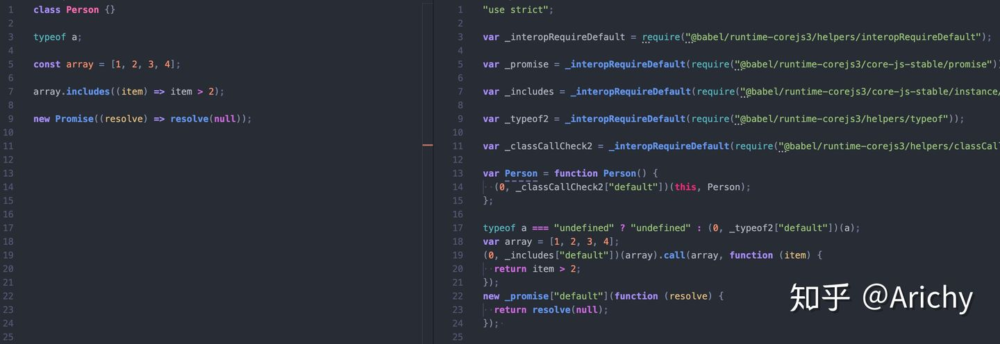

[toc]

很多初学者在刚接触 babel 的时候，通常会看到这样一个报错信息：

```text
ReferenceError: regeneratorRuntime is not defined
```

这个报错表面上是由于 async function 语法被 babel 转译之后的代码使用了 regeneratorRuntime 这个变量，但是这个变量在最终的代码里未定义造成的报错。


## Babel转译包括：syntax 和 api处理

**babel 在转译的时候，会将源代码分成 syntax 和 api 两部分来处理：**

- syntax：类似于展开对象、optional chain、let、const 等语法
- api：类似于 [1,2,3].includes 等函数、方法

## @babel/preset-env 配置：快速入门

### A. Syntax 处理

首先写一个最简单的 babel 配置文件：

```json
{
  "presets":[["@babel/preset-env"]]
}
```

转译结果如下：



上面说过，const 这种语法为 syntax，includes 这种方法为 api。可以看到，syntax 很轻松就转好了，但是 api 并没有做任何处理。babel 转译后的代码如果在不支持 includes 这个方法的浏览器里运行，就会报错。

### B.  API处理（useBuiltIns选项）

babel 使用 polyfill 来处理 api。@babel/preset-env 中有一个配置选项 useBuiltIns，用来告诉 babel 如何处理 api。由于这个选项默认值为 false，即不处理 api，所以上面的代码转译后没有处理 includes 这个方法。

#### 1)   useBuiltIns =entry 全部引入依赖

* 设置 useBuiltIns 的值为 "entry";

```json
{
  "presets": [
    [
      "@babel/preset-env",
      {
        "useBuiltIns": "entry",
        "debug": true
      }
    ]
  ]
}
```

* 同时在源代码的最上方手动引入 @babel/polyfill 这个库（该库一共分为两部分，第一部分是 core-js，第二部分是 regenerator-runtime。其中 core-js 为其他团队开源的另一个独立项目）

```javascript
import "@babel/polyfill";

const array = [1, 2, 3, 4];
array.includes((item) => item > 2);
```

转译结果如下：



缺点： 可以看到，这种模式下，babel 会将所有的 polyfill 全部引入，这样会导致结果的包大小非常大，而我们这里仅仅需要 includes 一个方法而已。

#### 2)   useBuiltIns =usage 按需引入依赖

正确的做法是使用**按需加载**，将 useBuiltIns 改为 "usage"，babel 就可以按需加载 polyfill，另外源代码中也不需要手动引入 @babel/polyfill

```json
{
  "presets": [
    [
      "@babel/preset-env",
      {
        "useBuiltIns": "usage",
        "debug": true
      }
    ]
  ]
}
```

转译结果如下：



------

到这里，最开始的那个问题真正的原因大家就应该理解了。babel 在转译 async function 的时候，生成的代码里使用了 regeneratorRuntime 这个变量，而这个变量是放在 regenerator-runtime 这个 polyfill 库中的，所以如果不修改 useBuiltIns（设置usage或entry）以 引入 polyfill，那么自然会报 undefined 错误，因为根本就没有引入这个变量。

## 解决全局变量污染和辅助函数重复定义问题

### A. 全局变量污染

上面转译代码中：

```javascript
require("core-js/modules/es7.array.includes");
```

这个 polyfill 机制是，对于 includes 实例方法，直接在 global.Array.prototype 上添加（对于例如 Array.from 等静态方法，直接在 global.Array 上添加）。这样直接修改了全局变量的原型，有可能会带来意想不到的问题（这个问题在开发第三方库的时候尤其重要）：因为我们开发的第三方库修改了全局变量，有可能和另一个也修改了全局变量的第三方库发生冲突，或者和使用我们的第三方库的使用者发生冲突。

公认的较好的编程范式中，也不鼓励直接修改全局变量、全局变量原型。

### B. 辅助函数重复定义

babel 转译 syntax 时，有时候会使用一些辅助的函数来帮忙转，比如：



class 语法中，babel 自定义了 _classCallCheck这个函数来辅助；typeof 则是直接重写了一遍，自定义了 _typeof 这个函数来辅助。这些函数叫做 helpers。

从上图中可以看到，helper 直接在转译后的文件里被定义了一遍。如果一个项目中有100个文件，其中每个文件都写了一个 class，那么这个项目最终打包的产物里就会存在100个 _classCallCheck 函数，他们的长相和功能一模一样，这显然不合理。

### @babel/plugin-transform-runtime 这个插件的作用就是解决上面提到的两个问题

先执行下面两条命令安装两个库：

```bash
yarn add @babel/plugin-transform-runtime -D

yarn add @babel/runtime-corejs3
```

其中 @babel/plugin-transform-runtime 的作用是转译代码，转译后的代码中可能会引入 @babel/runtime-corejs3 里面的模块。所以前者运行在编译时，后者运行在运行时。类似 polyfill，后者需要被打包到最终产物里在浏览器中运行。

再修改配置：

```json
{
  "presets": [
    [
      "@babel/preset-env",
      {
        "useBuiltIns": "usage",
        "debug": true
      }
    ]
  ],
  "plugins": [
    [
      "@babel/plugin-transform-runtime",
      {
        "corejs": 3 // 指定 runtime-corejs 的版本，目前有 2 3 两个版本
      }
    ]
  ]
}
```



从上图可以看到，在引入了 transform-runtime 这个插件后：

- api 从之前的直接修改原型改为了从一个统一的模块中引入，避免了对全局变量及其原型的污染，解决了第一个问题
- helpers 从之前的原地定义改为了从一个统一的模块中引入，使得打包的结果中每个 helper 只会存在一个，解决了第二个问题

## 总结

babel 在转译的过程中，对 syntax 的处理可能会使用到 helper 函数，对 api 的处理会引入 polyfill。

默认情况下，babel 在每个需要使用 helper 的地方都会定义一个 helper，导致最终的产物里有大量重复的 helper；引入 polyfill 时会直接修改全局变量及其原型，造成原型污染。

@babel/plugin-transform-runtime 的作用是将 helper 和 polyfill 都改为从一个统一的地方引入，并且引入的对象和全局变量是完全隔离的，这样解决了上面的两个问题。