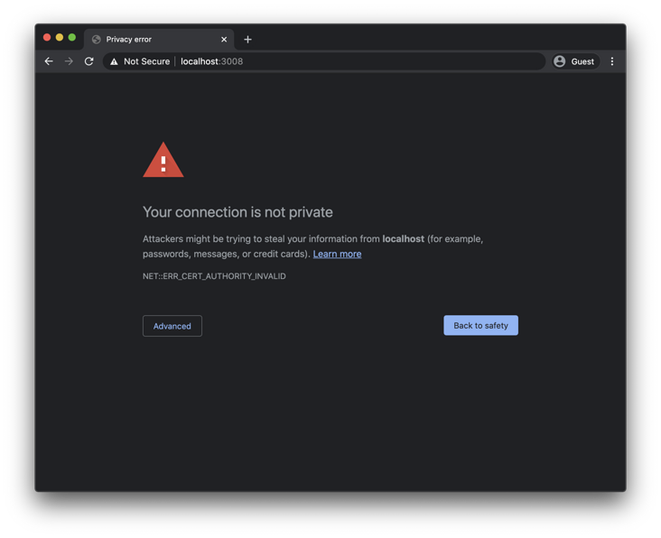
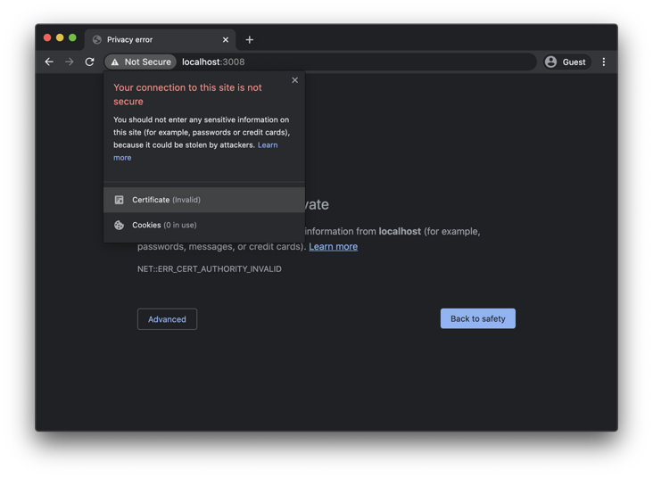
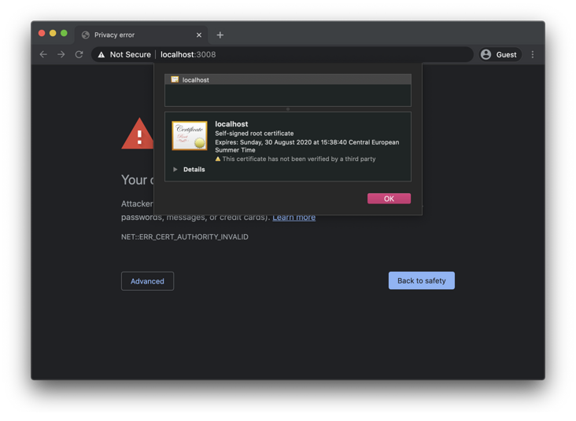
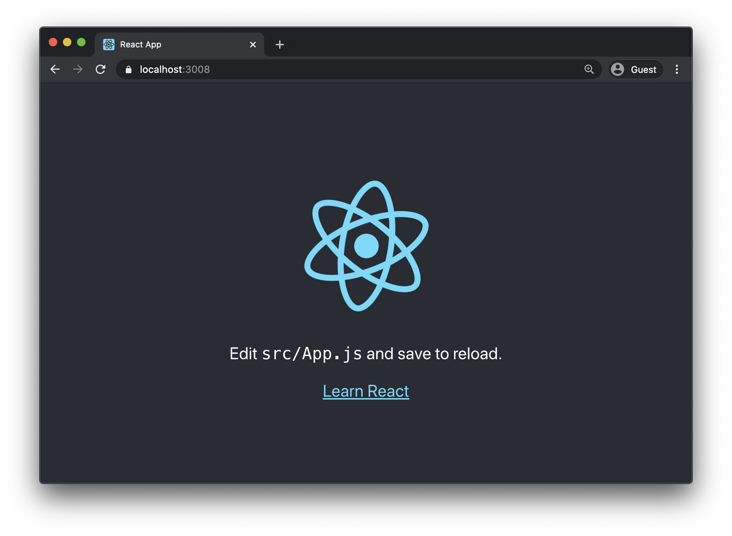

[toc]
# 给在本机运行的CRA React 程序配置 HTTPS

如果用 `create-react-app` 构建一个程序，并且在本地运行，默认情况下会用 HTTP 协议为该程序提供服务。

而在生产环境中运行的程序都用 HTTPS 进行服务。

尽管说把 HTTPS 配置出来非常简单，但是想在本地配置要复杂一些。

我们都知道，`create-react-app` 程序是用 `npm run start`（或简称为 `npm start`）运行的，在 `package.json` 文件的 `scripts` 部分中，有这样一行配置：

```plaintext
"start": "react-scripts start"
```

把它修改为：

```plaintext
"start": "HTTPS=true react-scripts start"
```

把环境变量 `HTTPS` 的值设置为 `true` 。

但是还不够，还需要生成本地证书。

> 注意：以下命令是在 macOS 上执行的，Linux 下可以用相同的方式操作。但是不保证在 Windows 下也能成功。

在项目根目录中运行：

```bash
openssl req -x509 -newkey rsa:2048 -keyout keytmp.pem -out cert.pem -days 365
```

然后运行：

```bash
openssl rsa -in keytmp.pem -out key.pem
```

在当前目录下会生成 `cert.pem` 和 `key.pem` 两个文件。

现在把 `package.json` 文件中的 `start` 脚本改为：

```plaintext
"start": "export HTTPS=true&&SSL_CRT_FILE=cert.pem&&SSL_KEY_FILE=key.pem react-scripts start",
```

现在运行 `npm run start` 并访问 React 程序，应该能看到下面的警告消息：



这是因为默认浏览器不信任本地证书。

单击地址栏附近的“不安全”小图标，然后会出现一个小面板：



单击“证书”，会看到另一个面板，其中包含证书详细信息：



现在用鼠标把证书图标拖到桌面或某个文件夹中，就会得到证书文件。然后双击证书安装，设置为“受信任的证书或签发机构”。

设置完成后，就可以通过 HTTPS 在本地访问自己的 React 程序了：

