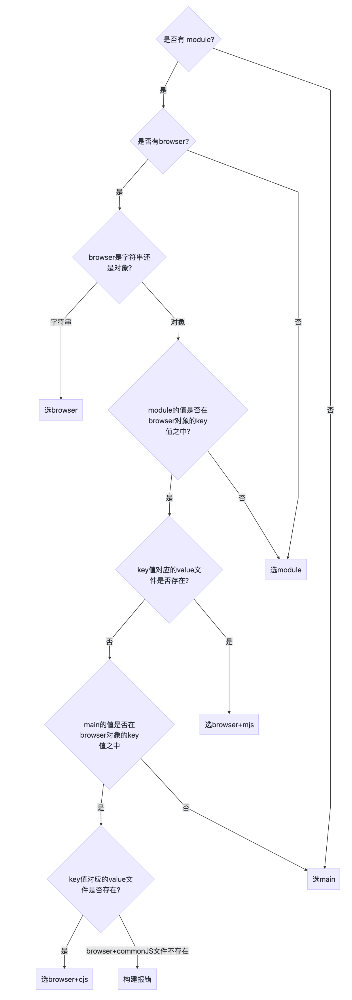

- [`browser` VS `module` VS `main`](https://github.com/SunshowerC/blog/issues/8#browser-vs-module-vs-main)
- [文件优先级](https://github.com/SunshowerC/blog/issues/8#文件优先级)
- `browser`，`module` 和 `main` 字段
  - [字段定义](https://github.com/SunshowerC/blog/issues/8#字段定义)
  - 使用场景与优先级
    - [webpack + web + ESM](https://github.com/SunshowerC/blog/issues/8#webpack-web-esm)
    - [webpack + web + commonJS](https://github.com/SunshowerC/blog/issues/8#webpack-web-commonjs)
    - [webpack + node + ESM/commonJS](https://github.com/SunshowerC/blog/issues/8#webpack-node-esmcommonjs)
    - [node + commonJS](https://github.com/SunshowerC/blog/issues/8#node-commonjs)
    - [node + ESM](https://github.com/SunshowerC/blog/issues/8#node-esm)
- [总结](https://github.com/SunshowerC/blog/issues/8#总结)

## `browser` VS `module` VS `main`

前端开发中使用到 `npm` 包那可算是家常便饭，而使用到 `npm` 包总免不了接触到 `package.json` 包配置文件。

那么这里就有一个问题，当我们在不同环境下 `import` 一个 `npm` 包时，到底加载的是 `npm` 包的哪个文件？

老司机们很快地给出答案：**`main` 字段中指定的文件**。

然而我们清楚 `npm` 包其实又分为：只允许在客户端使用的，只允许造服务端使用的，浏览器/服务端都可以使用。
如果我们需要开发一个 `npm` 包同时兼容支持 web端 和 server 端，**需要在不同环境下加载npm包不同的入口文件**，显然一个 `main` 字段已经不能够满足我们的需求，这就衍生出来了 `module` 与 `browser` 字段。

本文就来说下 这几个字段的使用场景，以及同时存在这几个字段时，他们之间的优先级。

## 文件优先级

在说 `package.json` 之前，先说下文件优先级

由于我们使用的模块规范有 ESM 和 commonJS 两种，为了能在 node 环境下原生执行 ESM 规范的脚本文件，`.mjs` 文件就应运而生。

当存在 `index.mjs` 和 `index.js` 这种同名不同后缀的文件时，`import './index'` 或者 `require('./index')` 是会优先加载 `index.mjs` 文件的。

也就是说，优先级 **`mjs` > `js`**

## `browser`，`module` 和 `main` 字段

### 字段定义

- `main` : 定义了 `npm` 包的入口文件，browser 环境和 node 环境均可使用
- `module` : 定义 `npm` 包的 ESM 规范的入口文件，browser 环境和 node 环境均可使用
- ·`browser` : 定义 `npm` 包在 browser 环境下的入口文件

### 使用场景与优先级

首先，我们假定 `npm` 包 `test` 有以下目录结构

```
- lib
   |-- index.browser.js
   |-- index.browser.mjs
   |-- index.js
   |-- index.mjs
```

其中 `*.js` 文件是使用 commonJS 规范的语法(`require('xxx')`)，`*.mjs` 是用 ESM 规范的语法(`import 'xxx'`)

其 package.json 文件：

```
  "main": "lib/index.js",  // main 
  "module": "lib/index.mjs", // module

  // browser 可定义成和 main/module 字段一一对应的映射对象，也可以直接定义为字符串
  "browser": {
    "./lib/index.js": "./lib/index.browser.js", // browser+cjs
    "./lib/index.mjs": "./lib/index.browser.mjs"  // browser+mjs
  },

  // "browser": "./lib/index.browser.js" // browser
```

根据上述配置，那么其实我们的 `package.json` 指定的入口可以有

- `main`
- `module`
- `browser`
- `browser+cjs`
- `browser+mjs`
  这 5 种情况。

下面说下具体使用场景。

#### webpack + web + ESM

这是我们最常见的使用场景，通过 `webpack` 打包构建我们的 web 应用，模块语法使用 ESM

当我们加载

```
import test from 'test'
```

实际上的加载优先级是 **`browser` = `browser+mjs` > `module` > `browser+cjs` > `main`**
也就是说 webpack 会根据这个顺序去寻找字段指定的文件，直到找到为止。

然而实际上的情况可能比这个更加复杂，具体可以参考流程图
[](https://user-images.githubusercontent.com/13402013/50725620-02d88e00-113b-11e9-8065-12fd12c6360a.png)

#### webpack + web + commonJS

```
const test = require('test')
```

事实上，构建 web 应用时，使用 `ESM` 或者 `commonJS` 模块规范对于加载优先级并没有任何影响

优先级依然是 **`browser` = `browser+mjs` > `module` > `browser+cjs` > `main`**

#### webpack + node + ESM/commonJS

我们清楚，使用 webpack 构建项目的时候，有一个 [target](https://webpack.js.org/configuration/target/) 选项，默认为 web，即进行 web 应用构建。

当我们需要进行一些 同构项目，或者其他 node 项目的构建的时候，我们需要将 `webpack.config.js` 的 `target` 选项设置为 `node` 进行构建。

```
import test from 'test'
// 或者 const test = require('test')
```

优先级是： **module > main**

#### node + commonJS

通过 `node test.js` 直接执行脚本

```
const test = require('test')
```

**只有 main 字段有效。**

#### node + ESM

通过 `--experimental-modules` 可以让 node 执行 ESM 规范的脚本(必须是 mjs 文件后缀)
`node --experimental-modules test.mjs

```
import test from 'test'
```

**只有 main 字段有效。**

## 总结

- 如果 `npm` 包导出的是 ESM 规范的包，使用 module
- 如果 `npm` 包只在 web 端使用，并且严禁在 server 端使用，使用 browser。
- 如果 `npm` 包只在 server 端使用，使用 main
- 如果 `npm` 包在 web 端和 server 端都允许使用，使用 browser 和 main
- 其他更加复杂的情况，如`npm` 包需要提供 commonJS 与 ESM 等多个规范的代码文件，请参考上述使用场景或流程图


## 纠正

流程图确实不够全，实际上不存在 module 时会再判断有没有 browser 的，解析顺序是 browser > module > main，所以有 browser 无 module 的场景下是用 browser 的。
如果自己的项目有用到 webpack 的，可以通过自行配置 webpack -> mainFields 改变其加载优先级 。
如果没用 webpack 的，可以参考上述默认的加载优先级。[]()