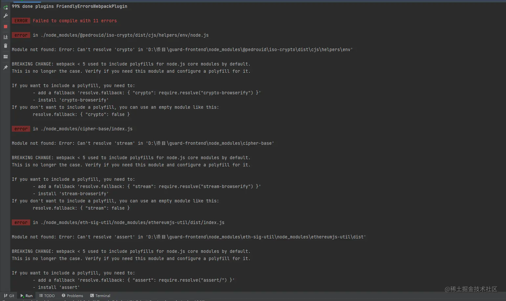

项目从 Webpack4 升级到 5 有很多坑，主要是 Webpack5 不再提供 Node.js 提供 Polyfill 等问题。


## 1、BREAKING CHANGE: webpack < 5 used to include polyfills for node.js core modules by default.

### 错误信息



### 解决方案

在 `webpack.base.config.js`中加上

```yaml
module.exports = {
  resolve: {
	  alias: {
	    crypto: false,
	    stream: false,
	    assert: false,
	    http: false,
	    https: false
  	}
  }
}
// 具体加哪个，根据报错信息判断
```

## 2、Can't resolve 'react/jsx-runtime' in './node_modules/xxx'

### 错误信息

```bash
Can't resolve 'react/jsx-runtime' in './node_modules/xxx'
```

### 解决方案

在 `webpack.base.config.js`中加上

```js
module.exports = {
  resolve: {
	  alias: {
      //...
      'react/jsx-runtime': require.resolve('react/jsx-runtime')
  	}
  }
}
```

## 3、process is not defined webpack

### 错误信息

```
process is not defined webpack
```

### 解决方案

由于 `webpack 5`不再为 `Node.js` 变量包含 `polyfill`，要避免在前端使用相关 API，说明文档：[webpack.js.org/migrate/5/#…](https://webpack.js.org/migrate/5/%23run-a-single-build-and-follow-advises)

因此，如果遇到依赖包有 `process` 等字段时，就会出现这个报错。 很多答案会给你一个答案是

```javascript
//webpack.base.config.js
module.exports = {
    plugins: [ 
        //...
        new webpack.ProvidePlugin({ 
            process: 'process/browser', 
        }), 
    ],
}    
复制代码
```

但这会导致一个新的报错：

```javascript
Cannot find module "process/browser"
```

因此，正确答案应该是：

```javascript
module.exports = {
    plugins: [ 
        //...
        new webpack.ProvidePlugin({ 
            process: 'process/browser.js', 
        }), 
    ],
}    
```

上述配置也可以用`resolve.alias`替代

## 4、Uncaught ReferenceError: Buffer is not defined

### 错误信息

```csharp
Uncaught ReferenceError: Buffer is not defined
```

### 解决方案

```java
module.exports = {
    plugins: [ 
        //...
        new webpack.ProvidePlugin({ 
            //...
            Buffer: ['buffer', 'Buffer']
        }), 
    ],
}  
```

## 5、webpack-dev-server hmr 模块热更新失效

### 问题描述

在使用 `webpack-dev-server` 的新的运行命令 `webpack serve` 后，项目的 hmr 模块热更新失效了。每次修改 js、css 文件后只能通过 `window.reload()` 来查看更改。

### 解决方案

使用 `react-refresh-webpack-plugin` 插件

```css
yarn add --dev @pmmmwh/react-refresh-webpack-plugin react-refresh
复制代码
//webpack.dev.config.js
//...
const ReactRefreshWebpackPlugin = require('@pmmmwh/react-refresh-webpack-plugin')

module.exports = merge(baseConfig, {
    devServer: {
        //...
        hot: true
    },
    //...,
    plugins: [
      ...baseConfig.plugins,
      new ReactRefreshWebpackPlugin()
    ],
})
复制代码
// .babelrc
{
    "plugins": ["react-refresh/babel"]
}
复制代码
```

## 6、开启 React Router 的 Browser router 模式

关于 React Router 的 `BrowserRouter` 和 `HashRouter` 的模式可以参阅官方文档：[v5.reactrouter.com/web/api/Bro…](https://v5.reactrouter.com/web/api/BrowserRouter)

这里需要修改一下`webpack devServer`配置：

```java
//webpack.dev.config.js
module.exports = merge(baseConfig, {
    //...
    devServer: {
        //...
        historyApiFallback: true
    }
})
复制代码
```

然后修改一下打包后的 `publicPath`：

```java
//webpack.base.config.js

module.exports = {
    output: {
        //...
        publicPath: '/'
    }
}
```

