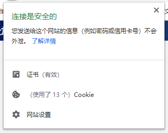

# 给在本机运行的Webpack应用配置 HTTPS

>为什么本地需要 https 环境？
>
>一个重要理由：因为 Facebook 的 Javascript SDK 只能在 **https** 环境中运行，为了开发方便，本地搭建https开发环境。

使用webpack devserver搭建本地https开发环境。

## 一、**域名**：域名可以用配置hosts解决，hosts配置一条记录指向127.0.0.1即可。

```
notepad C:\Windows\System32\drivers\etc\hosts
127.0.0.1 jydeng.dev
```

## 二、**证书**：证书我们使用mkcert签发。

1、安装mkcert

Windows使用Chocolatey 包管理工具安装
```bash
choco install mkcert
```

macOS使用 brew
```bash
brew install mkcert
```

2、使用mkcert生成根证书

```
mkcert -install
```

3、在项目根目录下创建自目录存放域名证书和私钥, 生成所需域名对应的本地证书，例如 my.com

```bash
mkdir ca 
cd ca
mkcert my.com
```

4、配置devServer开启 https (这一部分不了解的同学，参考一下webpack文档中devServer那一章)

```json
 devServer: {
    host: "my.com", // 可能不是必须的
    port: 80,
    disableHostCheck: true,
    https: {
      key: fs.readFileSync(path.resolve(__dirname, "./ca/my.com-key.pem")),
      cert: fs.readFileSync(path.resolve(__dirname, "./ca/my.com.pem")),
    },
  }
```

启动webpack即可，会发现证书已经生效，Facebook SDK也可用了。

