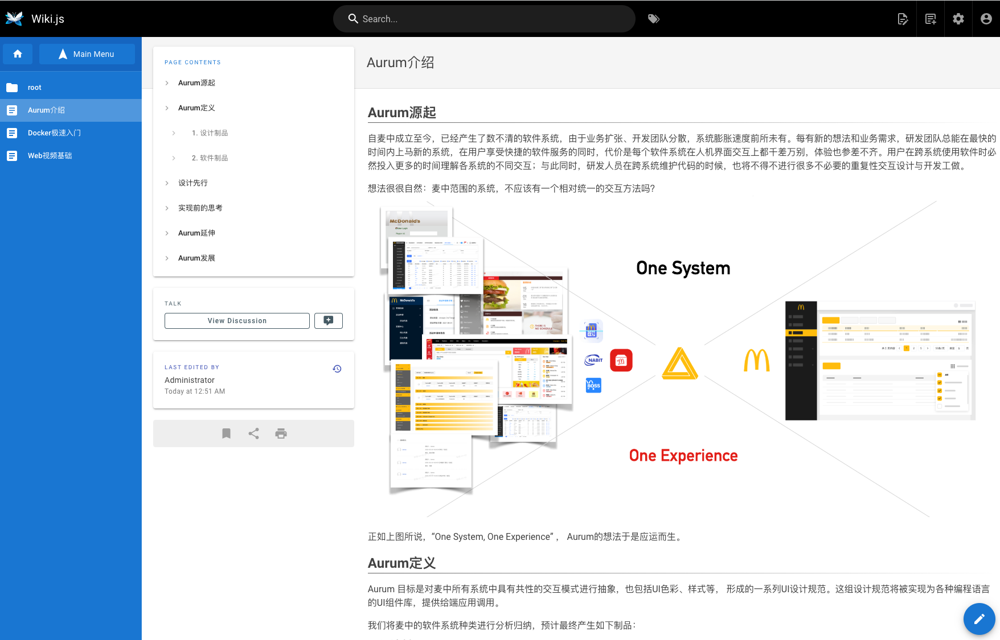

Wiki.js主要特点：

1. 轻量但功能强大。
2. 界面操作反应敏捷，体验平滑（比Conflunce反应快）
3. AGPL-v3 协议，自由使用和修改原有代码；
4. 采用单一语言(JavaScript)全栈实现，架构相对单一，二次开发难度中等

但系统特性与Confluence比起来，也有显然的不足：

1. 缺乏命名空间支持和细粒度的权限控制

2.  extensions 能力比较初级，特别是还不具备Conflunce强大的宏扩展能力

3. 创建“知识”（页面）和组织“知识“结构还不如Conflunce简洁、友好（这方面Conflunce无以伦比）

4. 非文本文档（Work、PDF）管理不足，缺乏直观的方式检索

   

另外，不确定数据扩张后，wikijs是否能支撑得很好，它关系到系统所适合的团队规模，这方面conflunce 显然是胜任的。

观察业务方提出的有关团队知识分享的若干痛点，看起来Conflunce软件能力基本全部覆盖，问题出在规范的定义、软件的使用方法上。如果一个“知识”由大家随意重复张贴、“空间”之间任意设置权限阻断信息传播导致信息孤岛，无论用什么软件都无法解决这些痛点。

Conflunce提供了强大的扩展能力，我们已经有了商业授权，如果不是软件本身能力受限，我不建议寻求第三方同类软件替换。