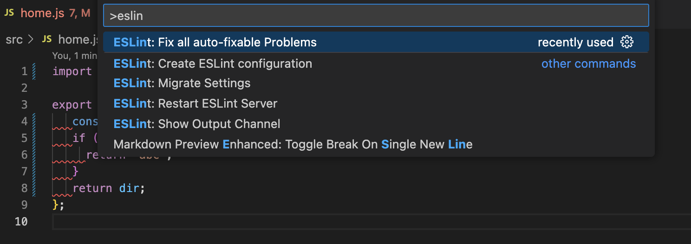

# ESLint命令行、IDE和Git、CI集成

https://github.com/eslint/eslint - ESLint是一个识别和报告 ECMAScript/Javascript代码模式的工具，说人话：规范 JS 代码，

## I. 命令行检查和修复
建立实验项目（有package.json的合法js项目），然后初始化 ESLint：

### 声明 ESLint 规则

```bash
npm init @eslint/config
```

交互式建立 eslint规则，生成 `.eslintrc.js`（选择React、流行的 airbnb 规则作为基础规则）内容如下：

```javascript
module.exports = {
  env: {
    browser: true,
    es2021: true,
  },
  extends: [
    'plugin:react/recommended',
    'airbnb',
  ],
  overrides: [
  ],
  parserOptions: {
    ecmaVersion: 'latest',
    sourceType: 'module',
  },
  plugins: [
    'react',
  ],
  rules: {
  },
};
```

### 执行 ESLint 规则检查

创建 `src/index.js`，内容如下：
```javascript
import _ from "lodash-es"

export default () => {
	console.log(_.merge({}));
	// return <div>Hello</div>
}
```

然后执行ESLint检查，
```bash
npx eslint src
```

一堆错误:

```
/.../conduct-test/src/index.js
  1:15  error    Unable to resolve path to module 'lodash-es'      import/no-unresolved
  1:15  error    Strings must use singlequote                      quotes
  1:26  error    Missing semicolon                                 semi
  4:1   error    Unexpected tab character                          no-tabs
  4:1   error    Expected indentation of 2 spaces but found 1 tab  indent
  4:2   warning  Unexpected console statement                      no-console
  5:1   error    Unexpected tab character                          no-tabs
  5:1   error    Expected indentation of 2 spaces but found 1 tab  indent
  6:2   error    Newline required at end of file but not found     eol-last
  6:2   error    Missing semicolon                                 semi

✖ 10 problems (9 errors, 1 warning)
  6 errors and 0 warnings potentially fixable with the `--fix` option.
```

这个应该就是 airbnb 等默认 ESLint规则的检查结果。

### 修复 ESLint 错误规则

```bash
npx eslint src --fix
```

修复结果如下：

```
/.../conduct-test/src/index.js
  1:15  error    Unable to resolve path to module 'lodash-es'  import/no-unresolved
  4:3   warning  Unexpected console statement                  no-console

✖ 2 problems (1 error, 1 warning)
```

有些能自动修复，有些不能则需要手动修复，如：手动安装 `loadsh-es`库，删除`console`代码等

### 项目定制规则

在 airbnb、react/recommended基础上定义自己的规则，修改 `.eslintrc.js`的rules节点，如：

```diff
  plugins: [
    'react',
  ],
  rules: {
+    "semi": ["error", "never"],
+    "quotes": ["error", "double"],
+    "indent": ["error", 3]
  },
```
第一条规则`semi`表示：不应该有`;`结尾，否则返回错误/自动修复；

第二条规则`quote`表示总是用双引号，否则返回错误/自动修复；

第二条规则`indent`表示缩进为3个空格，否则返回错误/自动修复。

修改 `src/index.js`内容如下：

```javascript
import _ from 'lodash-es';

export default () => {
	console.log(_.merge({}));
	// return <div>Hello</div>
}
```

重新执行

```bash
npx eslint src --fix
```

按照上述规则修复了文件内容（不能自动修复的，要手动修复）。


### .eslintignore
项目有很多`.js`文件，包括 `.eslintrc.js`，如果不想检查某些 js 文件，可以创建 '.eslintignore'文件，内容如下：
```
.eslintrc.js
```

## II. IDE中使用ESLint（VSCode）
vscode中安装 ESLint插件（VS Code ESLint extension），打开项目如果根目录下有 `.eslintrc.js`，就会对项目中的所有 .js/ts文件进行ESLint检查。如果有规则违背，编辑器就标红。此时，

* 要么用该插件修复

  

* 要么安装 `prettier` 插件进行格式化修正。

## III. 和 git 集成

请参考我的 **`Prettier`Wiki文档**学习细节——渐进实施`ESLint`：

### A. lint-staged —— 仅检查git的staging区的文件

由于在 package.json已经有了 `prettier`的 lint-staged配置，现在增加 `eslint`配置

```diff
{
  "lint-staged": {
    "**/*": [
      "prettier --check --ignore-unknown",
+      "eslint"
    ]
  }
}
```

当执行  `lint-staged`，会对待提交代码依次执行 prettier 和 eslint检查，如果代码违规，则不予提交。同理，可以使用`eslint --fix`替代`eslint`，直接修复，这取决于团队哲学，有的团队宁愿手动执行命令或在IDE中修复 ESLint违规代码，而不是在在提交代码时强制修复，此时就不要使用`--fix`。

### B. Husky —— 提交git时机触发检查

请参考我的 `Prettier`Wiki文档学习 husky 细节

## IV 与 CI集成

与 CI 集成时，宁愿不选择自动修复 git 源代码，所以更多选择不带 `--fix`参数的 `eslint`，即仅仅检查错误，有则返回报错通知。

参考我的”Prettier Wiki文档——与CI集成“，解释更完整。

## V. 与  Preittier 结合使用

要点是：ESLint和Prettier配置不能冲突。最基本的原则是：确保`.prettierrc.json`和`.eslintrc.js`规则一致。有些工具可以辅助使用：https://prettier.io/docs/en/integrating-with-linters.html。

可以参考我的 `Prettier` wiki文档 <<V. 与ESLint 结合使用>> 学习更多细节。

