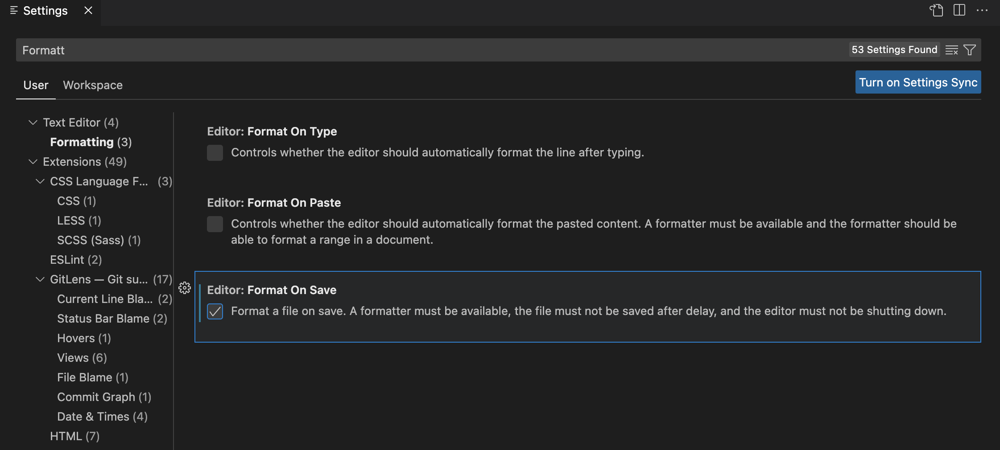

# EditorConfig

https://editorconfig.org/

> `EditorConfig`帮助开发人员在不同的编辑器和IDE之间定义和维护一致的编码样式。

试想：当在IDE/编辑器中创建源码文件后，输入回车、TAB等键时，回车符、缩进按照什么标准实行？答案是：按照 EditorConfig的配置说明实行。 

“执行时机”是它和`prettier`等工具的重要区别。`prettier`是对已经完成的代码进行处理：明确地运行命令行或IDE快捷键操作时，格式化已有的代码。而`EditorConfig`是在代码输入时就施行预期的格式。

也因此，`EditorConfig` 是一个仅在编辑器/IDE中应用代码格式的方法。

## VSCode插件

名称：EditorConfig for VS Code

安装好后，右键单击目录名能产生 .editorconfig 文件，例：

```ini
# EditorConfig is awesome: https://EditorConfig.org

# top-most EditorConfig file
root = true

[*]
indent_style = space
indent_size = 4
end_of_line = lf
charset = utf-8
trim_trailing_whitespace = false
insert_final_newline = false
```

这样，比如，在源码码文件中按TAB键就会执行规则 `indent_size = 4` 产生4个空格。为了更明显地感受 EditorConfig的作用，将`indent_size=4`修改为`indent_size =3`，在源码码文件中按TAB键，会产生3个空格。

### VS编辑器底部 EditorConfig规则显示

同时， vscode 编辑器底部，看到`Spaces: 3`，这就是 EditorConfig 插件生效的佐证。


### 保存时自动格式化

Preferences->Settings找到Fromatting



可以做到：当文件存储的时候，按照 .editorconfig 的内容进行格式化后保存。