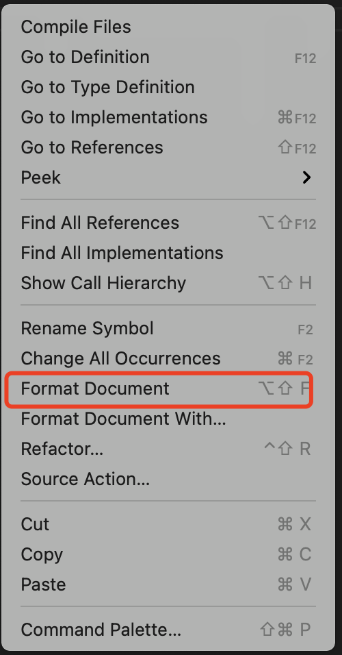

# Prettier

https://prettier.io/

## 独立使用

首先 `npm i -D prettier`

然后，在项目根目录下写一个.prettierrc.json 例子，如下：

```json
{
  "tabWidth": 3,
  "semi": true,
  "singleQuote": true  
}
```

接着，写一个例子 helper.js 文件在项目src目录下，

```js
function lookup(path) {
      if (typeof path === "object") return path;

  const    [entityName, columnName] = path.split("/");
  if (!entityName || !columnName) {
     return     false
  }
  const enums = constants
  return enums[entityName][columnName];
}
    
export default {
       lookup
};
```

执行

> npx prettier --write src

看看 helper.js 是不是被格式化了？ 更多参考 https://prettier.io/docs/en/install.html

## 集成IDE：VSCode 插件

Prettier - Code formatter - https://marketplace.visualstudio.com/items?itemName=esbenp.prettier-vscode

在IDE中，执行"格式化"操作，如何达到和  `npx prettier --write src/`同样目地？在 vscode中使用 Prettier - Code formatter 插件。

### 1. 全局设置

一旦安装好，就可以去 Preferences->Settings->Extensions->Prettier里进行具体设置了，这里的设置是**全局设置**，这里的修改都会反映到  settings.json 配置里。所以，如果你习惯直接写json配置，可以按 COMMAND+SHIFT+P 快捷键直接调出该文件进行修改：


以下是一个修改过的 settings.json 的例子：

```json
{
    "[javascript]": {
        "editor.defaultFormatter": "esbenp.prettier-vscode"
    },
    "[html]": {
        "editor.defaultFormatter": "vscode.html-language-features"
    },
    "prettier.jsxSingleQuote": false,
    "prettier.singleQuote": true,
    "prettier.tabWidth": 5,
    "prettier.semi": true,
    "editor.formatOnSave": true
}
```

在我上面的例子中，修改了格式化js使用prettier而不是默认的格式化器。

```diff
{
    "[javascript]": {
-        "editor.defaultFormatter": "Wscats.eno"
+        "editor.defaultFormatter": "esbenp.prettier-vscode"
    },
}
```

此时，用前面的例子，执行格式化试试（下图为文件右键单击的下拉菜单）



### 2. 使用.prettierrc.json 设置

如果项目目录下有 .prettierrc.json 文件配置，该配置将覆盖前面的全局配置（settings.json)，即使 .prettierrc.json文件的内容为  `{}` 也是如此。

### 3. 如果存在 .editorconfig，那么有个优先级问题

该插件官网描述如下：

>You can use [VS Code settings](https://marketplace.visualstudio.com/items?itemName=esbenp.prettier-vscode#prettier-settings) to configure prettier. Settings will be read from (listed by priority):
> 1. [Prettier configuration file](https://prettier.io/docs/en/configuration.html)
> 2. `.editorconfig`
> 3. Visual Studio Code Settings (Ignored if any other configuration is present)

当然，可以禁止 .editorconfig 在prettier格式化时起作用，在 settings.json 中加入规则：

 ```json
 "prettier.useEditorConfig": false
 ```

等同于如下图形化操作哦：


