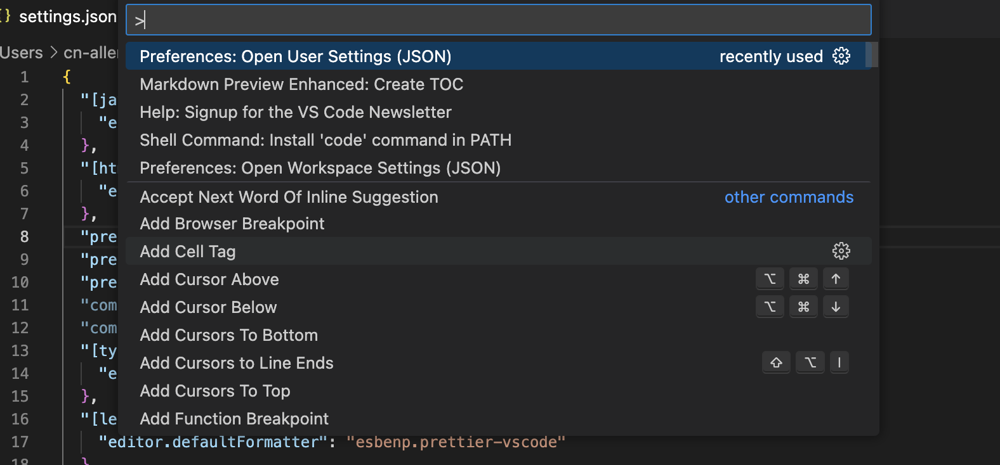
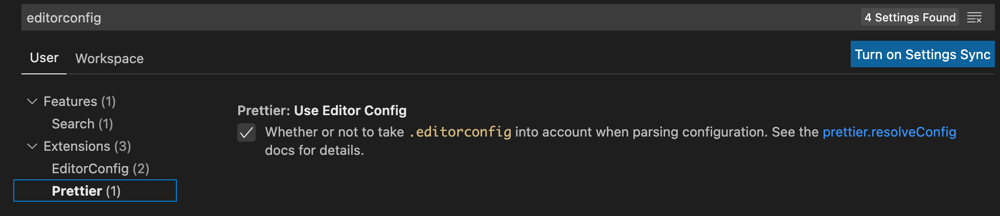

# Prettier命令行、IDE和Git、CI集成

https://prettier.io/ 代码格式化，主要是ESLint 代码风格方面的规范，可以用它来检查和修正。

## I. 命令行使用

安装依赖

```bash
npm i -D prettier
```

### 配置 .prettierrc.json

然后，在项目根目录下写一个`.prettierrc.json` 例子，如下：

```json
{
  "tabWidth": 2,
  "semi": true,
  "singleQuote": false
}
```

接着，写一个例子 helper.js 文件在项目src目录下，

```js
function lookup(path) {
      if (typeof path === "object") return path;

  const    [entityName, columnName] = path.split("/");
  if (!entityName || !columnName) {
     return     false
  }
  const enums = constants
  return enums[entityName][columnName];
}
    
export default {
       lookup
};
```

执行格式化
```bash
npx prettier --write src
```

看看 helper.js 是不是被格式化了？ 更多参考 https://prettier.io/docs/en/install.html

### 忽略处理配置 .prettierignore


## II. 集成IDE(VSCode 插件)

Prettier - Code formatter - https://marketplace.visualstudio.com/items?itemName=esbenp.prettier-vscode

在IDE中，执行"格式化"操作，如何达到和  `npx prettier --write src/`同样目地？在 vscode中使用 Prettier - Code formatter 插件。

### 1. 全局设置

一旦安装好，就可以去 Preferences->Settings->Extensions->Prettier里进行具体设置了，这里的设置是**全局设置**，这里的修改都会反映到  settings.json 配置里。所以，如果你习惯直接写json配置，可以按 COMMAND+SHIFT+P 快捷键直接调出该文件进行修改：



以下是一个修改过的 settings.json 的例子：

```json
{
    "[javascript]": {
        "editor.defaultFormatter": "esbenp.prettier-vscode"
    },
    "[html]": {
        "editor.defaultFormatter": "vscode.html-language-features"
    },
    "prettier.jsxSingleQuote": false,
    "prettier.singleQuote": true,
    "prettier.tabWidth": 5,
    "prettier.semi": true,
    "editor.formatOnSave": true
}
```

在我上面的例子中，修改了格式化js使用prettier而不是默认的格式化器。

```diff
{
    "[javascript]": {
-        "editor.defaultFormatter": "Wscats.eno"
+        "editor.defaultFormatter": "esbenp.prettier-vscode"
    },
}
```

此时，用前面的例子，执行格式化试试（下图为文件右键单击的下拉菜单）


### 2. 使用.prettierrc.json 设置

如果项目目录下有 `.prettierrc.json` 文件配置，该配置将覆盖前面的全局配置（settings.json)，即使 `.prettierrc.json` 文件的内容为  `{}` 也是如此。

### 3. 如果存在 .editorconfig，那么有个优先级问题

该插件官网描述如下：

>You can use [VS Code settings](https://marketplace.visualstudio.com/items?itemName=esbenp.prettier-vscode#prettier-settings) to configure prettier. Settings will be read from (listed by priority):
> 1. [Prettier configuration file](https://prettier.io/docs/en/configuration.html)
> 2. `.editorconfig`
> 3. Visual Studio Code Settings (Ignored if any other configuration is present)

当然，可以禁止 .editorconfig 在prettier格式化时起作用，在 settings.json 中加入规则：

 ```json
 "prettier.useEditorConfig": false
 ```

等同于如下图形化操作哦：



## III. 与 GIT 集成

准备工作：使项目在git控制下，如：运行`git init`初始化 git 项目。目标是在代码入库前检查或修复代码格式的违规。

### A. lint-staged —— 仅检查git的staging区的文件

如果有一个古老的 git 项目，大量的代码不符合`prettier`规范，现在希望渐进引入 `prettier`，即：仅新增的代码遵循 `prettier`规范，老的代码慢慢改造，最好的方法就是使用 `lint-staged`

安装 `lint-staged`

```bash
npm install lint-staged
```

在 package.json加入 lint-staged配置

```json
{
  "lint-staged": {
    "**/*": "prettier --check --ignore-unknown"
  }
}
```

违规代码 `src/home.js`

```javascript
import path from "path"

export default () => {
   const dir = path.resolve(__dirname, 'src')
   return dir;
}
```

将其加入到git staging 区：

```bash
git add src/home.js
```

运行

```bash
npx lint-staged
```

返回结果如下：

```
✔ Preparing lint-staged...
❯ Running tasks for staged files...
  ❯ package.json — 1 file
    ❯ **/* — 1 file
      ✖ prettier --check --ignore-unknown [FAILED]
↓ Skipped because of errors from tasks. [SKIPPED]
✔ Reverting to original state because of errors...
✔ Cleaning up temporary files...

✖ prettier --check --ignore-unknown:
[warn] src/home.js
[warn] Code style issues found in the above file. Forgot to run Prettier?
Checking formatting...

```

如果 `lint-staged`配置的 prettier 命令是：`--write`，不是`--check`，可以直接使违规代码格式化。

### B. Husky —— 提交git时机触发检查

安装 husky

```bash
npm install husky -D
npx husky install
npm pkg set scripts.prepare="husky install"
npx husky add .husky/pre-commit "npx lint-staged"
```

增加git 的`pre-commit`这个hook，当代码提交时，就会触发调用 `npx lint-staged`实现 `prettier` 规则检查或直接修复（修复成功则完成提交）

注：

1. `npm pkg set scripts.prepare="husky install"`是必要的，它确保git团队其他成员clone代码后，执行`npm install`后能自动初始化husky(名字为prepare脚本执行husky install)，因为该初始化脚本无法提交到git仓库，必须每成员自己执行 `husky install`。
2. 使用prettier规则检查(`--check`)还是修复(`--write`)，取决于团队哲学，如果宁愿在IDE里格式化，那么此处就使用`--check`。

## IV. 与 CI 集成

与CI集成时，一般不直接格式化代码，而是执行 --check参数 prettier：

```bash
npx prettier --check src
```

此时如果检查结果存在违规，返回 false，停止执行CI下一步；否则继续执行CI下一步。

例如，运行下面命令：

```bash
npx prettier --check src && npm run build
```

如果发现被检查代码有违规，就可以确保 `npm run build`不会被运行。

## V. 与ESLint 结合使用

虽然说 ESLint 其实也具备一定的代码风格的格式化能力，但是在实践中，我们一般采用 ESlint 来做代码质量的约束，用 Prettier 来做代码风格的约束。

官网：Integrating with Linters：https://prettier.io/docs/en/integrating-with-linters.html

> 假设你已经阅读了 `ESLint` 文档，并且配置使用过了 ESLint，开始下面的结合使用

### 规则冲突(eslint-config-prettier)检查

当 ESLint 的规则和 Prettier 的规则相冲突时，就会发现一个尴尬的问题，用其中一种来格式化代码，另一种就会报错。

prettier 官方提供了一款工具 `eslint-config-prettier` 来解决这个问题。本质上这个工具其实就是禁用掉了一些不必要的以及和 Prettier 相冲突的 ESLint 规则。

#### 问题：ESLint和Prettier规则冲突

假设有`.eslintrc.js`和`.prettierrc.json`配置如下：
* `.eslintrc.js`

```json
{
  extends: ['plugin:react/recommended', 'airbnb'],
  ...
  rules: {
  }
}
```

* `.prettierrc.json`

假设 `prettierrc.json`有如下规则：

```json
{
  "tabWidth": 4,
  "semi": false,
  "singleQuote": false
}
```
上面的例子中，当运行`prettier`格式化代码时，会产生4个空格缩进，去掉分号结尾等. 但是这和 `eslint`配置相冲突，因为上面`eslint`配置使用`airbnb`规则：要求缩进时 2个空格，分号结尾。

#### 禁用 ESLint规则

此时，可以配置 `eslint-config-prettier`：使之覆盖 `airbnb`规则

* 安装依赖

```bash
npm i eslint-config-prettier -D
```
* 修改 `.eslintrc.json`：extends 增加 `prettier`
```javascript
{
  extends: ['plugin:react/recommended', 'airbnb', 'prettier'],
}
```

在此运行 `npx prettier --write src/index.js`，ESLint不会再提示报错，包括IDE中不会报红，命令行执行`npx eslint --fix src/index.js`也不会报错，因为该插件已经禁用了与ESLint相冲突的规则。

#### ESLint配置的rules节点和Prettier规则冲突处理

ESLint配置的rules节点规则，该插件是禁用不了的，要手动处理使不冲突。例：修改`.eslintrc.js`，增加定制规则：

```diff
{
  extends: ['plugin:react/recommended', 'airbnb', 'prettier'],
  rules: {
+    semi: ['error', 'always'],
+    indent: ['error', 4],
  }
}
```

对比前面的`.prettierrc.json` 和当前 `.eslintrc.js`的rules：tabWidth/indent重复配置；规则 semi矛盾，一个是要求有分号，一个要求不可以有。

此时可以使用`eslint-config-prettier`CLI工具，找出这些冲突项，并手动删除：

```bash
npx eslint-config-prettier src/home.js 
```

返回结果如下：

```
The following rules are unnecessary or might conflict with Prettier:

- indent
- semi
```

根据上述提示，将 `.eslintrc.js`中的这些规则移除，确保规则唯一存在于 `prettier`配置中

### 使用 prettier 替代 eslint规则(eslint-plugin-prettier)

上面介绍的工具，仅仅只是将部分 ESLint 规则给禁用了，避免 Prettier 格式化之后的代码导致 ESLint 报错而已，如何将两者结合起来使用呢？

prettier 官方提供了一个 ESLint 插件 `eslint-plugin-prettier`。

这个插件的主要作用就是将 prettier 作为 ESLint 的规则来使用，相当于代码不符合 Prettier 的标准时，会报一个 ESLint 错误，同时也可以通过 eslint --fix 来进行格式化。

* 安装依赖

```bash
npm i  eslint-config-prettier -D
```

* 修改`.eslintrc.js`配置

extends 增加 `plugin:prettier/recommended`，然后`rules`删除 `prettierrc.json`定义的重复规则。

```javascript
{
  extends: ['plugin:react/recommended', 'airbnb', 'plugin:prettier/recommended'],
	...
	rules: {
	}
}
```

执行`npx eslint --fix xxx.js`，将按照 `.prettierrc.json`的规则覆盖 `xxx.js`

Prettier官方：https://prettier.io/docs/en/integrating-with-linters.html提到：该插件缺点也是显然的，尤其是：编辑器（VSCode）将出现大段错误波浪线，是提示变得不明确，更加扰人。

## prettier-eslint 用法？

