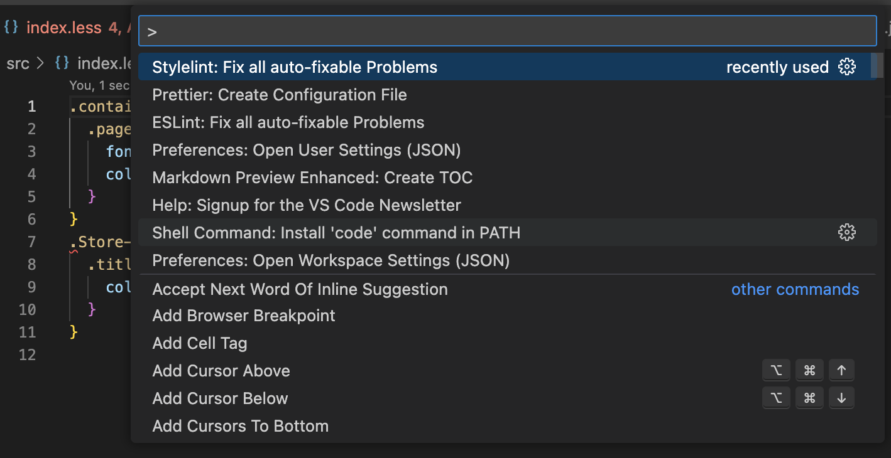

# Stylelint命令行、IDE和Git、CI集成

https://stylelint.io/ - Stylelint 对CSS样式进行规范。

## I. 命令行检查和修复

建立实验项目（有package.json的合法js项目），然后初始化 Stylelint：

### 安装依赖 

```bash
npm install --save-dev stylelint stylelint-config-standard
```

### 配置文件 .stylelintrc.json

```javascript
{
  "extends": "stylelint-config-standard"
}
```

### 执行 Stylelint 规则检查

创建 `src/index.css`，内容如下：

```javascript
:root {
  font-family: Inter, Avenir, Helvetica, Arial, sans-serif;
  background-color: #242424;
  text-rendering: optimizeLegibility;
  -webkit-font-smoothing: antialiased;
  -moz-osx-font-smoothing: grayscale;
  -webkit-text-size-adjust: 100%;
}
.Store-album {
  color: blue;
}
```

然后执行Stylelint检查，

```bash
npx stylelint "**/*.css"
```

一堆错误:

```
 4:19  ✖  Expected "optimizeLegibility" to be "optimizelegibility"  value-keyword-case
 7:3   ✖  Unexpected vendor-prefix "-webkit-text-size-adjust"       property-no-vendor-prefix
 9:1   ✖  Expected empty line before rule                           rule-empty-line-before
 9:1   ✖  Expected class selector ".Store-album" to be kebab-case   selector-class-pattern

4 problems (4 errors, 0 warnings)
```

这个应该就是 airbnb 等默认 Stylelint规则的检查结果。

### 修复 Stylelint 错误规则

```bash
npx stylelint **/*.css --fix
```

修复结果如下：

```
src/index.css
 9:1  ✖  Expected class selector ".Store-album" to be kebab-case  selector-class-pattern

1 problem (1 error, 0 warnings)
```

4个错误修复了3个，剩下一个就是不能自动修复的项，需要手动修复：根据提示，将 `.Store-album`修改为`store-album`，重新运行`npx stylelint **/*.css`，就不返回错误了


### .忽略某些文件检查

修改`.stylelintrc.json`

```diff
{
  "extends": ["stylelint-config-standard"],
+  "ignoreFiles": ["**/store.css"],
}
```

再次执行`npx stylelint **/*.css`，将不会检查`store.css`。

### 项目自定义规则

修改`.stylelintrc.json`， 增加自定义 rules：

```json
{
  "extends": ["stylelint-config-standard"],
  "ignoreFiles": ["**/store.css"],
  "rules": {
    "color-no-invalid-hex": true,
    "unit-allowed-list": ["em", "rem", "%", "s"],
  }
}
```

 `src/index.css`增加两条错误规则

```diff
:root {
+  font-size: 20px;
+  color: #999999;
}

.store-album {
  color: blue;
}
...
```

重新运行 `npx style lint **/*.css`，返回错误提示：

```
src/index.css
 8:16  ✖  Unexpected unit "px"             unit-allowed-list
 9:10  ✖  Expected "#999999" to be "#999"  color-hex-length

2 problems (2 errors, 0 warnings)
```

根据提示自动修复即可

### LESS 的 Stylelint

* 安装 less 依赖

  ```bash
  pnpm add postcss-less -D
  ```
* 修改 `stylelintrc.json` ，增加overrides选项
  ```json
  {
    "extends": ["stylelint-config-standard"],
    "ignoreFiles": ["**/store.css"],
    "rules": {
      "unit-allowed-list": ["em", "rem", "%", "s"],
      "color-no-invalid-hex": true
    },
    "overrides": [
      {
        "files": ["**/*.{less}"],
        "customSyntax": "postcss-less"
      }
    ]
  }
  ```
  
  运行 lint 检查
  
  ```bash
  npx stylelint "**/*.{css,less}"
  ```

## II. IDE中使用Stylelint（VSCode）

vscode中安装 Stylelint插件（VS Code Stylelint extension），打开项目后会根据根目录下的 `.stylelintrc.json`对项目中的 css（less/scss)等进行 lint 检查。如果有规则违背，编辑器就标红。然后，

* 要么用该插件修复



* 要么安装 `prettier` 插件进行格式化修正。


## III. 和 git 集成

渐进实施`Stylelint`（请参考 `Prettier`文档学习基础细节）：

### A. lint-staged —— 仅检查git的staging区的文件

由于在 package.json已经有了 `prettier`、`eslint`的 lint-staged配置，现在增加 `stylelint`配置

```diff
{
  "lint-staged": {
    "**/*": [
      "prettier --check --ignore-unknown",
      "eslint",
    ]
+    "**/*.(less|css)": [
+      "stylelint",
+    ]
  }
}
```

当执行  `lint-staged`，会对待提交代码依次执行 prettier 和 eslint检查，如果代码违规，则不予提交。同理，可以使用带` --fix参数的stylelint`，直接修复，这取决于团队哲学，有的团队宁愿手动执行命令或在IDE中修复 Stylelint违规代码，而不是在在提交代码时强制修复，此时就不要使用`--fix`。

### B. Husky —— 提交git时机触发检查

请参考我的 `Prettier`Wiki文档学习 husky 细节

## VI. 与CI集成

与 CI 集成时，宁愿不选择自动修复 git 源代码，所以更多选择不带 `--fix`参数的 `stylelint`，即仅仅检查错误，有则返回报错通知。

参考我的”Prettier Wiki文档——与CI集成“，解释更完整。


## V. 与  Preittier 结合使用

https://prettier.io/docs/en/integrating-with-linters.html 有一个 stylelint 集成用法。

### stylelint-config-prettier

如果已经安装了 `prettier`，那么格式化的时候可能和 stylelint规则冲突。具体如：stylelint默认配置` "extends": ["stylelint-config-standard"]`要求 css 文件 2个空格缩进，但是如果 `prettier`规则使用 `"tabWidth": 4,`缩进，那么 pettier 格式化将导致stylelint检查报错，导致 prettier 永远不可使用。

如果安装 `stylelint-config-prettier`，

```
pnpm add stylelint-config-prettier -D
```

修改配置 `.stylelintrc.json`：

```json
{
  "extends": ["stylelint-config-standard", "stylelint-config-prettier"],
  ...
}
```

将 `stylelint-config-prettier` 作为最后一个扩展，这将覆盖 `stylelint-config-standard`和prettier相冲突的配置，以 prettier 配置为准。

请参考我的 **`Prettier`Wiki文档**学习更多 Prettier 和 Stylelint结合的用法。

- [prettier-stylelint](https://github.com/hugomrdias/prettier-stylelint)
- [eslint-plugin-prettier](https://github.com/prettier/eslint-plugin-prettier)

