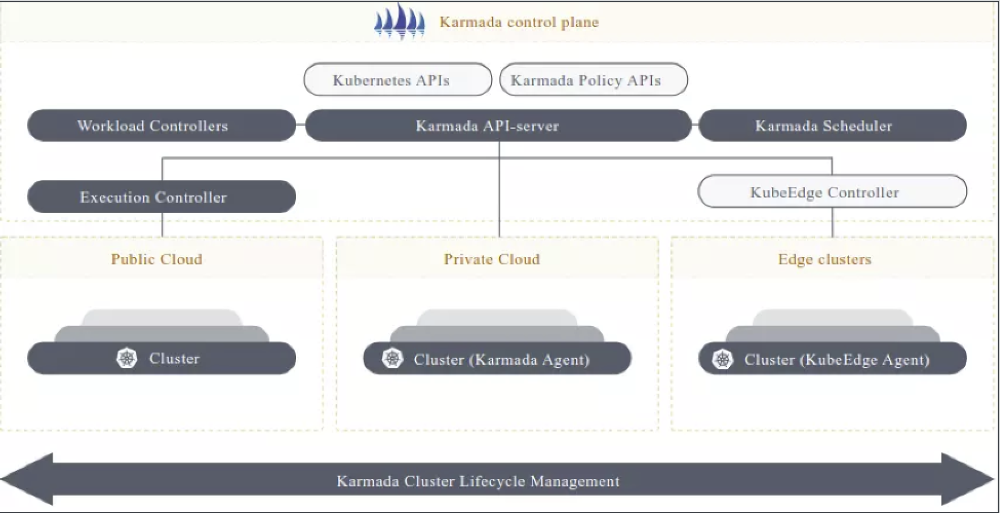

[toc]

# 用户版】 云原生进阶实战营课程大纲

## 模块一：云原生 DevOps 概览

教学目标：

1.  理解云原生 DevOps 的概念和原则
2.  了解云原生 DevOps 的全场景

详细内容：

1.  云原生 DevOps 的概念和原则
2.  开发工作流，代码管理、分支协作、代码晋升等
3.  持续构建和镜像晋升
4.  应用定义和持续部署
5.  环境管理和晋升
6.  如何查看业务错误日志
7.  业务高峰告警和自动扩容
8.  基于业务指标的弹性扩容
9.  开发和 DevOps 两种协作模式
10.   如何高效学习 DevOps

## 模块二：云原生 DevOps 实践基础

教学目标：

1.  了解云原生应用的基本概念和优势
2.  通过编写示例应用，掌握 Manifest、Helm 和 Kustomize 应用定义
3.  了解Helm 和Kustomize 的技术选型差异
4.  掌握常用中间件的部署和生产实践
5.  掌握多环境管理实践

详细内容：

1.  微服务示例应用的设计和实现
2.  配置文件、秘钥和环境变量的读取和健康检查
3.  Dockerfile 和 K8s Manifest、Helm、Kustomize 应用定义
4.  MySQL、Kafka、Redis 等中间件的部署和生产实践
5.  实战演练：多语言微服务应用K8s 部署实战
6.  实战演练：多环境的两种定义方式 (Kustomize 和 Helm）

## 模块三：基础设施即代码 (aC)

教学目标：

1.  理解基础设施即代码的概念及其优势
2.  掌握 Terraform 和 HCL 的基本用法
3.  掌握云 Kubernetes 集群和本地 Kubernetes 集群的搭建方法
4.  掌握使用 IaC 的方式管理 Kubernetes 集群

详细内容：

1.  基础设施即代码的概念和优势
2.  HCL Ai7
3.  Terraform 常用命令和状态管理
4.  Terraform Cloud Providers 的使用
5.  实战演练：使用IaC 的方式管理 Kubernetes 集群

## 模块四：持续构建 (CI)

教学目标：

1.  理解持续构建、制品库的概念和原理
2.  了解常用持续构建工具的使用方法，包括 GitHub Action、阿里云效、CODING DevOps.
    GitLab CI. Jenkins. Kaniko
3.  掌握制品仓库的使用和制品生产管理实践
4.  掌握多分支流水线，包括代码静态扫描和单元测试
5.  掌握如何借助 laC 管理持续构建流水线

详细内容：

1.  持续构建的概念和原理及常用的 CI 工具介绍：GitHub Action、阿里云效、CODING
    DevOps. GitLab CI. Jenkins. Kaniko
2.  自托管镜像仓库 Harbor 和生产实践
3.  代码静态扫描的概念、原理及其工具 SonarQube
4.  实战演练：构建多分支流水线

1.  构建镜像
2.  代码静态扫描

•.单元测试

## 模块五：持续部暑 (CD)

教学目标：

1.  掌握持续部署的一般做法
2.  掌握持续部署的最佳实践：Gitops，包括自动同步、自愈和回滚
3.  掌握多集群和多环境部署实践：基于分支和基于目录
4.  掌握自动多环境管理的最佳实践

详细内容：

1.  持续部署的基本概念和流程
2.  持续部署的一般做法 （Jenkins） 和最佳实践( GitOps)
3.  基于分支和基于目录的多环境管理实践
4.  实战演练：Argo CD 全自动多环境管理实践
5.  实战演练：ArgoCD 多集群方案选型和最佳实践

## 模块六：DevSecOps

教学目标：

1.  理解 DevSecOps 的概念和意义
2.  掌握镜像安全：镜像签名、可信基础镜像和镜像漏洞扫描
3.  掌握质量门禁的概念和原理，了解如何设置质量门禁来限制应用程序的发布
4.  了解软件供应链 ( Software BOM)安全的概念和原理，掌握供应链安全工具的使用方法
5.  掌握 DevOps 中秘钥存储，了解如何安全地存储、使用和管理秘钥
6.  掌握如何借助 Kubernetes Admission Webhook 实现自定义安全策略

详细内容：

1.  DevSecOps 的概念和意义，如何在 DevOps 流程中融入安全
2.  镜像安全：可信基础镜像、镜像签名和镜像漏洞扫描
3.  质量门禁的原理和实践
4.  实战演练：使用 Sealed-Secrets 和 Vault 加固密钥存储
5.  实战演练：借助 Kyverno 实现自定义安全策略，包括限制镜像仓库来源和要求资源配额
6.  实战演练：借助 Syit 和Grype 工具实现软件供应链 (SBOM)安全

## 模块七：连接 DevOps 工作流

教学目标：

1.  掌握连接 DevOps 工作流的关键技术和工具
2.  学会如何在云原生环境下连接 CI/CD 流程，并形成 DevOps 工作流
3.  掌握两种 DevOps 协作方式
4.  掌握如何通过 IaC 的方式连接工作流

详细内容：

1.  Trigger 的概念和使用，如何触发自动化构建流程
2.  从 Docker Image Tag 视角审视制品管理的最佳实践
3.  实战演练：通过laC 的方式连接工作流
4.  实战演练：为示例应用打造 DevOps 工作流（监听应用定义模式）
5.  实战演练：为示例应用打造 DevOps工作流(监听镜像变更模式）

## 模块八：从零构建可观测性

教学目标：

1.  掌握日志、监控、 告警的概念和原理
2.  熟练使用 Loki、 EFK、Prometheus、 Grafana、Alertmanager 等工具，实现从零构建可
3.  掌握 OpenTelemetry 的概念和实现方式

详细内容：

1.  日志：Loki和ELK 简介和分析，日志采集的最佳实践
2.  监控：Prometheus 和 Grafana 的简介和使用，PromQL 实践
3.  告警：Alertmanager的介绍和使用，告警策略的最佳实践
4.  OpenTelemetry：可观测性的统一解决方案
5.  Promethues + Thanos 实现大规模指标存储
6.  Promethues 实现多集群（租户）监控
7.  Promethues 高可用部署的方式
8.  实战演练：从零构建可观测性方案，包括日志、监控、告警的整合
9.  实战演练：搭建 HTTP 请求监控指标面板
10.   实战演练：使用 Prometheus 采集业务指标
11.   实战演练：为持续部署搭建监控面板

## 模块九：自定义弹性伸缩策略

教学目标：

1.  掌握永不宕机的三板斧：探针、资源配额和弹性扩容
2.  掌握使用 Prometheus 和 KEDA 实现业务指标弹性伸缩
3.  理解 CA、VPA 和 HPA 三大伸缩方式的适用场景和优缺点
4.  掌握 Pod 资源原地更新的原理和实现方式

详细内容：

1. 借助探针、资源配额和弹性扩容实现永不宕机的业务系统

2. CA、VPA 和 HPA 三大伸缩方式的使用场景和方法
3.  Pod 资源原地更新使用场景和方法
4.  实战演练：使用 Prometheus 和 KEDA 实现基于业务指标的弹性扩容

## 模块十：多云、混合云和灾备

教学目标：

1.  了解云原生 DevOps 中的多云和混合云概念
2.  掌握如何使用 Karmada 管理多个 Kubernetes 集群
3.  掌握 Etcd、自签名证书的备份和恢复操作
4.  掌握 Velero 的备份和恢复过程

详细内容：

1.  云原生 Devops 中的多云和混合云概念及其优势和挑战
2.  Karmada 的架构和功能
3.  在多云和混合云场景下应用部署和管理的最佳实践
4.  Etcd、自签名证书和 Kubeconfig 备份和恢复实践
5.  实战演练：使用 Karmada 实现多云多集群应用部署
6.  实战演练：以laC 的方式实现跨地域多集群管理
7.  实战演练：使用 velero 备份和恢复 Kubernetes 集群

## 模块十一：高级发布策略

教学目标：

1.  掌握常用的高级发布策略，包括蓝绿发布、金丝雀发布、渐进式交付等
2.  了解不同发布策略的优缺点 ，如何选择合适的发布策略

详细内容：

1. 介绍蓝绿发布、金丝雀发布、渐进式交付的优缺点和适用场景
2.  实战演练 1：使用 Argo Rollout 实现蓝绿发布
3.  实战演练2：使用 Argo Rollout 实现金丝雀发布
4.  实战演练 了：使用 Argo Rollout 实现全自动渐进式交付

## 模块十二：云计算实战

**教学目标：**

1.  理解云计算的概念和基础知识
2.  掌握生产级 Kubernetes 集群的管理方法
3.  掌握腾讯云和阿里云常用服务
4.  掌握常用的云厂商中间件
5.  掌握如何通过 IaC 的方式管理基础设施
6. 了解云计算在 DevOps 中的应用和实践

**详细内容：**

1.  云计算的概念和基础知识，公有云、私有云、混合云等云计算部署模式的比较
2.  生产级公有云 Kubernetes 集群的管理和高可用配置
3.  腾讯云的云产品：TKE、SLB、VPC、CVM COS、 CMQ、 TencentDB 等简介和使用场景
4.  阿里云常用云产品：ECS、ACK、SLB 等简介和使用场景
5.  实战演练：通过 lac 的方式管理云厂商基础设施
6.  云厂商常用中间件的选型：MySQL、KafkaRedis、 PostgresQL
7.  云计算架构师入门实战：如何选择云中间件提升业务稳定性

## 模块十三：云原生组织架构和管理

教学目标：

1.  了解云原生下的组织变革以及其对企业和个人的影响
2.  提升沟通技巧，掌握如何顺利在公司落地新技术
3.  了解云原生组织架构转型下的 DevOps、SRE、平台工程、基础架构等角色的职责和关系
4.  掌握设计组织架构转型方案的能力

详细内容：

1.  云原生下的组织变革，包括组织架构、文化和流程等方面的变化
2.  不同角色的职责和关系，包括 DevOps、 SRE、平台工程、基础架构等角色
3.  如何在四队中实施新技术：识别技术风险、沟通技巧、案例分享、小步快跑、扩大范围等
4.  云原生下的组织转型案例分析：不同团队规模下，DevOps 的落地经验
5.  实战演练：如何搞定新技术落地时“人〞的障碍

## 模块十四：职业发展与拥抱开源

教学目标：

1.  通过了解云原生全景图掌握云原生技术全貌
2.  掌握参与 CNCF 代码和非代码贡献的途径和方法，提升个人价值和知名度
3.  了解如何将项目捐赠给 CNCF
4.  以 DevOps 岗位为例，学会如何撰写一份优秀的简历
5.  熟悉常见的云原生 DevOps 面试题目和答题技巧
6.  学会如何在面试中展现自己的实习经历和项目经验
7.  理解如何在职场中快速脱颖而出并实现职业晋升

**详细内容**：

1. CNCF 组织模式和云原生一手信息的获取方法
2.  参与 CNCF 代码和非代码贡献，提升个人价值和知名度的途径
3.  CNCF 项目捐赠流程介绍 （以 CNCF 为例）
4.  撰写云原生简历的技巧和要点，如何突出自己的技能和经验
5.  常见的云原生 DevOps 面试题目和答题技巧，如何准备和应对面试
6.  如何在面试中展现自己的实习经历和项目经验，如何回答与经验相关的问题
7.  实习期如何安全落地，如何展现自己的能力和热情
8. 如何在职场中脱颖而出，如何提升自己的职业发展规划，寻找晋升路径

每一位学员经老师辅导并通过考试后，将获得由 ArgoCD 预发的认证证书，该证书支持在

Linkedin 的“认证资格”中展示。（证书可能随时调整，先到先得）

## 实战项目

### 项目一：构建安全的 DevSecOps 流水线

实践目标：

1.  掌握 DevSecOps 流水线的构建方法，如质量门禁、代码扫描、镜像安全扫描、单元测试等
2.  掌握 SBOM 软件供应链安全的实施方法
3.  掌握持续部署 （CD）中秘钥的加密方法
4.  学会多分支流水线的构建方法，掌握多环境和多集群的应用部署方式

核心要点：

1.  在持续构建 （CI） 中集成代码扫描、质量门禁、单元测试和 SBOM 软件供应链扫描
2.  在制品库中实现镜像安全漏洞扫描，并限制其部署到生产环境
3.  在Gitops 部署环节加密 Kubernetes Secret 对象
4.  借助 Kubernetes Admission Webhook 限制不可信镜像来源
5.  实现多分支流水线及多环境应用部署

### 项目二：扩展Kuberetes 自定义部署策略

实践目标：

1.  理解 Kubernetes Admission Webhook 的概念和扩展方式
2.  学会使用 Kubernetes Admission Webhook 实现自定义部署控制策略
3.  掌握使用 Kyverno 配置自定义部署策略

核心要点：

1.  深入理解 Kubernetes Admission Webhook 的原理和机制
2.  借助 Kubernetes Admission Webhook 扩展自定义部署策略
3.  使用Kyverno 实现自定义部署策略：限制镜像和要求资源配额

### 项目三：从零构建可观测性：日志、监控和告警

实践目标：

1.  掌握 Kubernetes 日志、监控和告警系统的搭建
2.  学会将日志、监控和告警系统整合在一起，并掌握查询方法
3.  学会使用 Prometheus 采集业务指标和配置告警，如 HTTP 请求失败率、HTTP 请求延迟
    率等
4.  掌握多种告警渠道的配置：邮件、钉钉和企业微信等

核心要点：

1.  深入理解 EFK、ELK、Loki 日志系统选型和搭建方式
2.  Prometheus、Grafana 和 Alertmanager 最佳实践
3.  使用 Prometheus 采集业务指标，并配置告警策略
4.  为持续部署 (CD）搭建监控面板

### 项目四：基于业务指标的高级弹性扩容

实践目标：

1.  掌握 HTTP 核心请求指标监控面板的搭建
2.  学会使用 KEDA 实现自定义弹性扩容策略
3.  掌握基于业务指标实现弹性扩容

核心要点：

1.  HTTP 请求核心指标的采集和监控
2.  基于事件驱动的 Kubernetes 扩容策略
3.  使用 Prometheus 和KEDA 实现业务指标的高级弹性扩容

### 项目五：混合云和多集群应用部署

实践目标：

1. 掌握多集群管理基础开放式集群管理 (OCM）的概念
2. 学会在混合云和多集群环境下部署和管理应用

核心要点：

1. 深入理解混合云和多集群部署的优势和挑战
2. 开放式集群管理（OCM）的概念和架枸
3. 使用 Karmada 实现多云多集群应用部署和管理

### 项目六：高级发布策略

实践目标：

1. 掌握灰度发布、金丝雀发布和渐进式交付的概念和实践方法
2. 学会使用 Argo Rollout 实现高级发布策略：灰度发布和金丝雀发布
3. 学会使用 Prometheus + Argo Rollout 实现自动渐进式交付

核心要点：

1. 交度发布、金丝雀发布和渐进式交付的概念和区别
2. Argo Rollout 实现高级发布策略的方法
3. 结合 Prometheus 指标实现自动渐进式交付和自动回滚

### 项目七：云计算实战

实践目标：

1. 掌握腾讯云和阿里云常用云产品的概念和使用场景
2. 掌握基础设施即代码 (laC）管理云资源
3. 学会对云产品的技术选型，提升业务稳定性

核心要点：

1. 阿里云和腾讯云常用产品和使用场景：TKE、SLB、 VPC、CVM、CMQ、TencentDB、
    ECS. ACK, SLB #
2. 基础设施即代码 (laC） 的概念和优势
3. 使用 Terraform 实现lac
